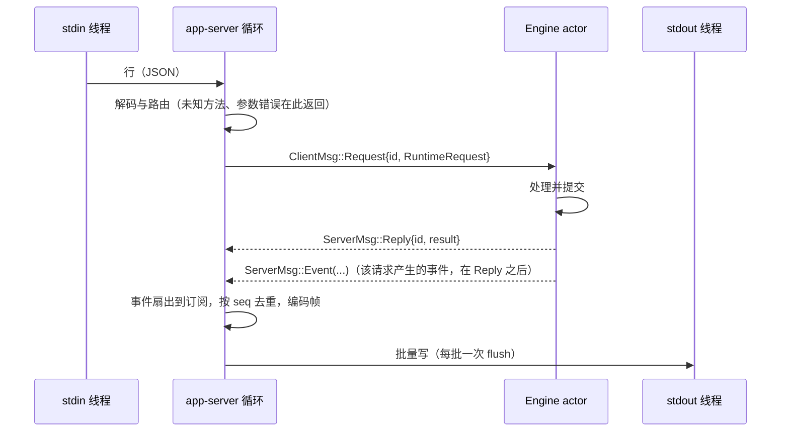

# Rust M0：核心与传输解耦

总设计见 [P0/P1 架构设计](rust-p0-p1-architecture.md) 第 4、5.1 节。M0 是后续里程碑的地基，**不改变业务语义**；对外可观察的变化只有本文件明确列出的几项（错误码、分片阈值、sessions-index 去重、`tui` 子命令），均向 Node 现有行为对齐。

## 1. 交付项与顺序

每项单独提交，提交前 Rust 单测与 Node 驱动的集成测试全部通过。

1. **命令行子命令**：`app-server`（参数与现有完全一致）与 `tui`（占位）。
2. **错误模型**：类型化 `RuntimeError`，由 app-server 统一映射为 JSON-RPC 错误。
3. **连接模型与投递迁移**：core 只产出类型化事件；JSON-RPC 编解码、订阅、帧编码与分片、stdout 写出迁到 app-server。
4. **RunScope**：run 期等待者（权限、问答、Host 鉴权）统一归属，run 结束时一次性收口。
5. **状态枚举**：`Mode`、`Phase`、`TaskType`，serde 格式不变。
6. **命令 admission 校验与 schema 漂移检查**（见第 11 节）。
7. **日志**：`tracing` 非阻塞 JSONL 写出。

## 2. 所有者与事件顺序

| 状态                                                                                                     | 唯一所有者                          | 其他层的访问方式                         |
| -------------------------------------------------------------------------------------------------------- | ----------------------------------- | ---------------------------------------- |
| 会话事实、队列、rows、seq/epoch、驻留 pin 计数、上传会话                                                 | core `Engine` actor                 | 发送 `RuntimeRequest`，接收 `ServerMsg`  |
| JSON-RPC id、订阅注册表（subscriptionId、connectionId、topic、ordinal、暂停/需恢复标记）、帧编码、写队列 | app-server 事件循环（单任务，无锁） | 无                                       |
| Host 反向请求的 id 映射                                                                                  | app-server                          | core 通过 `HostRequest`/`HostReply` 交互 |
| 进程句柄、MCP 连接、文件观察                                                                             | tools 适配器（不变）                | 端口调用                                 |



- **顺序**：同一连接上，actor 先入队 `Reply`，再入队该请求产生的事件（与 Node 先写响应行、再写 initial frame 一致）。所有 `ServerMsg` 走同一条有序通道。
- **订阅快照**：`subscribe`、`resync` 与 `drained` 补齐时，app-server 向 actor 请求 `TopicSnapshot { topic }`，actor 原子返回 `(epoch, seq, snapshot)`。订阅者的 `sent_seq` 设为该 seq，之后只接受 `from ≥ sent_seq` 的增量，更早的增量丢弃。这样快照与增量之间不依赖时序巧合。
- **驻留 pin**：订阅建立或撤销时，app-server 向 actor 发 `TopicInterest { topic, delta: ±1 }`。actor 以计数替代现在对 `self.subscriptions` 的扫描，计数大于 0 的会话不被 LRU 淘汰。
- **连接关闭**：`v4/connection/flow closed` 时，app-server 移除该连接的订阅（M0 保持 Rust 现有行为；与 Node 一致的保留语义在 M8 调整），并通知 actor 清理该连接的上传（`ConnectionClosed`）。
- **不反压 actor**：actor 到 app-server 的通道有界，但 app-server 循环只做内存操作，从不阻塞在 IO 上。写队列按字节记账：超过高水位（64 MiB）时，该连接的会话订阅标记为需恢复并丢弃增量，写队列降到低水位（16 MiB）后以快照补齐；RPC 响应不丢弃。

## 3. 接口

`core-api` 删除未使用的 `SessionRuntime`、`AppServer`、`TuiFrontend`、`CoreRuntime`，新增：

```rust
pub enum ClientMsg {
    Request { id: RequestId, body: RuntimeRequest },
    HostReply { id: String, result: Value },
    Eof,
}
pub enum ServerMsg {
    Reply { id: Option<RequestId>, result: Result<Value, RuntimeError> },
    Event(RuntimeEvent),
    HostRequest { id: String, method: &'static str, params: Value },
    HostNotification { method: &'static str, params: Value },
}
pub enum RuntimeEvent {
    ConversationDeltas { session: String, from: u64, to: u64, deltas: Arc<Vec<Value>> },
    ConversationReset { session: String },                 // 历史改写后要求订阅者重新取快照
    IndexChanged { from: u64, to: u64, op: IndexOp },       // 仅在摘要实际变化时产生
    ConfigChanged { from: u64, to: u64 },
}
```

- 请求为 `{ token, method: Method, params: Value }`，`Method` 是方法名枚举，未知方法在 app-server 边界以 -32601 拒绝；`v4/command` 在 admission 按第 11 节校验。
- `TopicSnapshot`、`TopicInterest`、`ConnectionClosed` 是 app-server 专用的内部请求，不出现在 wire 上。
- 响应值暂保持 `Value`，内容与现在逐字节一致；类型化响应随后续里程碑按需推进。

## 4. 错误映射

对齐 Node `server-types.ts` 的 `parseParams` 与 `toProtocolError`：

| 情况                                                | code   | message                                                       | data                       |
| --------------------------------------------------- | ------ | ------------------------------------------------------------- | -------------------------- |
| 未知方法                                            | -32601 | 与 Node 一致                                                  | —                          |
| 请求或参数结构不合法                                | -32602 | `Invalid params — <path>: <msg>; …`（最多 5 项，`(+N more)`） | issues 数组                |
| 请求超过大小上限                                    | -32600 | 现有文本                                                      | —                          |
| JSON 解析失败                                       | -32700 | 现有文本                                                      | —                          |
| 其他业务故障（含 V4 的 `fault.*`/`proto.*` 原因码） | -32603 | 原因码或错误文本                                              | `{ name: "Error", code? }` |

- 业务代码只构造 `RuntimeError`（`InvalidParams`、`SessionUnavailable`、`Fault { message, code }` 等），不直接拼 JSON-RPC 错误；未分类的 `anyhow` 错误一律视为 `Fault`（-32603），不再默认为 -32602。
- `-32004`（`Session is not active: <id>` / `Session not found: <id>`）、`-32009`、`-32010`、`-32031` 只用于旧 `session/*` 方法，在 M3 启用，本里程碑只定义类型。V4 方法对未知会话按 Node 走业务故障（-32603）。
- 现有明确属于参数结构检查的错误（字段缺失、类型不符、取值越界）改用 `InvalidParams`；其余保持文本不变、code 改为 -32603。集成测试中断言 -32602 的用例逐条对照 Node 行为更新。

## 5. 帧编码与分片

移植 Node `packages/shared/src/zcode-protocol-v4/wire-codec.ts`：

- 物理尺寸取三者最大值：
  - CLI NDJSON 行：`{"method":"v4/conversation/frame","params":wire}` 的 UTF-8 字节数 + 1；
  - Channel socket 帧：Channel payload（header 按 `Number.MAX_SAFE_INTEGER` 事件 id 的最坏情况计算）+ 13 字节 socket 头；
  - 手机 relay：固定信封（transport id 取 256 字符上限）加上 `4 * ceil(channelPayload / 3)` 字节的 base64。
- 上限：物理帧 1 MiB，逻辑帧 16 MiB（超出报 `proto.frameAssemblyTooLarge`），分片数 1024（超出报 `proto.frameFragmentCountExceeded`）。
- complete 帧的物理尺寸超限时才分片：用二分法求最大分片字节数（按最坏的索引位数测量），crc32 为 8 位小写十六进制；每个分片都复测，超限时报 `proto.frameEnvelopeTooLarge`（fail closed）。
- payload 只序列化一次：deltas 先编码为 `Box<RawValue>`，所有订阅者的帧共享同一份；测量尺寸时直接复用编码结果，不再重复序列化。
- 写出：stdout 线程用 `BufWriter`，每取到一批消息只 flush 一次。

## 6. 等待者收口（RunScope）

实现时调整为单一登记表：放在每个 run 上靠 drop 自动收口，做不到发送 Host 取消通知，问答计时器也要跨 scope 扫描，反而更复杂。

- `Waiters` 统一登记权限、问答与 Host 请求三类等待者，按所属者（会话 id 或辅助任务 id）索引；删除 `Engine.permissions`、`Engine.questions`、`Engine.auth` 三个分散的 map。
- 唯一收口入口 `release_waiters(owner)`：run 结束（`Finished`）、会话关闭与 runtime 停止都只调用它。释放时丢弃应答发送端，等待中的工具以取消收口；Host 请求逐条发出 `providerRuntimeHeadersCancelled`（与原行为一致）。
- stop、改写历史、暂停 Goal 等只需提前取消凭据等待的路径调用 `cancel_auth(owner)`，它同样经 `Waiters` 统一处理。
- debug 构建断言释放后该所有者不再持有任何等待者；单测覆盖三类等待者只释放指定所有者。
- 迟到事件继续按 `session + run_id` 丢弃。M2 的交互状态机在 `Waiters` 上扩展，不另建登记路径。

## 7. 状态枚举

- `domain::execution::Mode { Build, Edit, Yolo, Auto }`（`plan_enabled` 仍为独立字段）与 `Phase { Draft, Prewarming, Running, CompletedSuccess, CompletedInterrupted, Error }`，serde 字符串与原 `String` 字段一致，SQLite 与 wire 不变。
- 读取到 `plan` 时按 Node 语义解析为 `Build`，plan 标记由导入路径单独记录；其他未知取值反序列化失败，不静默回退。缺少 mode 的旧 native 会话仍按 `build` 处理。
- `task_type` 保持字符串：它原样透传 TS 数据中的任务类型，取值集合由 TS 决定，枚举化会把新增类型变成导入失败。

## 8. 命令行

```text
zcode-cli-rust app-server --stdio [--cwd] [--data-dir] [--config] [--surface desktop|terminal] [--prepare-storage]
zcode-cli-rust tui        # 占位：stderr 输出“TUI 尚未实现”，退出码 2
```

`app-server` 的参数、默认值、互斥关系与现在完全一致；Host 与集成测试的启动命令不改。

## 9. 日志

- runtime 只用 `tracing` 门面宏（已是 hyper/reqwest 的传递依赖），目标前缀 `zcode`；`host::logging` 实现一个 JSONL `Subscriber`，未引入 tracing-subscriber/tracing-appender。
- 写入 `ZCODE_LOG_DIR` 或 `~/.zcode/cli/log/zcode-rust-YYYY-MM-DD.jsonl`（本地日期，跨日切换文件）。与 Node 同目录便于收集，文件名前缀不同，避免两个进程追加同一文件。
- 行字段对齐 Node `serialize.ts`：`timestamp`、`level`、`module`、`message`，以及 `event`、`traceId`、`sessionId`、`turnId`、`toolCallId`、`durationMs`、`status`、`error` 等保留字段，其余进入 `context`。key 含 `api-key/apikey/authorization/cookie/credential/password/secret/token`（不区分大小写）的字段替换为 `[Redacted]`。
- 只接收 `zcode*` 目标的事件，依赖库的内部事件不进入产品日志。默认 info，`ZCODE_RUNTIME_ENV=development` 时为 debug；`ZCODE_LOG_CONSOLE=1` 时同时写 stderr。stdout 仍只输出协议帧。
- 有界队列（4096 行）+ 单写线程；队列满时丢弃并计数，不阻塞调用方。全局订阅者在进程内一直持有发送端，所以退出时不 join 写线程，而是发送 flush 标记并最多等待 1 秒，保证退出不被日志卡住。
- 当前记录：`runtime.started`、`run.started`、`run.finished`（含 outcome 与失败原因）、`rpc.request.failed`（只记方法与错误码，不记可能含用户内容的错误文本）、`storage.commit.failed`。7 天保留策略在 M9 实现。

## 10. 验收

- 现有 63 个 Rust 测试与 `pnpm test:zcode-cli-rust` 的 Node 集成测试全部通过（错误码断言按第 4 节对照 Node 调整）。
- 新增测试：
  - 响应先于该请求产生的帧（订阅、发送文本）；
  - 分片：任意 payload 下每个物理帧在三种测量方式下都 ≤ 1 MiB，且与 Node `encodeTopicWireFrames` 对同一输入的分片数一致（夹具由脚本生成）；
  - 文本增量不产生 sessions-index 帧，标题或状态变化才产生；
  - 错误码：未知方法 -32601、参数错误 -32602 且带字段摘要、业务故障 -32603；
  - `tui` 退出码 2；
  - RunScope：stop、EOF、存储失败时所有等待者被解决，没有遗留 pending interaction；
  - 日志：写入 JSONL，敏感字段被脱敏，stdout 无日志输出；
  - 写队列超过高水位时 actor 不阻塞，订阅以快照恢复。
- 性能：`scripts/bench-zcode-cli-rust-suite.mjs` 同机对比 M0 前后，流式期间控制 RPC p95 与首段延迟不退化；结果写入 `docs/reports/`。

## 11. 命令 admission 校验

实现时调整：不手写 34 个 payload 结构体再用 schemars 比对，而是直接以 TS zod 契约为唯一来源。

- `scripts/generate-zcode-cli-rust-protocol-schema.mjs` 用 zod 4 `toJSONSchema({ io: "input" })` 导出信封、34 个命令 payload、`COMMANDS_REQUIRING_BASE_REVISION` 与 `ROW_TARGETING_COMMANDS`，写入 `crates/protocol/schema/v4-command.json`；`pnpm test:zcode-cli-rust` 以 `--check` 检测漂移。
- `crates/protocol` 内置一个只覆盖 zod 实际输出关键字子集的校验器（type、enum、const、长度、pattern、数值范围、properties/required/additionalProperties/propertyNames、items/数组长度、anyOf、format uuid）。编译时遇到子集外的关键字直接失败，TS 引入新构造会在测试中暴露；字符串长度按 UTF-16 计，与 zod 一致。未引入 jsonschema crate（会额外带入约 38 个依赖）。
- `superRefine` 无法表达的 `sendText` 跨字段规则（automationId 与 offPeakTaskId 互斥、offPeakRunType 需要 offPeakTaskId、modelExecution 需要 modelSelection）在 Rust 手写镜像。
- 校验失败按 Node `CommandInbox.handle` 回 `{commandId, status:"rejected", reasonCode:"proto.invalidPayload", message, revisionAtDecision:0}`，不再返回 -32602。CAS 命令缺 `baseRevision`（行定位命令缺 `baseLogEpoch`）同样在此拒绝。
- 已知差异：zod `.trim().min(1)` 的 trim 不进 JSON Schema，全空白字符串在 admission 通过，由各命令的现有语义校验处理。
- 命令处理仍读取 `Command { kind, payload: Value }`；后续里程碑改写具体命令时再迁移为类型化 payload。
- 集成测试夹具按真实 Host 的 CAS 方式补齐 `baseRevision`（取当前修订号，stale 时重试），显式指定修订号的用例保持不变。
