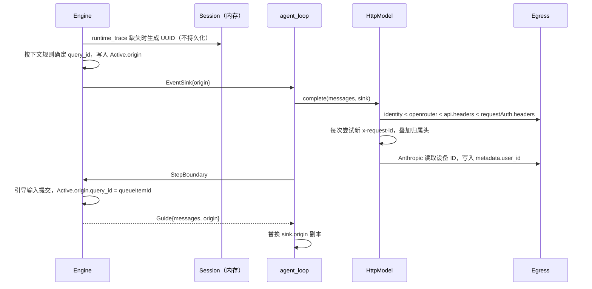
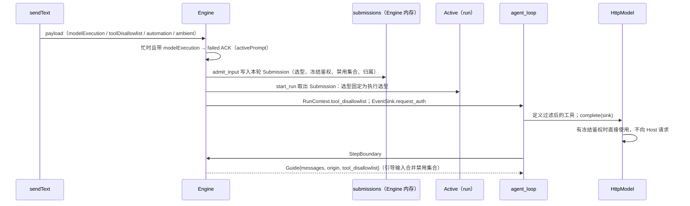

# Rust M1：配置、网络出口与输入兼容

总设计见 [P0/P1 架构设计](rust-p0-p1-architecture.md) 5.2–5.4。原则：**对齐 Node 现有行为**（2026-09-23 确认，含已知缺陷，例如 D13）。每项单独提交；提交前清理编译产物、以 `CARGO_INCREMENTAL=0` 构建，Rust 单测与 Node 集成测试全部通过。

## 1. 交付项

1. **配置体系**：纯逻辑放 `domain::config`，文件与环境 IO 放 `host::config`；各适配器只使用 composition root 注入的加载器，不再自行读取配置文件。
2. **运行环境与网络出口**：启动时计算子进程环境；新增 `net` crate，负责代理、CA、身份头、Coding Plan 网关和设备 ID；模型、MCP、子进程统一使用。
3. **`sendText` 扩展字段**：`browserAmbientContext`、`toolDisallowlist`、`modelExecution`，以及 automation/off-peak 归属。
4. **`session/close`**：Host 与 UI 仍在调用的旧方法。

## 2. 配置体系

依据 `apps/zcode-cli/packages/adapters/src/config/`。

### 2.1 所有者与流程

```text
host::config::load(cwd, env)            （IO：发现并读取文件）
  ├─ 用户层 ~/.zcode/cli/config.json
  ├─ 项目层：git 根 → cwd，每级 zcode.json、.zcode/config.json（规范路径去重）
  └─ 环境层 ZCODE_*
        ↓ domain::config（纯函数）
  parse_file → normalize → validate → to_patch
  merge_layers(system < user < project < env < cli)
  resolve_mcp(system < project < user < env < cli)
        ↓
  Arc<ConfigSnapshot>（不可变）
```

- 与 Node 一致，没有文件监听：每个入口（启动、MCP 准备、Skill/Agent 发现、插件操作）重新加载。加载器以端口 `ConfigSource` 注入，适配器只拿快照。
- `ConfigSnapshot` 包含：各段的类型化字段（network、storage、permission、modelStream、features、memory、skills、skillOverrides、commandOverrides、logging、ui、toolConcurrency、modelAnomalyGuard、hooks）、按 Node 规则解析后的 MCP servers 及其来源、plugins 段与插件来源、项目 hooks 信任候选、诊断信息、合并后的原始 JSON（透传未知键）。

### 2.2 解析与校验

- 读取失败或 JSON 不合法：该文件 `loaded=false`，产生 `config_file_invalid`（error），整份忽略。
- MCP 旧格式归一化同 `normalizeMcpServerConfigInput`：
  - `environment` 转为 `env`；
  - `enable` 与 `enabled` 冲突时以停用为准；
  - 删除 `timeout`、`startup_timeout_sec`；
  - `remote` 转为 `http`；缺少 type 时按 command/url 推断；
  - `http_headers` 转为 `headers`。
- 单个 MCP server 校验失败只丢弃该项，产生 `config_mcp_server_invalid`（warning）；`mcp.servers` 不是对象时全部忽略。
- 整份文件按 `ZCodeConfigFileSchema` 校验，失败则整份忽略。schema 由 `scripts/generate-zcode-cli-rust-config-schema.mjs` 从 TS 导出（zod 4 `toJSONSchema`），用 M0 的子集校验器执行，`--check` 纳入测试。
- 转换为运行时补丁同 `parsedConfigFileToRuntimePatch`：
  - `skills[绝对路径]={enable}` 映射为 skillOverrides，与 `skill` 段合并；`command` 映射为 commandOverrides；
  - plugins 中 CUA 插件旧 id 规范化为新 id。Node 在加载时还会把迁移写回磁盘，Rust 只在内存中规范化、不写盘，结果相同。

### 2.3 合并

- 规则同 `config-merger.ts`：各段一层浅合并；mcp.servers 按名合并。
- plugins 专门处理：`dirs` 取并集，`enabledPlugins`、`extraKnownMarketplaces`、`options` 按 key 合并；项目层的 `extraKnownMarketplaces` 丢弃。
- hooks：来源 `enabled !== false` 时追加事件，`enabled` 取任一层为真。
- 项目层 hooks 从可执行合并中剔除，只作为信任候选保留，并产生 `config_project_hooks_pending_trust`。项目层 stdio MCP 的相对 `cwd` 按项目基准目录解析（`.zcode/config.json` 的基准目录是其上一级）。
- MCP servers 单独按 system < project < user < env < cli 解析，即用户层覆盖项目层。
- 环境层同 `env-config.adapter.ts`：`ZCODE_STORAGE_DIR`、`ZCODE_SESSION_DB_PATH`/`ZCODE_SESSION_DB`、`ZCODE_HTTP_PROXY`、`ZCODE_NO_PROXY`、`ZCODE_AGENT_CA_CERT`、`ZCODE_HTTP_TIMEOUT`/`ZCODE_TIMEOUT`、`ZCODE_LOG_FORMAT`、`ZCODE_MAX_TOOL_CONCURRENCY`。数值按 JS `Number()` 解析，NaN 记为 0（D13，保持 Node 语义）；按环境变量出现顺序，后出现者覆盖。
- 默认值同 `DefaultRuntimeConfig`。

### 2.4 验收

- 纯函数的表驱动测试，夹具由 `scripts/generate-zcode-cli-rust-fixtures.mjs` 调用 TS 的 `parseConfigFileToRuntimePatchWithDiagnostics`、`mergeConfigs`、`parseEnvConfig` 批量生成。
- 项目 MCP cwd 用例使用当前 OS 的真实绝对路径：Windows 带盘符并预期反斜杠，POSIX 预期 `/`。分别验证相对 cwd、缺省 cwd、绝对 cwd 与 HTTP server 不注入 cwd，避免把 POSIX fixture 的表示差异误判为 Windows 解析失败。
- MCP、Skill、Agent profile、插件发现改用快照后，现有集成测试保持通过；新增用户层覆盖项目层 MCP 的集成用例。

## 3. 运行环境与网络出口

依据 `packages/shared/src/runtimeEnv.ts`、`adapters/src/network/*`、`bootstrap/src/model-config.ts`、`runtime-platform-headers.ts`、`adapters/src/model/{model-execution,official-coding-plan-gateway,anthropic-request-metadata}.ts`、`adapters/src/device/cli-device-mid.ts`。

### 3.1 运行环境（启动时计算一次）

- **passthrough**：已有的 `ZCODE_TOOL_ENV_PASSTHROUGH_JSON`，加上当前环境中所有可捕获的键（`shouldCaptureZCodeToolEnvPassthroughKey`：排除 `OTEL_*`、`ZCODE_TELEMETRY_*`、`ZCODE_MODEL_TELEMETRY_ENABLED` 与非工具键）。
- **子进程基础环境**：当前环境去掉 `SANITIZED_RUNTIME_ENV_KEYS`，以及匹配 `^(npm_config|yarn|pnpm)_(http_proxy|https_proxy|proxy|all_proxy|no_proxy|cafile|ca)$`（不区分大小写）的键。
- **`Egress::child_env()`** 同 `applyNetworkEgressEnv`：
  1. 在基础环境上删除 passthrough 键；
  2. 还原 passthrough 的值；
  3. 若配置了代理（`network.httpProxy`，其次 `ZCODE_HTTP_PROXY`），写入六个代理键；
  4. 若配置了 no_proxy，写入 `NO_PROXY`、`no_proxy`；
  5. 若配置了 CA，写入五个 CA 键。

  Windows 上键名不区分大小写。

- Bash、MCP stdio、git 上下文命令、将来的 hooks 与插件 git，都以 `env_clear()` 加 `child_env()` 启动；进程自身环境不被修改，因此不存在多线程下修改环境的问题。

### 3.2 HTTP 客户端

- **代理**：只认 `network.httpProxy` → `ZCODE_HTTP_PROXY`；`no_proxy` 取 `network.noProxy` → `ZCODE_NO_PROXY`，按 `http-config.ts` 的规则逐 URL 匹配（逗号分隔、`*`、带端口 token、`*.x` 或 `.x` 或 `x` 匹配自身与子域、带 scheme 的 token、方括号 IPv6）。关闭 reqwest 对 `HTTP(S)_PROXY` 环境变量的自动读取：模型与 MCP 请求与 Node 一样不使用 shell 代理。WebFetch 另用 passthrough 中捕获的 shell 代理（M5）。支持 http、https、socks5 代理；PAC 不支持，配置时明确报错。
- **CA**：`network.caCertFile` → `ZCODE_AGENT_CA_CERT`，读 PEM 后**替换**系统根证书（与 Node 一致）。
- **超时**：`network.timeout` 不作用于模型请求（与 Node 一致），模型请求沿用 `modelStream.idleTimeoutMs`。
- 模型与 MCP HTTP 共用同一个客户端构建函数；按用途各建一个客户端并惰性初始化。

### 3.3 身份请求头（仅模型请求）

- **默认头**，进程内计算一次：
  - `HTTP-Referer`：ZCode origin，取 `ZCODE_BASE_URL`，其次 `ZCODE_ENDPOINT_ORIGIN`，默认 `https://zcode.z.ai`；
  - `User-Agent`：`ZCode/<version>`，version 取 `ZCODE_APP_VERSION`，否则取 Rust 包版本；
  - `X-ZCode-App-Version`；
  - `X-Title`：app-server 时为 `Z Code@electron`；
  - `X-Release-Channel`：`ZCODE_ENV=test` 时为 test，否则 production；
  - `X-Client-Language`：由 LC_ALL/LC_MESSAGES/LANG 推出 BCP47；
  - `X-Client-Timezone`：IANA 时区；
  - `X-ZCode-Agent: glm`；
  - `X-Platform`：Node 命名的 `darwin|win32|linux-arm64|x64`；
  - `X-Os-Category`：macos/windows/linux；
  - `X-Os-Version`：内核版本。
  - 值必须是可打印 ASCII，否则省略。
- **合并顺序**（不区分大小写，后者覆盖）：默认头 < OpenRouter 归属头（`X-OpenRouter-Title`、`X-OpenRouter-Categories`，仅 `*.openrouter.ai`） < provider `api.headers` < 每次尝试的 `requestAuth.headers` < 请求归属头（`x-request-id`、`x-zcode-session-type`（main/subagent/other）、`x-zcode-trace-id`、`x-query-id`（去掉 `query_` 前缀）、`x-session-id`（去掉 `sess_`/`subagent_agent_` 前缀））。
- **Anthropic 鉴权**：没有显式 Authorization 时补 `Bearer <apiKey>`；已有的 `x-api-key` 行为保持。
- **Coding Plan 网关**：`https://open.bigmodel.cn/api/anthropic/v1/messages` 改写为 `{origin}/api/v1/ultra/anthropic/v1/messages`，`https://api.z.ai/api/anthropic/v1/messages` 改写为 `{origin}/api/v1/ultra-zai/anthropic/v1/messages`。匹配 https、小写 host、端口（默认 443）、去掉尾部斜杠的路径；保留 query，删除 Host 头。改写在选择代理之前。
- **Anthropic `metadata.user_id`**：`{"device_id":…,"account_uuid":"","session_id":…}` 的 JSON 字符串，session id 去掉前缀。
- **设备 ID**：`${ZCODE_DATA_BASE_DIR 或 home}/.zcode/v2/telemetry-state.json` 的 `deviceMid`，与 Desktop 共用。
  - 读写经 `telemetry-state.lock` 独占锁：最多 200 次、每次 10 ms，锁超过 5 分钟或持有进程已死即视为过期；
  - 原子写入；进程内缓存；任何失败都退回仅本进程有效的 UUID。

### 3.4 reqwest 版本

模型原先使用 reqwest 0.12，MCP（rmcp）使用 0.13。现已统一到 0.13，共用同一套代理、CA 与构建逻辑。

- 0.13 的 `tls_certs_only` 可以替换根证书，因此不再保留两个版本。
- 依赖树因此移除了 reqwest 0.12 及其 quinn、rand 等传递依赖。

### 3.5 Rust 实现结构

新增 `crates/net`（`zcode-cli-net`），不依赖任何内部 crate，只做运行环境与网络出口：

| 模块      | 内容                                                  | Node 对应                                                                 |
| --------- | ----------------------------------------------------- | ------------------------------------------------------------------------- |
| `env`     | `RuntimeEnv`：启动时捕获一次的进程环境视图            | `runtimeEnv.ts`、`cli/src/env.ts`                                         |
| `proxy`   | 代理与 no_proxy 解析                                  | `http-config.ts`                                                          |
| `child`   | 子进程环境                                            | `subprocess-env.ts`                                                       |
| `headers` | 默认身份头、不区分大小写合并、OpenRouter 与请求归属头 | `model-config.ts`、`runtime-platform-headers.ts`、`runner-attribution.ts` |
| `gateway` | Coding Plan 网关改写                                  | `official-coding-plan-gateway.ts`                                         |
| `device`  | 设备 ID                                               | `cli-device-mid.ts`                                                       |
| `Egress`  | 以上各项的唯一持有者，按用途惰性构建 reqwest 客户端   | `createNetworkProxyFetch`                                                 |

**运行环境**

- `RuntimeEnv::capture` 等价于 Node 的 `applyCliRuntimeEnvSanitization`：
  - 先捕获 passthrough，再剔除敏感键，写回 `ZCODE_TOOL_ENV_PASSTHROUGH_JSON`；
  - `ZCODE_RUNTIME_ENV` 缺省为 `production`；
  - 按 beta 规则补 `ZCODE_STORAGE_DIR`。
- 结果就是 Node 启动后的 `process.env`。Rust 不修改真实进程环境，所有读取方都从这份视图取值：配置 env 层、代理解析、子进程。
- 子进程分两类：
  - **普通子进程**（git 上下文）：使用 `RuntimeEnv` 视图本身，对应 Node 用默认 `process.env` 启动的 `execFile`；
  - **工具子进程**（Bash、MCP stdio）：使用 `child_env`，即 `applyNetworkEgressEnv(sanitize(视图), 视图)`。

  两者都以 `env_clear()` 加完整环境启动。

- 网络策略取启动时的配置快照。Node 的 MCP、执行与模型适配器也都在 app 创建时读取一次 `network`，运行中改配置不影响已创建的出口。`child_env` 因此在启动时算好并共享。

**HTTP 客户端**

- `Egress::client(Purpose)` 为 `Model` 与 `Mcp` 各惰性构建一个客户端，构建放在 `spawn_blocking` 中执行，因为它要读 CA 文件并初始化平台校验器。
- 每个客户端都：
  - 先关闭系统代理（`no_proxy()`）；
  - 再装入 `Proxy::custom`，按 Node 规则逐 URL 决定代理；
  - 配置了 CA 时用 `tls_certs_only` 替换根证书。
- ring crypto provider 在构建函数中幂等安装。
- CA 文件读取失败时，客户端构建失败，本次请求以网络错误结束。Node 同样是在首次请求时读文件并抛错。
- reqwest 统一到 0.13：
  - features 为 `json`、`stream`、`rustls-no-provider`、`socks`；
  - 去掉 `reqwest_mcp` 别名；
  - state crate 只用 URL 解析，改为直接依赖 `url`。

**请求归属上下文**

`EventSink` 增加 `origin: Arc<RequestOrigin>`，内容为 `{ kind: Main | Subagent | Other, session_id, trace_id, query_id }`。

- 唯一所有者是 Engine：run 的当前 origin 存在 `Active` 中。
- agent loop 只持有副本；引导消息提交时，Engine 更新 `Active` 并在回执中带回新 origin，loop 替换副本。



origin 各字段的取值：

- **trace_id**：对应 Node 每个会话运行时创建一次的 root trace（UUID，不落盘）。Rust 存于 `Session.runtime_trace`，该字段 `serde(skip)`。
- **query_id**：对应 Node 的 inputId。
  - 直接开始的输入：`userInput` 行 id，与 ACK 的 `inputId` 相同；
  - 由队列提升的输入与引导输入：`queueItemId`；
  - 没有用户输入的续跑（子代理完成回流、目标续跑）：本轮 `userInput` 行 id，找不到时用 turn id。
- **kind**：
  - 主会话为 `Main`；
  - 有 `parent_id` 的子会话为 `Subagent`，它继承父 run 的 trace_id 与 query_id（Node 子任务沿用父 turn 的 trace 上下文）；
  - 压缩摘要（hidden sink）、工作区生成文本、连通性测试、MCP 相关请求为 `Other`，与 Node 中 `AgentStep` 以外的操作一致。
- **session_id**：辅助请求没有会话，因此不发送 `x-session-id`，trace 为本次请求新建。

**其它取值**

- `X-Client-Language`：
  - 按 ICU 规则，依次取 `LC_ALL`、`LC_MESSAGES`、`LANG` 中第一个**存在**的变量；
  - 去掉 `.charset`；`@modifier` 作为变体附加；`_` 换成 `-`；
  - `C`、`POSIX` 为 `en-US`，空串为 `und`，都不存在为 `en-US`。
- `X-Client-Timezone`：
  - `TZ` 存在时去掉前导 `:`，空串为 `Etc/Unknown`；
  - 名称在系统 zoneinfo 中不存在时为 `unknown`；
  - 未设置 `TZ` 时取系统 IANA 时区。
- `User-Agent` 为 `ZCode/<version>`。Node 的 AI SDK 会在其后追加 `ai-sdk/provider-utils/<v> runtime/node.js/<v>`，这两段描述的是 Node 运行时，Rust 不伪造。
- `ZCODE_BASE_URL` 或 `ZCODE_ENDPOINT_ORIGIN` 不是 http(s) URL 时：
  - Node 在创建 app 时抛错；
  - Rust 在启动时报 `Invalid network configuration` 并退出，不会在每次请求时才失败。
- Windows：
  - `X-Os-Version` 用 `RtlGetVersion`，与 libuv 的 `os.release()` 相同；
  - 设备锁持有进程的存活判定用 `OpenProcess` 加 `GetExitCodeProcess`，与 libuv 的 `kill(pid, 0)` 相同。

  这两段代码只在 Windows 上编译，本机（macOS）无法验证。

**验证**

- Node 夹具：`scripts/zcode-cli-rust-egress-fixtures.mjs` 直接调用 Node 函数，生成 `crates/net/fixtures/egress.json`，覆盖：
  - 代理与 no_proxy；
  - WebFetch 回退；
  - 子进程环境（含 Windows 大小写）；
  - 运行环境捕获与 passthrough 排序；
  - 网关改写；
  - 请求头合并、归属头、OpenRouter、身份头。
- `packages/services/tests/zcode-cli-rust-egress.test.ts` 用真实进程验证：
  - 身份头与归属头，以及忽略 shell 代理；
  - Anthropic `metadata.user_id`；
  - 显式代理与 no_proxy；
  - Bash 子进程环境；
  - 自定义 CA 信任与 CA 文件缺失。
- 子代理与引导输入的 trace/query 继承，在已有的子代理与忙时输入集成测试中断言。

## 4. `sendText` 扩展字段

依据 `core/src/runtime/helpers/conversation.ts:141-181`、`bootstrap/src/zcode-protocol-v4/commands/prompt-turn.ts:189-256`、`packages/shared/src/model-execution.ts`。M0 的 admission 已按 TS schema 校验字段结构与跨字段规则。

- **`browserAmbientContext`**：`tabCount` 为正整数且文本非空时，把本轮用户文本改写为 Node 的 `<in-app-browser-context source="ambient-ui-state">…## My request for ZCode:\n<text>` 格式（逐字一致）。
  - 改写只存在于内存中的规范消息（私有字段 `_zcode_request_content`，请求投影与压缩读取它）；持久化与 rows 使用原文。重启后改写消失，与 Node 一致。
- **禁用工具**：本轮冻结的禁用集合 = payload 的 `toolDisallowlist`，加上 automation 时的 `CronCreate/CronUpdate/CronDelete`，加上 off-peak 时的 `OffPeakCreate/SendMessage/Workflow`。
  - automation/off-peak 由显式 `automationId`/`offPeakTaskId` 判定，或由 inputId 前缀 `automation-`/`offpeak-` 推出（取 `:` 之前的部分，长度必须超过前缀）。
  - 只从提供给模型的工具定义中移除；模型仍调用被隐藏工具时照常执行（D1，保持 Node 语义）。
- **`modelExecution`**：
  - 会话忙时拒绝；
  - 选型只用于本轮，不写入会话、不改会话选择；
  - `requestAuth`（apiKey/headers）冻结在本轮，覆盖该轮每次请求的鉴权且不向 Host 请求，从不持久化、不写日志；
  - `subagents.foregroundModel=submission` 时前台子代理沿用本轮选型与鉴权，`background=deny` 时拒绝后台子代理；
  - `memoryExtraction=skip` 只记录（Rust 尚无记忆提取）。
- **`automationId`、`offPeakTaskId`、`offPeakRunType`**：记录为本轮归属，参与上面的禁用集合计算。

### 4.1 输入标识（与 Node 对齐的修正）

- Node V4 中 `inputId = queryId = commandId`：
  - 各入口 ACK 的 `inputId` 都是提交该输入的 `commandId`；
  - 队列项 id 为 `queue_<commandId>`。
- Rust 原先 ACK 返回 `userInput` 行 id 或队列项 id，已改为 `commandId`。
- 模型请求的 query id 取本轮 `userInput` 行的 `sourceCommandId`；引导输入取队列项的 `sourceCommandId`。

### 4.2 Rust 结构



- **Submission 的唯一所有者是 Engine**：
  - `admit_input` 写入，`start_run` 取出后挂到 `Active`，run 结束随 `Active` 释放；
  - 会话结构（domain `Session`）不持有凭据。
- **冻结鉴权**：
  - `{apiKey?, headers?}` 只存在于 `Active` 和 `EventSink.request_auth`，`Debug` 输出为 `<redacted>`；
  - 历史边界 payload 在落盘前剔除 `modelExecution`、`browserAmbientContext`、`toolDisallowlist`、`automationId`、`offPeakTaskId`、`offPeakRunType`；这些字段属于 Node 的 `SendInputOptions`，不属于可持久化的 intent。
- **执行选型**：
  - 带 `modelExecution` 时不调用 `apply_selection`；
  - `notify_selection` 不把会话选型推给该 run。
- **模型鉴权**：
  - `requestAuth.apiKey` 覆盖任意 provider 的 key；
  - `requestAuth.headers` 按 3.3 的顺序合并；
  - 账号型 provider 带冻结鉴权时不发 `RequestAuth` 事件。
- **队列项**：
  - 保存计算后的禁用集合，提升时重新套用（Node `queueItem.toolDisallowlist`）；
  - `modelExecution` 不会进入队列，因为忙时直接拒绝。
- **子代理**（`subagents` 存在时）：
  - 前台子代理的选型与冻结鉴权取本轮 Submission，优先于 profile 选型；
  - `background=deny` 时，后台请求返回工具错误 `Idle-time tasks do not support background agents. Run this agent in the foreground.`
- **浏览器环境上下文**：
  - 用户消息在内存中带私有字段 `_zcode_request_content`；
  - `model_protocol::body` 在所有协议的请求边界用它替换 `content`，压缩也经过同一边界；
  - 消息落盘时剔除该字段。

## 5. `session/close`

依据 `bootstrap/src/zcode-protocol/server-operations.ts:2708-2733`。

- 参数 `{sessionId, workspace?, expectedPersistence?}`。会话不在活动集合时返回 `-32004 "Session is not active: <id>"`。
- 当前 persistence：草稿为 `deferred`，其余为 `immediate`。带了 `expectedPersistence` 且不一致时返回 `{closed:false}`，不做任何改动。
- 否则走与 `deleteSession` 相同的 actor 收口：取消前后台工作、释放等待者、关闭上传与订阅、发布 index 移除、回收无历史的草稿，已持久化的历史保留。返回 `{closed:true}`。
- 为此把现有 `deleteSession` 的收口逻辑提取为共享方法，V4 命令与旧方法只是两个入口。

## 6. 验收

- 各项的 Rust 单测与集成测试：
  - 代理与 no_proxy 匹配（Node 夹具）、CA 替换、默认头与合并顺序、网关改写、设备 ID 锁与回退；
  - 子进程环境（Bash 看到的代理与 CA 变量）；
  - 浏览器上下文改写只进入请求、不进入持久化；
  - 禁用集合过滤工具定义；
  - `modelExecution` 本轮选型与鉴权不写入会话，忙时拒绝；
  - `session/close` 的三种结果。
- 每项提交前：`cargo clean`、`pnpm test:zcode-cli-rust`、`pnpm check:zcode-cli-rust`；改动 TS 文件时加跑 `pnpm typecheck`、`pnpm lint`。
