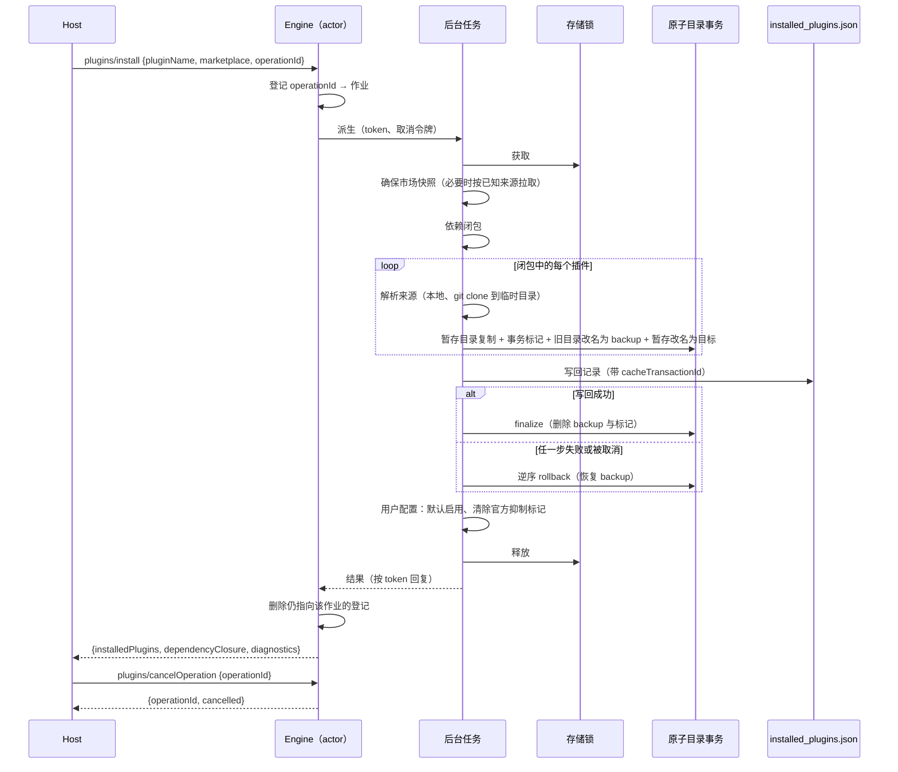

# Rust M10.4：插件来源、市场与安装

M10 的第四期（总览见 `rust-m10-plugins.md` §1）。依据 Node 源码中的以下文件：

- `adapters/src/plugins/{marketplace,atomic-directory,official-marketplace,source-errors,helpers}.ts`
- `adapters/src/plugins/{zip-source,github-archive-source}.ts`（M10.4b）
- `adapters/src/config/file-config.adapter.ts`（`enablePluginsByDefaultInFileConfig`）
- `bootstrap/src/plugins.ts`（市场、安装、校验、描述）
- `bootstrap/src/zcode-protocol/{plugins,plugin-reference-catalog,server}.ts`

协议形状以 `packages/shared/src/zcode-protocol/index.ts` 为准。

## 1. 分期

| 分期   | 内容                                                                                                                                                                                                                                                                                       |
| ------ | ------------------------------------------------------------------------------------------------------------------------------------------------------------------------------------------------------------------------------------------------------------------------------------------ |
| M10.4a | 原子目录事务；市场来源 `directory`、`file`、`settings`、`url`（JSON）、`git`、`github`（系统 Git）；插件来源 `directory`、相对路径、`git`、`github`、`git-subdir`、内置 `filesystem`/`sea`；市场 `add`、`remove`、`update`；`install`、`update`、`validate`、`describe`；`cancelOperation` |
| M10.4b | 插件来源 `url`+`zip`（https、sha256）；公开 GitHub 仓库先走 archive，再按规则回退系统 Git；`resolveSuggestedReference` 与 `plugins/operationProgress`                                                                                                                                      |

M10.4a 期间：

- `url`+`zip` 插件来源报 `Plugin zip sources are not supported yet`，诊断码为 `plugin_marketplace_source_unsupported`。
- GitHub 来源直接用系统 Git。
- `resolveSuggestedReference` 不注册。

## 2. 所有者与时序

- **存储锁**（M10.3 的 `atomic_write::lock`，每个存储根一把进程内互斥锁）串行化以下方法：`marketplace/add`、`marketplace/remove`、`marketplace/update`、`install`、`update`、`validate`、`describe`、`uninstall`、`restoreBuiltin`。与 Node 相同，锁不跨进程。
- **权威文件**：
  - 市场目录 `marketplaces/<id>/` 以 `known_marketplaces.json` 为权威；
  - 插件缓存 `cache/<market>/<name>/<version>/` 以 `installed_plugins.json` 为权威。
  - 权威记录携带 `cacheTransactionId`，与原子目录事务的 `transactionId` 相同。只有权威文件带上该 id 落盘之后，事务才算提交（§3）。
- **操作登记**：
  - Engine 按 `operationId`（去掉首尾空白）登记可取消的插件作业，覆盖 `setEnabled`、`marketplace/add`、`marketplace/update`、`install`，M10.4b 起加上 `resolveSuggestedReference`。
  - 同一 id 重复登记时，新作业覆盖旧作业（Node 的 `Map.set`）：旧作业仍会执行，但不再能被取消。
  - 作业结束时，只删除仍指向自己的登记。
- **取消**：
  - `plugins/cancelOperation {operationId}` 在 actor 内同步处理，取消登记的作业并删除登记。返回 `{operationId, cancelled}`，登记不存在时 `cancelled: false`。
  - 作业看到取消令牌后按 Node 语义结束：
    - `install` 返回带诊断的正常结果；
    - `marketplace/add`、`marketplace/update`、`setEnabled` 以错误结束；
    - 取消不写入市场刷新失败记录。

## 3. 原子目录事务（`activateDirectoryAtomically`）

- **暂存**：
  - 创建暂存容器 `<parent>/.<name>.stage-XXXXXX`；
  - 有来源目录时，把来源树复制到 `容器/content`，否则建空目录；
  - 执行 prepare（写 `marketplace.json`，或写合成的插件 manifest）；
  - 检查取消。
- **进程内保留**：同一目标已有进行中的事务时报错 `Atomic directory activation is already active: <target>`。
- **提交点**：
  - 登记活跃事务，排他写入事务标记 `.<name>.transaction.json`（version 2，`mode` 为 `coordinated` 或 `standalone`；`authorityPath` 取绝对路径）；
  - 目标存在时改名为 `.<name>.backup`；
  - 暂存改名为目标；
  - 删除暂存容器。
  - 提交点之后不再响应取消。
- **finalize**：删除 backup 与标记，解除登记。
- **rollback**：删除目标，恢复 backup，删除标记，解除登记。
- **复制语义**同 Node `fs.cp(recursive, force)`：
  - 保留文件权限，不保留时间戳；
  - 符号链接按原样重建，相对目标解析成绝对路径（Node `verbatimSymlinks: false`）。
- 读取方的恢复规则已在 M10.1 实现（`atomic::recover`），两端边车格式互通。

## 4. 市场来源

### 4.1 输入解析（`parseMarketplaceSourceInput`，用于 `marketplace/add` 与 `validate` 的 `source`）

- 去掉首尾空白后为空：报错 `Marketplace source is empty`。
- 以 `http://` 或 `https://` 开头：
  - 按最后一个 `#` 拆出 ref。
  - URL 以 `.git` 结尾或含 `/_git/`：`{source:"git", url, ref?}`。
  - `github.com` 或 `www.github.com` 的 `owner/repo` 路径：补上 `.git` 后作为 `git` 来源。
  - 其余：`{source:"url", url}`（不带 ref）。
- 形如 `user@host:path`（SSH）：`git` 来源，按 `#` 拆出 ref。
- 以 `./`、`../`、`/`、`~` 或 `X:\`、`X:/` 开头：
  - 路径按进程工作目录解析；`~` 按 `HOME`（缺失时为空串）展开。
  - 路径不存在时报 `Marketplace source path does not exist`。
  - 是文件时必须以 `.json` 结尾，得到 `{source:"file", path}`；是目录时得到 `{source:"directory", path}`。
- 含 `/` 且不含 `:`：GitHub 简写，按最后一个 `#` 或 `@` 拆出 ref，得到 `{source:"github", repo, ref?}`。
- 以上都不匹配：报错 `Unsupported marketplace source: <input>`。

### 4.2 拉取（`loadMarketplaceFromSource`，不落盘）

| 来源                                | 行为                                                                                                                                                                                                                                                                            |
| ----------------------------------- | ------------------------------------------------------------------------------------------------------------------------------------------------------------------------------------------------------------------------------------------------------------------------------- |
| `settings`                          | 直接规范化 `source.marketplace`，不校验名称                                                                                                                                                                                                                                     |
| `file`                              | 读取并解析；`sourceRoot` 为文件所在目录                                                                                                                                                                                                                                         |
| `directory`                         | 在目录中依次找 `.claude-plugin/marketplace.json`、`marketplace.json`；`sourceRoot` 为该目录                                                                                                                                                                                     |
| `url`                               | HTTP GET（§4.3）后解析                                                                                                                                                                                                                                                          |
| `github`、`git`                     | `github` 的仓库地址为 `https://github.com/<repo>.git`。浅克隆到临时目录（§6），有 `sparsePaths` 时用稀疏检出。按 `source.path`、`.claude-plugin/marketplace.json`、`marketplace.json` 的顺序找 manifest。`sourceRoot` 为克隆目录，用完清理。M10.4b 起，非稀疏检出先尝试 archive |
| `npm`、`hostPattern`、`pathPattern` | 报错：`Marketplace source is recognized but not supported in this runtime: <kind>`                                                                                                                                                                                              |
| 其他                                | 报错 `Cannot read properties of undefined (reading 'manifest')`，这是 Node 缺陷（switch 无 default），照样保留                                                                                                                                                                  |

manifest 按 `parseMarketplaceManifest` 解析：名称须匹配 `^[a-z0-9][a-z0-9._-]{0,127}$`，否则报错 `Marketplace manifest is invalid`。

### 4.3 HTTP JSON（`requestMarketplaceJson`）

- 使用 WebFetch 出口（ZCode 显式代理，shell 代理作为兜底；CA 覆盖）。
- 限制：上限 10 MiB，超时 180 s。
- 重定向手动跟随，最多 5 次：
  - 跨 origin 时丢弃市场自定义 header；
  - 缺少 `Location` 时报错 `Marketplace redirect is missing Location header: <url>`；
  - 超过 5 次时报错 `Marketplace fetch exceeded redirect limit: <url>`。
- 非 2xx 响应报错 `Failed to fetch marketplace: <status> <statusText>`。
- 网络错误的文案与 Node HTTP 适配器一致：
  - 超时：`HTTP request timed out after <ms>ms`；
  - 取消：`This operation was aborted`；
  - 其他：`fetch failed`。
  - 超限：`HTTP response is too large: …`。

### 4.4 官方市场分片（`writeCdnOfficialMarketplacePartitionSync`）

名为 `zcode-plugins-official` 的 manifest 按以下步骤写入：

1. 写 `marketplaces/zcode-plugins-official/cdn-marketplace.json`。
2. 与 `bundled-marketplace.json` 的分片合并：
   - 合并结果为 `{...bundled, ...cdn, name, plugins: [...cdn, ...同名以外的 bundled]}`；
   - 写到 `marketplace.json`，内容相同则跳过。
3. 持久化与计数都以合并结果为准。

官方的 `url` 来源不走目录事务，与 Node 相同。

## 5. 插件来源（`resolvePluginSourceRoot`）

基准目录：

- 市场目录（`sourceRoot`，或 `marketplaces/<id>/`）；
- 若 `metadata.pluginRoot` 在市场目录内且存在，则改用它。

| `entry.source`                     | 行为                                                                                                                                                |
| ---------------------------------- | --------------------------------------------------------------------------------------------------------------------------------------------------- |
| `"filesystem"`、`"sea"`            | 依次取 `cachePath`、`cache/<market>/<name>/<version ?? 0.0.0>`；都不存在时报错 `Bundled plugin cache directory missing`                             |
| 字符串                             | 去掉开头的 `./`，按基准目录解析，并限制在基准目录内；不存在时按进程工作目录解析（Node 行为）；都不存在时报错 `Unsupported or missing plugin source` |
| `{source:"directory", path}`       | 绝对化后必须存在                                                                                                                                    |
| `{source:"github", repo}`          | 仓库地址为 `https://github.com/<repo>.git`，其余同 git                                                                                              |
| `{source:"git", url}`              | 克隆（§6），取 `path` 子目录；pin 为 `sha`，其次为 `commit`                                                                                         |
| `{source:"url", url, type?}`       | `type` 为 `zip` 时见 M10.4b；为空或 `git` 时按 git 处理；其他值报错 `Plugin source is recognized but not supported in this runtime: url:<type>`     |
| `{source:"git-subdir", url, path}` | `owner/repo` 简写补全为 GitHub 地址                                                                                                                 |
| `npm`、`pip`                       | 报错 `Plugin source is recognized but not supported in this runtime: <kind>`                                                                        |
| 其他对象                           | 报错 `Plugin source is invalid or unsupported for <id>: <kind \| missing kind>`，不回退到同名目录                                                   |
| 缺失                               | 取基准目录下的 `<name>` 目录，不存在时报错 `Plugin source is not supported for <id>`                                                                |

必填字段缺失时报错 `Plugin <label> source requires a non-empty <field>`。

## 6. 系统 Git

- **可执行文件**：取 `ZCODE_GIT_BINARY`（去掉首尾空白后非空），否则为 `git`。
- **环境变量**：Node `buildMarketplaceGitEnv` 的做法，即在净化后的进程环境上叠加网络出口变量，不读取配置文件的 `network` 段。
- **超时**：单条命令 90 s，超时发送 SIGTERM。
- **插件克隆**：
  - 命令为 `clone [--depth 1] [--branch ref] <url> <dir>`；有 pin 时不加 `--depth 1`，克隆后执行 `-C dir checkout <pin>`。
  - 临时目录为 `<tmp>/zcode-plugin-src-XXXXXX`。
- **市场克隆**：
  - 命令为 `clone --depth 1 [--branch ref] [--filter=blob:none --sparse] <url> <dir>`，之后执行 `sparse-checkout set …`。
  - 临时目录为 `zcode-marketplace-src-XXXXXX`。
- **重试**：
  - 克隆最多 3 次。只有输出匹配网络类错误时才重试（`RPC failed`、`Operation timed out`、`Recv failure`、`expected flush`、`early EOF`、`remote end hung up`、`HTTP/2 stream`、`Connection reset`、`ETIMEDOUT`、`ECONNRESET`、`network timeout`，不区分大小写）。
  - 重试间隔为 `1 s × 次数`，可被取消。
  - 重试前清空目标目录。
- **错误**：
  - 命令失败：`Command failed: <bin> <args…>\n<stderr>`。
  - 取消：`The operation was aborted`。
  - 可执行文件不存在：诊断码 `plugin_git_unavailable`，文案为 `System Git is required for plugin source <来源>, but git is unavailable on this Agent Host. …`。来源 URL 中的用户名和密码会被清除。

## 7. 市场方法

- **`marketplace/add {source, dryRun?}`**：
  - `dryRun` 时只解析来源，返回 `{marketplace: {id:"dry-run", name:"dry-run", source, pluginCount:0, isOfficial:false}, diagnostics: []}`。
  - 否则执行 `addMarketplace`：
    1. 拉取；
    2. 校验：
       - 官方 id 保留：manifest 名为官方 id 且不等于 `trustedId` 时报错；
       - `expectedId` 不一致时报错；
       - 官方 `trustedId` 必须得到官方名；
    3. 官方 manifest 写分片（§4.4）；
    4. 目录事务：有 `sourceRoot` 时复制来源树，并把规范 manifest 写为 `marketplace.json`；否则非官方来源只暂存 manifest；
    5. 用 `upsertKnownMarketplace` 写入权威文件：
       - 保留旧记录的其他字段与 `addedAt`，去掉旧的 `cacheTransactionId` 与 `lastRefreshFailure`；
       - 记录字段依次为 `id`、`source`、`name`、`description?`、`addedAt`、`lastUpdated`、`pluginCount`、`cacheTransactionId?`；
    6. 事务目录存在时检查取消；
    7. finalize。
  - 任一步失败时：先回滚权威文件（并发改写时报错），再回滚目录事务；权威文件回滚失败时改为 finalize 目录事务。最后清理临时克隆。
- **`marketplace/remove {marketplace}`**：从 `known_marketplaces.json` 删除该记录，原子写回；不删除目录。返回 `{diagnostics: []}`。
- **`marketplace/update {marketplace?}`**（`updateZCodePluginMarketplace`）：
  - 声明来源为配置（合并视图）中的 `plugins.extraKnownMarketplaces`，其中相对 `file` 或 `directory` 路径按用户配置所在目录解析。
  - 目标：指定的 id；未指定时为全部已知记录，不包括仅声明的市场。
  - 指定的 id 既不是已知也不是声明：报错 `Marketplace not found: <id>`。
  - 对每个目标：
    - 指定 id、已声明、已知，但来源不同：产生 repoint 诊断并跳过。
    - 已声明但未知：以 `expectedId` 执行 add，失败时转为诊断。
    - 其余：用已知来源执行受信刷新（`trustedId = id`）。失败时写入 `lastRefreshFailure {code, failedAt, message}`；已取消时直接抛出，不写入失败记录。
  - 结果：
    - `marketplaces` 为成功刷新的摘要；
    - `diagnostics` 为声明诊断，加上所选记录（未指定 id 时为全部记录）的 `lastRefreshFailure`。
- 摘要形状同 `toMarketplaceSummaryData`：`isOfficial` 按官方 id 判断，`refreshFailure` 来自记录。

## 8. 安装、更新、校验与描述

- **`install {pluginName, marketplace, dryRun?}`**（`installZCodeMarketplacePlugin`，在存储锁内）：
  - 先确保默认市场记录存在。
  - **dryRun**，按顺序判断：
    - 声明来源与已知来源不一致：返回 repoint 诊断。
    - 声明了但未知，或没有快照：用 `validateMarketplaceSource` 校验声明来源（带 `expectedId` 与 `pluginName`）。
    - 其余：`validateMarketplacePlugin`。
  - **已被抑制的内置官方插件**（条目来源为 `filesystem` 或 `sea`）：
    - 走 restore（§3.10），重读配置并重新发现。
    - 结果为 `{dependencyClosure: [id], installedPlugins: [恢复后的摘要]}`；找不到时返回 `plugin_not_found` 诊断。
  - **正常流程**：
    1. 物化声明市场：已知但来源不同时报 repoint 错误；已知且有快照时跳过；否则以 `expectedId` 执行 add。
    2. `installMarketplacePlugin`：
       1. 确保快照（缺失时按已知来源执行受信 add）；
       2. 计算依赖闭包；
       3. 逐个缓存；
       4. 写回 `installed_plugins.json`；
       5. 失败时逆序回滚全部激活；
       6. 成功后 finalize。
    3. 以上失败时，返回 `{dependencyClosure: [], installedPlugins: [], diagnostics: [安装诊断]}`，不抛错。
    4. 官方市场：清除已安装 id 的抑制标记。
    5. **默认启用**（`enablePluginsByDefaultInFileConfig`）：用户配置 `enabledPlugins` 中尚无的 id 写为 `true`，保持键序。
    6. 摘要的 `enabled`：新写入的为 `true`，其余取合并配置中的值，缺省为 `false`。
- **依赖闭包**（`resolveDependencyClosure`）：
  - 深度优先，依赖在前、根在最后。
  - 跨市场依赖只允许根市场 `allowCrossMarketplaceDependenciesOn` 中列出的市场。
  - 错误：
    - 环：`Plugin dependency cycle: a -> b -> a`；
    - 缺失：`Dependency not found: … required by …`，或 `Marketplace not found for dependency`；
    - 跨市场：`Cross-marketplace dependency is blocked`。
  - 依赖引用的规范化：字符串去掉 `@^…` 后缀；对象取 `name`，有 `marketplace` 时拼成 `name@marketplace`。
- **缓存**（`cacheMarketplacePlugin`）：
  - 版本取来源根目录 manifest 的 `version`（非空白字符串），其次为条目的 `version`，最后为 `0.0.0`。
  - 目标目录：`cache/<market>/<name>/<version>`，各段经过 sanitize。
  - 来源与目标不同时走目录事务，prepare 在缺少 manifest 且 `strict === false` 时写合成的 `.claude-plugin/plugin.json`；来源与目标相同时直接写合成 manifest。
  - 合成 manifest：条目原文去掉 `source`、`category`、`tags`、`strict` 与展示字段，再覆盖 `name` 和 `version`（缺省 `0.0.0`）。
  - 记录：`{id, name, marketplace, version, installPath, installedAt, updatedAt, scope:"user", dependencies?, source?, cacheTransactionId?}`。已有同 id 记录时合并旧字段，保留旧的 `installedAt`。
- **`update {pluginId?, marketplace?}`**：
  - 按 `pluginId`，否则按 `marketplace` 筛选已安装记录，都没有时取全部。
  - 在锁内逐条重装，不刷新市场。
  - 合并 `installedPlugins`、`dependencyClosure` 与 `diagnostics`。
- **`validate {source? | pluginName+marketplace}`**：
  - 有 `source`：先解析输入，解析失败转为诊断；再执行 `validateMarketplaceSource`：
    - 名称不符的市场报错；
    - 空市场给出警告；
    - 远端条目推迟校验，给出 `plugin_validation_deferred` 警告和条目兼容性诊断；
    - 本地条目解析插件根并执行 `validatePluginRoot`。
  - 有 `pluginName` 与 `marketplace`：先确保快照；再执行 `validateMarketplacePlugin`：依赖诊断、解析来源、`validatePluginRoot`。
  - 都没有：返回空诊断。
  - 结果：`ok` 为不存在 `error` 级诊断，`compatibility` 为 Node 常量。
- **`validatePluginRoot`**：
  - manifest 读取失败：`plugin_manifest_invalid`。manifest 缺失且 `strict !== false`：`plugin_manifest_not_found`。
  - 名称与条目不符：`plugin_manifest_invalid`。
  - 以下字段仅诊断：`channels`、`lspServers`、`outputStyles`、`settings`。
  - 必填 `userConfig` 没有默认值：`plugin_variable_missing` 警告。
  - MCPB/DXT：警告。
  - MCP 在空环境与空选项下试解析，产生的诊断一并返回。
- **`describe {pluginName, marketplace}`**：
  - 已安装且缓存目录存在：读本地目录。
  - 否则：确保快照，找条目，解析来源（可能克隆），枚举组件后清理临时目录。
  - manifest 读取失败时不致命，退化为按默认目录约定扫描；hook 与 MCP 枚举产生的诊断一并返回。
  - `metadata` 取 manifest 的作者、主页与版本。
  - `diagnostics` 为空时省略。
- **诊断映射**：
  - `toValidationDiagnostic` 与 `toMarketplaceInstallDiagnostic`：
    - 来源错误带自己的诊断码（`plugin_git_unavailable`、`plugin_archive_fetch_failed`）；
    - `Unsupported…`：`plugin_marketplace_source_unsupported`；
    - 按文案判断的：`plugin_dependency_cross_marketplace`、`plugin_dependency_cycle`、`plugin_dependency_missing`、`plugin_not_found`（仅安装）；
    - 其余为 `plugin_marketplace_invalid`。
  - 协议诊断不带 `path`。

## 9. M10.4b：zip 与 GitHub archive

- **`{source:"url", type:"zip", url, sha256, headers?, path?, stripRoot?}`**：
  - URL 限制：必须是 https；http 只允许回环地址。
  - 请求头：不允许 `authorization`、`cookie`、`proxy-authorization`、`set-cookie`。
  - 下载：上限 200 MiB，超时 180 s，最多 5 次重定向，跨 origin 时丢弃 header。
  - 校验 sha256（64 位十六进制，不区分大小写）。
  - 解压限制：
    - 条目不超过 2 万个，总大小不超过 500 MiB，单个文件不超过 50 MiB；
    - 拒绝加密条目、符号链接、非常规类型，以及不安全路径（绝对路径、`..`、反斜杠、盘符、NUL）。
  - 根目录选择：
    - 有 `path` 时使用该子目录；
    - 否则，解压根有 manifest 时使用解压根；
    - 否则，`stripRoot !== false` 且只有一个顶层目录时使用该目录；
    - 否则使用解压根。
  - 安装前还须确认根目录有合法 manifest，且名称与条目一致。
- **公开 GitHub 仓库**：仅限 https、`github.com` 主机、`owner/repo` 格式，且不带凭据、查询串或片段。
  - 先下载 `api.github.com/repos/<o>/<r>/zipball/<pin|HEAD>`，要求只有一个顶层目录，并去掉该层。
  - 以下情况回退系统 Git：
    - 仓库有 `.gitmodules`；
    - 仓库或所选路径（含祖先目录）声明了 LFS；
    - 下载返回 401、403 或 404；
    - 压缩包含符号链接或不支持的条目类型。
  - 其他失败报 `plugin_archive_fetch_failed`。
- **`resolveSuggestedReference`**：
  - 只接受 `<name>@zcode-plugins-official`。
  - 在引用目录中先查本地：存在时返回 `ready`、`disabled` 或 `conflict`。
  - 否则发出 `plugins/operationProgress {operationId, state:"refreshing"}`，在 10 s 超时内刷新官方市场，再查一次。
  - 结果：取消时返回 `plugin_operation_cancelled`；刷新失败返回 `marketplace_refresh_failed`；其余情况按 overview 的可用条目返回 `missing` 或 `unavailable`。

## 10. 与 Node 的差异

- 存储 JSON（`installed_plugins.json`、`known_marketplaces.json`、市场快照、合成 manifest）的对象键按字母序写出，因为 serde_json 未开启 `preserve_order`。数组顺序与内容一致。用户配置文件仍保持原键序（§3.10）。
- 文件系统与 JSON 解析错误的文案来自 Rust（例如 `No such file or directory (os error 2)`）。Node 为 libuv 或 `JSON.parse` 的文案。
- HTTP 状态文案取标准原因短语，Node 为服务器返回的原文。
- Git 输出按字节读取后有损转为 UTF-8。Node 的 `maxBuffer` 为 10 MiB，超过时终止进程；Rust 同样只保留前 10 MiB，但不终止进程。

- `plugins/update` 在存储锁内读取待重装的安装记录；Node 在加锁前读取，并发卸载时可能重装刚删除的记录。

## 11. 验收

- **单测**：
  - 来源输入解析；
  - 原子目录事务：提交、finalize、rollback，并发保留报错，与读取恢复互通；
  - 依赖闭包的环、缺失与跨市场；
  - 版本解析与合成 manifest；
  - 官方分片合并；
  - 诊断映射；
  - Git 重试判定；缺少可执行文件时的来源脱敏。
- **集成**（`zcode-cli-rust-plugin-install.test.ts`，App schema 严格校验）：
  1. 本地目录市场：
     - `add`，含 dry-run；
     - `overview` 可见；
     - `install` 带依赖闭包，写入缓存、记录与默认启用；
     - `plugins/list` 可见；
     - `describe` 与 `validate`；
     - `update` 重装；
     - `remove`。
  2. git 市场与 git 插件来源（本地 `file://` 仓库）：通过声明来源物化、`marketplace/update` 刷新、pin 检出。系统 Git 不存在（`ZCODE_GIT_BINARY` 指向不存在的路径）时返回 `plugin_git_unavailable`。
  3. `url` 市场（本地 HTTP 服务）：重定向，非 2xx 写入 `refreshFailure`。
  4. `cancelOperation`：
     - 取消挂起中的 `url` 市场拉取：`marketplace/add` 以错误结束，`install` 返回取消诊断且不写入刷新失败；
     - 取消未登记（或已取消）的 id 返回 `false`；
     - 同一 `operationId` 重复登记时只有后登记的作业可取消。
  5. 缓存与记录在安装失败时回滚，旧版本缓存保持不变。
