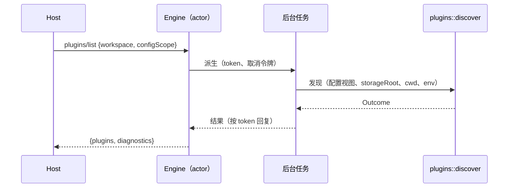
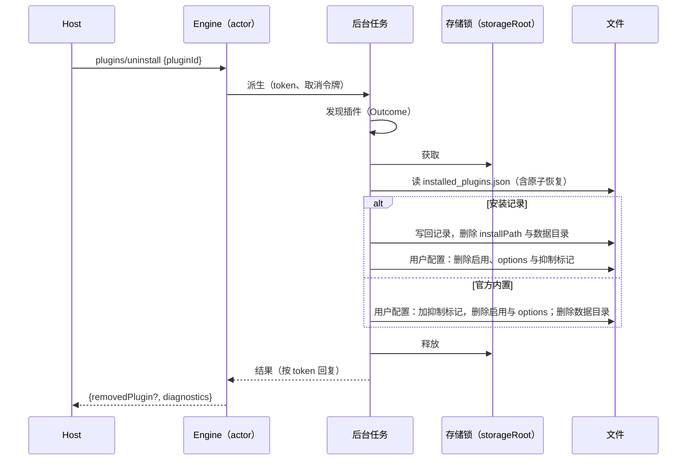

# Rust M10：插件管理与官方 MCP 鉴权

依据：Node 源码中的以下文件：

- `adapters/src/plugins/{index,mcp,hook-sources,plugin-components,markdown-frontmatter,official-marketplace,marketplace,helpers}.ts`
- `adapters/src/skills/scan.ts`
- `bootstrap/src/plugins.ts`
- `bootstrap/src/zcode-protocol/{plugins,plugin-reference-catalog}.ts`
- `bootstrap/src/app/{official-plugin-definitions,runtime-config,create-app}.ts`
- `core/src/plugin-reference/*`
- `adapters/src/config/config-factory.ts`（`resolvePluginConfigSources`）

协议形状以 `packages/shared/src/zcode-protocol/index.ts` 中的插件 schema 为准。架构见 `rust-p0-p1-architecture.md` §5.18。

## 1. 分期

Node 的插件子系统约 1 万行，按依赖关系分期交付。每期单独提交，只在该期验收通过后才注册对应的方法。

| 分期  | 内容                                                                                                                                                                                                                              |
| ----- | --------------------------------------------------------------------------------------------------------------------------------------------------------------------------------------------------------------------------------- |
| M10.1 | 统一的插件发现层（新 crate `plugins`）；运行时 skills、MCP、hooks、插件子代理改用它；`plugins/list`；`plugins/overview`（只读投影，引用目录的展示字段来自它）；workspace 的 `plugins/referenceCatalog`（含 `WithCategory` 变体）  |
| M10.2 | 会话冻结的插件引用目录与 `@plugin` 引用提醒；带 `sessionId` 的 `referenceCatalog`                                                                                                                                                 |
| M10.3 | 写配置类方法：`setEnabled`、`configure`、`resetConfig`、`restoreBuiltin`、`uninstall`；存储锁                                                                                                                                     |
| M10.4 | 插件来源：本地目录与文件、git（含 sparse）、GitHub archive、zip；原子目录事务；市场 `add`、`remove`、`update`；`install`、`update`、`describe`、`validate`、`resolveSuggestedReference`；`cancelOperation` 与 `operationProgress` |
| M10.5 | 官方 MCP 鉴权（`interaction/requestOfficialMcpAuthHeaders`）                                                                                                                                                                      |

不在本里程碑范围：官方插件的 seed，即从应用包资产写入 `cache/zcode-plugins-official/**` 与 `bundled-marketplace.json`。

- 当前由 Node CLI 在启动时完成 seed，Rust 只读取已 seed 的缓存。
- 资产随 Rust 打包属于发行门槛，届时按 §5.18 的"启动脚本"方案实现。

## 2. 所有者

- **插件发现层**（`crates/plugins`，纯读取、无状态）：
  - 输入为 `(config, storageRoot, cwd, env)`；
  - 输出为 `Outcome { plugins, diagnostics, skill_roots, hooks, mcp_servers }`。
- **运行时**（tools 的 skills 与 MCP，以及 Engine 的 hooks）只消费 `Outcome`，不再各自扫描插件目录；旧的 `extension_plugins.rs` 删除。
- **管理方法**在 Engine 的后台辅助任务中执行，与 `mcp/list` 同一模式：带取消令牌，不阻塞 actor。
- **配置写入**（M10.3 起）经存储锁串行化。写入之后，新会话读到新配置，已有会话保持会话冻结的目录，与 Node 的"App 创建时冻结"一致。

## 3. M10.1：发现（`discoverPlugins` 与 `resolveZCodePlugins`）

### 3.1 候选（按顺序）

`config.plugins.enabled == false` 时，发现结果为空。候选按以下顺序收集：

1. **inline**：`config.plugins.dirs` 中的每个路径，按 `cwd` 解析，默认启用。
2. **official**：`storageRoot/marketplaces/zcode-plugins-official/bundled-marketplace.json` 满足 `version == 1` 且带 `manifest` 时，取其 `plugins[].cachePath`。
   - `cachePath` 必须是 `cache/zcode-plugins-official/<name>/` 的严格后代。
   - 分片不存在时，改为扫描 `cache/zcode-plugins-official/*/*` 下的全部目录。
   - 扫描失败（不是"不存在"）时，发一条 `plugin_root_not_found` 警告。
3. **cache**：`installed_plugins.json` 中的记录。
   - 记录的 `plugins` 可以是数组，也可以是 `{id: record | record[]}` 形式的映射。
   - 根目录取 `installPath`，缺省为 `cache/<marketplace>/<name>/<version>`。

### 3.2 加载

对每个候选依次执行：

1. **根目录**：根目录不存在时，发 `plugin_root_not_found`（warning），跳过。
2. **定位 manifest**：按 `.zcode-plugin`、`.claude-plugin`、`.codex-plugin` 的顺序找 `plugin.json`；都找不到时发 `plugin_manifest_not_found`（error）。
3. **解析 manifest**：解析失败、不是对象、或 `name`（trim 后）不匹配 `^[a-z0-9][a-z0-9._-]{0,127}$` 时，发 `plugin_manifest_invalid`（error）。`version` 缺省为 `0.0.0`。
4. **身份**：`id = name@marketplace`。
5. **过滤与去重**：
   - official 来源且在 `suppressedBuiltins` 中的，跳过。
   - 重复 id 发 `plugin_duplicate_id`（warning），跳过。
6. **不支持的组件**：manifest 含 `channels`、`lspServers`、`outputStyles`、`settings` 时，发 `plugin_unsupported_component`（warning）。
7. **启用态**：`enabledPlugins[id] ?? (inline || 官方默认启用名单)`。官方默认启用名单由 TS 生成。
8. **数据目录**：`dataPath = storageRoot/data/<id 中 [^a-zA-Z0-9_.@-] 替换为 ->`；只有启用的插件才创建该目录。

### 3.3 组件与元数据

- **hooks 来源**：
  - 先读 `hooks/hooks.json`（wrapper 形式，取 `.hooks`）；
  - 再读 manifest 的 `hooks`：可以是字符串路径（须在根目录内，文件须存在，按 realpath 去重）、内联对象，或二者组成的数组。
  - 事件名不受支持时，发 `plugin_hook_unsupported_event`（warning）。
  - 事件值不是数组，或 matcher 不合法时，发 `plugin_hook_invalid`（error）。
  - 每个合法的 hook 生成一条 `hookDetails`：`{command, event, runnable: true, sourcePath, type}`，再按条件附加 `matcher`、`statusMessage`、`timeoutMs`；process 类型附加 `args`，command 类型附加 `async`、`shell`、`timeout`。
  - 只有启用的插件才注册可执行 hooks。
- **MCP 声明**：
  - 合并 `.mcp.json` 与 manifest 的 `mcpServers`（字符串路径、对象、数组，形状可带 `mcpServers` 包装），后者覆盖前者。
  - `declaredMcpServerNames` 是合并后的键。
  - 启用的插件逐个解析 server（规则见 §3.4），`mcpServerNames` 是解析成功的 `plugin:<name>:<key>`。
- **skills 根**：
  - 默认 `skills/` 目录存在时放在最前，其后是 manifest 声明的路径。
  - 路径越界时发 `plugin_component_path_invalid`（error）。
  - `skillCount` 是去重后的 `SKILL.md` 文件数：扫描不跟随符号链接，根目录自身的 `SKILL.md` 与一层子目录都计入。
  - 声明的路径不存在或为空时，发 `plugin_skill_root_empty`（warning）。
- **commands 根**：规则同 skills。`commandRootCount` 还包括 manifest 以对象形式声明 commands 时生成的根，写入 `dataPath/generated-commands/*.md`，并附加 frontmatter。
- **components 枚举**：与启用态无关，分组顺序为 agent、command、skill、hook、mcp。
  - agent 与 command：manifest 对象形式的键与描述，加上默认目录和声明目录下 `.md` 文件的 frontmatter `name` 或 `description`。
  - skill：`SKILL.md` 的 frontmatter，缺省用目录名；按文件路径和名称去重。
  - hook：事件名。
  - mcp：声明的 server 名。
  - frontmatter 只取 `name` 与 `description`，支持 `>`、`|` 块标量。
- **作者与主页**：`author` 可以是字符串或 `{name, url}`；`homepage` 取非空字符串。

### 3.4 插件 MCP 解析（`resolvePluginMcpServers`）

- **传输类型**：`type` 缺省时，有 `command` 视为 stdio，否则视为 http；只支持 stdio、http、sse。
- **模板 `${...}`**：
  - `CLAUDE_PLUGIN_ROOT`、`ZCODE_PLUGIN_ROOT` 展开为插件根目录；
  - `*_PLUGIN_DATA` 展开为 `dataPath`；
  - `*_PROJECT_DIR` 展开为 `cwd`；
  - 会话类与 skill 目录类变量报错；
  - `user_config.<key>` 取 `options[key] ?? userConfig[key].default`。缺失时报错；敏感值只能出现在"敏感出口"，即 env、headers、`clientSecret`；
  - `ZCODE_*` 取环境变量，缺失时报错；
  - 其他合法环境变量名只在敏感出口中展开；
  - 其余模板保留原文。
- **stdio 的环境变量**：先放入 `CLAUDE_PROJECT_DIR`、`ZCODE_PLUGIN_DATA`、`ZCODE_PLUGIN_ROOT`、`ZCODE_PROJECT_DIR`、`CLAUDE_PLUGIN_DATA`、`CLAUDE_PLUGIN_ROOT`，再合并 manifest 的 `env`，最后强制写入 `ZCODE_PLUGIN_ID = id`。
- **失败处理**：变量错误发 `plugin_variable_missing`，其他错误发 `plugin_mcp_server_disabled`（均为 error），该 server 不注入。
- **本期暂不支持**：`auth`（官方鉴权）与 `oauth` 字段。声明了这两个字段的 server 发 `plugin_mcp_server_disabled` 后跳过，M10.5 接入。这是有意的临时差异，没有鉴权通道时不能以无凭据方式连接。

### 3.5 运行时接入

- **skills**：启用插件的 skills 根替换原有的插件根收集，限定名与信任边界规则不变。
- **MCP**：解析成功的插件 server 替换原有的简化解析（旧实现只替换根路径模板）。新实现补上 data、project、`user_config`、`ZCODE_PLUGIN_ID`。
- **hooks**：
  - 每个会话首次需要 hooks 时发现一次并冻结，冷恢复时重新发现（与 Node 的"每个 App 一次"一致）。
  - 注册顺序：用户 → 项目 → 插件。
  - 只要插件提供了 hooks，就强制 `enabled = true`。此时用户 hooks 即使配置为关闭也会运行，保持 Node 缺陷。
  - 插件 hook 的 `source` 为 `plugin.<id>.<event>.<matcherIndex>.<hookIndex>`。
  - `plugin` 上下文为 `{id, name, rootPath, dataPath, sourcePath}`，供 `${CLAUDE_PLUGIN_ROOT}` 等展开使用。

### 3.6 `plugins/list`

- **参数**：`{workspace, configScope?}`。`configScope == "user"` 时只用默认层与用户层，不加载项目配置。
- **每个插件的 `ZCodePluginInfo`**：
  - `configuredOptions` 去掉 `userConfig` 中标为敏感的键。
  - `hostMcpServerNames` 来自官方插件定义（生成）。
  - inline 插件的 `rootSource` 按 workspace 优先、再 user 的顺序，匹配配置层的 `dirs`；Windows 上比较时忽略大小写与分隔符。
  - `enabledSource` 与 `optionSources` 来自各配置层（workspace 覆盖 user）。
- **"缺失"条目**：配置中声明了、但没有被发现的 `name@marketplace`，输出 `source: "missing"`、`packageStatus: "missing"`，计数与列表字段为 0 或空。
- **诊断**：只输出 `{code, message, severity, pluginId?}`。

### 3.7 `plugins/referenceCatalog`（workspace 部分）

- **没有 `sessionId` 时**：按当前发现构建目录。
  - 每个插件：`skillQualifiedNames = name:skill`、`subagentNames = name:agent`（都来自 components，排序去重）、`mcpServerNames`（排序）。
  - 同名且都启用的插件互相列入 `conflictingPluginIds`。
- **展示字段**：`icon`、`displayName`、`displayNameI18n`、`description`、`descriptionI18n`、`category` 来自市场 listing 与官方定义的 listing seed。
  - 本期只读官方定义 seed 与本地已缓存的市场快照（`marketplaces/<id>/marketplace.json`）。
  - `WithCategory` 变体缺省为 `"other"`。
- **带 `sessionId` 时**：M10.2 之前返回明确错误（`Session plugin catalog unavailable`），不回退到 workspace 目录，与协议"禁止静默回退"的约定一致。

### 3.8 `plugins/overview`

- 先补齐默认市场记录（`known_marketplaces.json`，与 Node `ensureDefaultPluginMarketplaces` 相同，会写文件）。
- 有效市场记录：已知记录叠加用户配置的 `extraKnownMarketplaces`。
  - 同 id 不同来源时，改用声明来源，且不读缓存。
  - 官方 id 例外：仍投影官方缓存，另发 `plugin_marketplace_declaration_reserved` 警告。
- 只有可以使用缓存的记录才读取 `marketplaces/<id>/marketplace.json`（经原子恢复）。
- 各部分内容：
  - `availablePlugins`：市场条目，附 listing、`componentTypes` 与 `installed`；
  - `installedPlugins`：已安装记录，附启用态、组件类型、hook 详情，以及 `updateStatus` 与 `latestVersion`（semver coerce 比较；目录没有 version 时比较 sha pin）；
  - `restorableBuiltins`：被抑制的官方定义。`computer-use` 受 CUA 内部特性开关控制。
- `node-repl-host` 不计入官方市场的插件数。

### 3.9 M10.2：会话冻结目录与 `@plugin` 引用提醒

依据 Node `core/src/plugin-reference/{references,reminder,catalog}.ts`、`runtime/methods/plugin-reference.ts`、`turn.ts`。

- **会话目录**：
  - 每个根会话在本进程内首次需要时冻结一次插件引用目录（§3.7 的条目，包含 `rootPath`），之后不随配置变化；冷恢复后重新冻结。
  - Node 在 App 创建时冻结；Rust 延迟到首次使用，避免给会话激活增加一次插件发现。
  - 会话被 LRU 淘汰时，目录随之释放。
  - 子代理会话不注入引用提醒，与 Node 一致。
- **带 `sessionId` 的 `referenceCatalog`**：
  - 会话不存在时报错；
  - 返回冻结目录（`authority: "session"`），展示字段仍来自当前 overview。
- **解析**：
  - 只解析根会话、用户可见输入的原文，与 UserPromptSubmit hooks 的同一门控；模型专用的续跑不解析。
  - 只接受 Markdown 链接目标 `plugin://<name>@<marketplace>`：两段都匹配 `[A-Za-z0-9][A-Za-z0-9._-]*`，总长不超过 256，协议名须为小写。
  - 按首次出现去重，每轮最多 8 个。
- **提醒正文**（`buildPluginReferenceReminderBody`）：
  - 跳过：未知、同名冲突、会话内已禁用、没有活能力的条目。
  - 活能力取与冻结声明的交集：
    - skills：会话 skill 目录中根目录属于该插件的限定名；
    - MCP：冻结声明过的 server，已连接，且本轮对模型可见的工具数大于 0；
    - 子代理：声明过的名称，且 profile 路径位于插件根下。
  - 标识符须匹配 `^[A-Za-z0-9._:@/-]{1,128}$`。
  - 合计上限：skills 32、MCP 16、子代理 16。正文超过 8 KiB 时，从尾部逐个移除插件。
  - 固定模板为 `<plugin_reference>…</plugin_reference>`。
- **注入**：
  - 位置：本轮用户消息之后、首个模型请求之前，以 `<system-reminder>` 用户消息的形式出现。
  - 作为 canonical 消息提交给 owner 并持久化，与 Node 的"model-only notice 落库"一致：冷恢复后前缀不变，UI 不产生用户气泡。
  - 生成失败时本轮照常执行（fail open），但不注入任何内容。

### 3.10 M10.3：写配置与卸载

依据 Node `bootstrap/src/plugins.ts`（`setZCodePluginEnabled`、`configureZCodePlugin`、`resetZCodePluginConfig`、`restoreBuiltinPlugin`、`uninstallZCodeMarketplacePlugin`）、`adapters/src/config/file-config.adapter.ts`、`bootstrap/src/lib/plugin-storage-lock.ts`。

- **写入位置**（`resolvePluginConfigPath`）：
  - `scope` 缺省或为 `user` 时写用户配置文件；
  - `scope: "workspace"` 时写当前 workspace 的 `.zcode/config.json`，若它已在项目配置链中则复用该路径（Windows 忽略大小写与分隔符），不写外层项目的配置。
- **配置文件写入**：
  - 读取失败（不存在）视为空对象；非对象或无法解析时报错，文案与 Node 一致。
  - 保持原有键序，`plugins` 或其下的分节不是对象时替换为空对象。
  - 同目录临时文件 `.{name}.{pid}.{ms}.{uuid}.tmp`（0600）写入并 `fsync` 后 rename 覆盖，结尾带换行；失败时删除临时文件。
  - CUA 旧 id `zcode-cua@zcode-plugins-official` 与 `computer-use@zcode-plugins-official` 互为别名：写入时先删别名再写 canonical id。
- **`plugins/setEnabled`**：
  - 选择器：先精确匹配 id，再按 manifest 名称唯一匹配；找不到或名称歧义时报错（`Plugin not found: …`、`Plugin name is ambiguous, use full plugin id: …`）。
  - 返回写入前发现的插件信息，覆盖 `enabled` 与 `enabledSource`（`scope ?? "user"`）。
- **`plugins/configure`**：
  - `options` 只保留字符串、数字、布尔值；`clearOptionKeys` 去空白、去空、去重。
  - 合并：已存值（canonical 优先，其次旧别名）先删除 clear 键，再合入新值。
  - `dryRun` 只校验选择器，不写文件。返回 `{pluginId, diagnostics: []}`。
- **`plugins/resetConfig`**：
  - `workspace` 只删除启用覆盖；`user` 删除启用与 options。
  - 没有删除任何内容时不写文件；删除时把缺失的 `enabledPlugins`/`options` 写成空对象（Node 行为）。
- **`plugins/restoreBuiltin`**：
  - `computer-use` 在 `ZCODE_CUA_PRODUCT_HELPER` 未启用时报错；
  - 从用户配置的 `suppressedBuiltins` 移除该 id。Rust 不做 seed（§1），重新发现依赖已存在的官方缓存。
- **`plugins/uninstall`**：
  - id 取 `pluginId`，或 `pluginName@marketplace`。
  - 命中安装记录：删除记录并写回 `installed_plugins.json`（`{version: 1, plugins}`，记录保持原始形状；map 形状的旧记录按 Node 归一化）；`removeCache` 不为 `false` 时删除 `installPath`（相对存储根解析）与插件数据目录；再从用户配置删除该插件的启用与 options，并移除可能遗留的抑制标记。
  - 命中官方内置插件：写入抑制标记，删除用户配置中的启用与 options，删除数据目录，保留不可变的官方缓存；摘要的 `installPath` 为插件根，`installedAt` 为当前时间。
  - 两者都不命中时返回 `{diagnostics: []}`。
  - `installed_plugins.json` 通过 Node 兼容的原子替换写入：rename 被拒绝时改走 standalone 事务，边车格式与 §4 的恢复规则互通。
- **存储锁**：`restoreBuiltin` 与 `uninstall` 在同一存储根的进程内互斥锁下执行（Node 为 promise 链，同样不跨进程）。M10.4 的安装、更新与市场写入复用该锁。
- **`operationId`**：M10.4 之前忽略（无进度事件、不可取消）。

已有会话的运行时不因这些写入而变化（§2），新会话读取新配置。

## 4. 与 Node 的差异（M10.1）

- 目录项按名称排序后遍历（Node 为平台 `readdir` 顺序），保证跨平台结果确定。
- JSON 解析失败的诊断文案来自 serde（Node 为 `JSON.parse` 的文案）。hook matcher 校验只复现 zod 4 常见情形的措辞。
- 插件目录读取大小上限 10 MiB（Node 无上限）。
- 读取 `installed_plugins.json`、`known_marketplaces.json` 与缓存根时，按 Node 规则做原子目录恢复（边车格式互通）。Windows 上用 `OpenProcess` 判断写入方进程是否存活。

- 发现层使用异步文件 IO（Node 为同步）。结果与诊断顺序保持一致。
- MCP 的 `auth` 与 `oauth` 暂时禁用（见 §3.4），M10.5 接入。
- 官方插件 seed 不做（见 §1）。
- 插件的 agents（子代理 profile）继续使用 `agent_profiles.rs` 的现有来源，本期不改。
- M10.3：`restoreBuiltin` 不重新 seed 官方缓存；`uninstall` 查找官方内置插件使用加锁前的发现结果（官方缓存不可变，结果等价）。

## 5. 验收（M10.1）

- **单测**：
  - manifest 优先级与名称校验；
  - 候选顺序、bundled 分片的严格后代校验、installed 两种形状；
  - suppressed、重复、启用解析；
  - hooks 来源与诊断；
  - MCP 模板规则，包括敏感出口与 `ZCODE_PLUGIN_ID`；
  - frontmatter 块标量；
  - 组件枚举；
  - "缺失"条目；
  - 引用目录冲突。
- **集成**（`zcode-cli-rust-plugins.test.ts`，App schema 严格校验）：
  1. `plugins/list` 覆盖：inline 目录插件、已安装的 cache 插件、官方 bundled 插件、缺失条目与各类诊断，并校验 `enabledSource`、`rootSource`、`optionSources`。
  2. 启用插件的 skill 在会话中可用；插件 MCP 以命名空间出现，并收到 `ZCODE_PLUGIN_ID`。
  3. 插件 hook 运行，带插件上下文与变量展开。
  4. 禁用插件：不注入运行时，但 components 仍然列出。
  5. workspace `referenceCatalog` 覆盖冲突与分类；带 `sessionId` 时报错。
