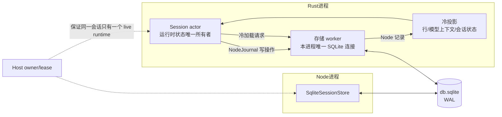
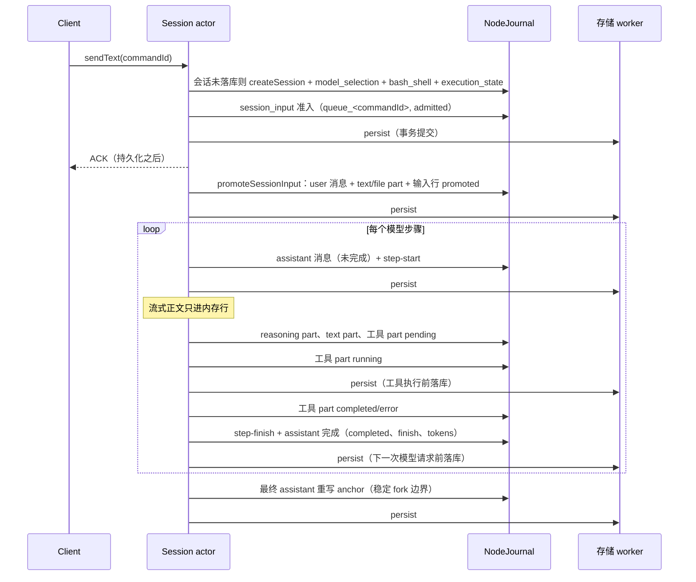
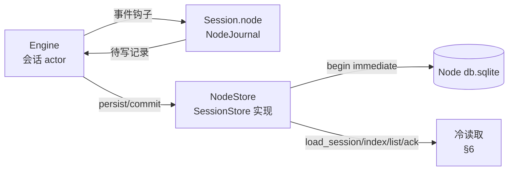
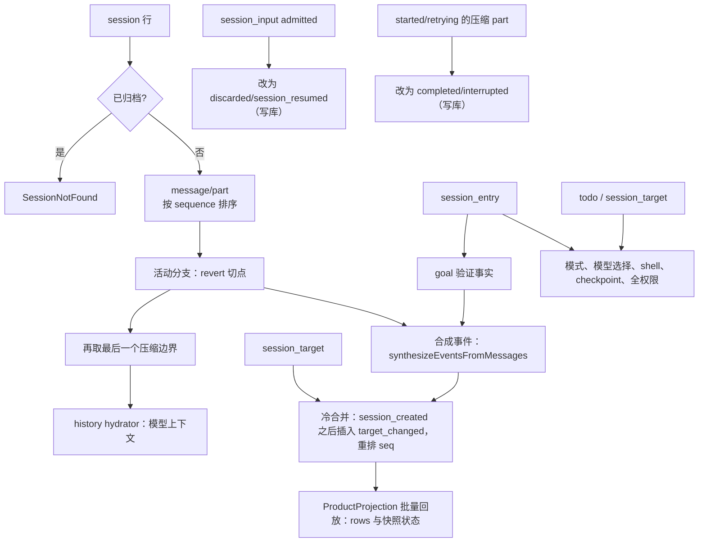

# Rust M11：与 Node 共用会话数据库

## 1. 背景与目标

此前 Rust 使用独立的 `~/.zcode/rust/rust-sessions.sqlite`，首次打开工作区时只读导入 TS 历史（`rust-cli-core.md`、`rust-app-p0.md` 的"TS 原库只读，Rust 使用独立 SQLite"）。这一决定来自"可独立运行的核心切片"阶段，与"替换用户 App 中的 CLI"的目标冲突：

- 切回 Node 后，Rust 期间新建或继续的会话不可见；
- 每个工作区导入时复制一份完整 TS 库（实测每份约 1 GB）；
- 两份数据各自演进，无法双向切换。

本里程碑的目标：**Rust 与 Node 读写同一个会话数据库，记录格式与 Node 完全一致，用户可在两个 runtime 之间任意切换，历史双向连续。**

依据（均以当前检出源码为准）：

- 写入：`apps/zcode-cli/packages/adapters/src/storage/session-store/**`、`adapters/src/storage/session-target.ts`、`core/src/runtime/methods/{message-persistence,turn*,tool-part-persistence,timeline-persistence,compact-persistence,stable-fork-boundary,events,steering}.ts`；
- 读取：`core/src/runtime/methods/resume.ts`、`core/src/agent/session-history-hydrator.ts`、`bootstrap/src/zcode-protocol-v4/{transcript-hydration,cold-event-merge,persistent-command-facts,command-inbox}.ts`、`packages/shared/src/conversation-message-projection-policy.ts`；
- 启动：`adapters/.../migration-runner.ts`、`bootstrap/src/zcode-protocol/storage-startup.ts`、`packages/desktop/src/host/storagePreparationProcesses.ts`。

## 2. 产品规则

### 2.1 单一数据库

- 数据库路径与 Node 相同，解析规则如下（后者覆盖前者）：
  1. 默认 `~/.zcode/cli/db/db.sqlite`；
  2. 用户配置 `~/.zcode/cli/config.json` 的 `storage.sessionDbPath`；
  3. 环境变量 `ZCODE_SESSION_DB_PATH` 或 `ZCODE_SESSION_DB`。

  只展开 `~/` 前缀；相对路径在 `--prepare-storage` 时相对 `--cwd`，否则相对进程 cwd。`ZCODE_DATA_BASE_DIR`、`ZCODE_STORAGE_DIR` 与项目配置都不移动数据库，与 Node 协议入口一致。

- Rust 不再创建或读取 `rust-sessions.sqlite`，不再导入 TS 历史，不再复制备份。`--import-ts-db` 参数删除。旧的 `~/.zcode/rust/rust-sessions.sqlite` 不迁移（其中只有 Rust 试运行期间的会话），由用户自行删除。
- 产物（工具结果落盘、附件、媒体、checkpoint）与 Node 同根：`<storage.dir>/cli/artifacts/<会话目录>/`，URI 为 `zcode-artifact://<sessionId>/<artifactId>`。`storage.dir` 默认 `~/.zcode`，可由 `ZCODE_STORAGE_DIR` 覆盖。

### 2.2 表结构与迁移

- Rust 内嵌 Node 的 22 个迁移，SQL 原文逐字节一致，校验和为 `sha256(sql.trim())`，与用户现有库核对一致。
- 启动流程与 Node 的 `migration-runner` 相同：
  1. `busy_timeout` 5000 ms，`foreign_keys = on`；
  2. `journal_mode` 不是 WAL 时切换为 WAL，失败则报 `sql_failed`；
  3. 预检：已应用的已知迁移逐个比对校验和，不一致报 `checksum_mismatch`；
  4. `begin immediate`，建 `schema_migration`，按数组顺序补齐缺失的已知迁移，同一事务提交。
- 未知的已应用迁移（如官方构建的 `0017_todo_state_revision`、`0023_session_soft_delete_outcome`）、未知表和未知列一律忽略。
- Rust 不新增任何表、列或迁移。Node 不持久化的状态，Rust 也不持久化（见 §4 的"仅内存"项）。

### 2.3 记录格式

- 所有写入沿用 Node 仓储层的 SQL 原文，包括 upsert、legacy 字段保留的 `json_set` 子查询、`sequence` 的 `coalesce(max(..),-1)+1` 分配、`touchSession` 的 `max()` 语义，以及事务边界（Node 用 `begin immediate` 的地方 Rust 同样使用）。
- JSON 按 Node 的对象字面量顺序生成键，`undefined` 字段省略，数值按 JS `JSON.stringify` 规则输出（整数值的浮点数不带 `.0`）。
- id 格式：
  - 会话 `sess_<uuid>`；
  - 消息 `msg_<Date.now() 的 36 进制>_<uuid>`，part `part_<同上>_<uuid>`，轮次 `turn_<uuid>`；
  - 子代理子会话 `sess_subagent_agent_<uuid>`（agentId `agent_<uuid>`）；
  - 输入账本 `queue_<commandId>`；
  - 其余 entry 的 id 模板见 §4。
- 读取与 Node 相同：`JSON.parse` 后展开；user 消息丢弃 legacy `model`，严格校验 `modelSelection`；assistant 丢弃 `providerID`/`modelID`/`variant`；`model_change` 与 `subtask` part 还原字段。

### 2.4 与现有 Rust 行为的差异（全部改为 Node 语义）

| 项目             | 原 Rust                                     | 改后（Node）                                                                                                                                     |
| ---------------- | ------------------------------------------- | ------------------------------------------------------------------------------------------------------------------------------------------------ |
| 流式正文         | 每 250 ms checkpoint 行                     | 不落库；模型步骤结束后写入，取消时写入已收到的部分                                                                                               |
| 界面行           | 行与行号持久化                              | 不落库；冷加载从消息与 part 重建，行号为回放计数，重启后重新编号（快照 epoch 本就变化）                                                          |
| 回退与编辑       | 截断行与消息                                | 只追加；写 `session.revert` 的分支切点，读取时选取活动分支                                                                                       |
| 命令回执         | 每个命令的 ACK 持久化                       | 只按 Node 的优先级从耐久事实反查：user 消息 `anchor.sourceCommandId`、timeline part `sourceCommandId`、`v4/command_fact`、`session_input` 终态行 |
| 未启动的排队输入 | 重启后按 ACK 判定丢弃                       | `session_input` 中 `admitted` 行在会话恢复或冷查询时改为 `discarded/session_resumed`                                                             |
| 工作区设置       | 以 workspace identity 为键                  | `local_setting` 的 `(project, project_id)`，`project_id = projectIdFromDirectory(path)`                                                          |
| 工具结果与附件   | `~/.zcode/rust/tool-results`、`attachments` | Node 产物目录与 `zcode-artifact://`                                                                                                              |

### 2.5 与 Node 的有意差异

- Node 的 `runtime_command_<n>` 与 `pending_deferred_<n>` 在每个进程从 1 计数，而 `session_input.id` 是全库主键，两个 runtime 共用库时会互相覆盖行。Rust 对这两类 id 使用 `<前缀>_<uuid>`。Node 不解析这些 id，因此不影响兼容。
- 其余已知 Node 缺陷（如不过滤 `time_deleted`、`v4_command_fact:timeline:*` 等不含会话 id 的全局 id）保持一致。

## 3. 状态所有者与依赖方向

- **domain**（无 IO）：Node 记录构造器（消息、part、entry、输入账本、会话行），按 Node 键序生成 JSON；冷投影与历史还原的纯函数。
- **core**：Session actor 在与 Node 相同的时机调用 `NodeJournal`，把待写记录排入会话；`persist` 把排队的写操作连同其他耐久事实交给存储。行与模型上下文仍是运行时内存状态。
- **state**：存储 worker 持有唯一连接，按顺序执行写操作。一次 `persist` 在一个 `begin immediate` 事务中提交。冷加载读取 Node 表并调用 domain 的冷投影。
- **进程间**：只依赖 SQLite 锁（WAL、`busy_timeout`、`begin immediate`），与 Node 相同。同一会话的 live 归属由 Host owner/lease 负责，不在库中加锁。

## 4. Rust 状态到 Node 记录的映射

| Rust 会话状态                                                                                | Node 记录                                                                                                                                           | 说明                                                                                                                                                                                                           |
| -------------------------------------------------------------------------------------------- | --------------------------------------------------------------------------------------------------------------------------------------------------- | -------------------------------------------------------------------------------------------------------------------------------------------------------------------------------------------------------------- |
| id、标题、标题来源、创建/更新时间、父会话、task_type、归档、trace、workspace 路径与 identity | `session` 行                                                                                                                                        | `project_id = projectIdFromDirectory(path)`；`slug = slugify(id)`；`directory = path = workspacePath`；本地 `workspace_id` 为 NULL，远程为 identity；`version` 为 Rust CLI 版本；`permission = {"mode": 模式}` |
| provider、model、推理档位                                                                    | `runtime/model_selection`（id `<sid>:runtime-model-selection`，`touchSession:false`）；user 消息 `modelSelection`；assistant `providerId`/`modelId` | 恢复时按 registry 校验，失败回退到只含 provider 与 model                                                                                                                                                       |
| 执行模式、plan 开关                                                                          | `runtime/execution_state`（id `<sid>:runtime-execution-state`）                                                                                     | 会话首次落库时写入；模式变化时写入                                                                                                                                                                             |
| shell 选择                                                                                   | `runtime/bash_shell_selection`（id `<sid>:runtime:bash_shell_selection`）                                                                           | 首次落库写一次                                                                                                                                                                                                 |
| 界面行                                                                                       | 不存                                                                                                                                                | 冷投影重建（§6）                                                                                                                                                                                               |
| 模型上下文                                                                                   | `message` / `part`                                                                                                                                  | 冷加载按 Node 的 history hydrator 重建                                                                                                                                                                         |
| 输入/响应边界（编辑、重试、fork）                                                            | user 消息与各轮最终 assistant 的 `anchor`                                                                                                           | 最终 assistant 带 `historyRoundCount`、`orderedMessageIds`、`boundaryMessageId`、`goalBoundary`                                                                                                                |
| 压缩状态                                                                                     | 时间线宿主 assistant（`timeline` context_compaction + `compaction` part）与摘要 user 消息（`summary`、`compaction` part 带 `compactBoundary`）      | 与 Node 相同                                                                                                                                                                                                   |
| todo                                                                                         | `todo` 表（替换式写入）                                                                                                                             |                                                                                                                                                                                                                |
| goal                                                                                         | `session_target`；`target_completion_verification` entry；`goal_verification` timeline part                                                         |                                                                                                                                                                                                                |
| 子代理                                                                                       | 子会话行（`subagent_child`，`parent_id`）；父会话 Agent 工具 part 的输出含 `agentId:` 行                                                            |                                                                                                                                                                                                                |
| 文件 checkpoint 与文件回退                                                                   | checkpoint 产物；`runtime/workspace_checkpoint`、`runtime/workspace_file_rewind` entry                                                              |                                                                                                                                                                                                                |
| 共享上下文导入                                                                               | `v4/shared_context_import` entry 与上下文消息                                                                                                       |                                                                                                                                                                                                                |
| 全权限授权                                                                                   | `runtime/permission_full_access` entry 与 `execution_state`                                                                                         |                                                                                                                                                                                                                |
| 提问自动结算                                                                                 | `runtime/user_input_auto_resolution` entry                                                                                                          |                                                                                                                                                                                                                |
| 命令回执                                                                                     | 不单独存（§7）                                                                                                                                      |                                                                                                                                                                                                                |
| 排队输入                                                                                     | `session_input`                                                                                                                                     | 重启不保留队列                                                                                                                                                                                                 |
| 用量                                                                                         | `model_usage`、`turn_usage`、`tool_usage`                                                                                                           | 列与 Rust 现有实现一致，只去掉 `rust_` 前缀                                                                                                                                                                    |
| 工作区设置                                                                                   | `local_setting`                                                                                                                                     | `permission/ruleset`、`permission/mode`                                                                                                                                                                        |
| 输入历史                                                                                     | `input_history`                                                                                                                                     | 只在 Rust 有对应入口时写                                                                                                                                                                                       |
| 后台任务、mailbox、skills 目录、提示快照、hook 调用行、重试状态                              | 仅内存                                                                                                                                              | Node 同样不持久化                                                                                                                                                                                              |

实现各期逐项核对上表；Node 未持久化的字段不新增落库，Node 持久化而 Rust 缺失的字段补齐。

## 5. 写入时序（一轮带工具的对话）

### 5.1 NodeJournal 与 NodeStore

- **NodeJournal**（domain，纯函数、无 IO）挂在 `Session.node`：记住当前轮与当前模型步骤的 Node id（用户消息、assistant 消息、各 part、工具 part 的声明序号与开始时间），在与 Node 相同的时机按 Node 写入模板生成记录，排入待写队列。
- **NodeStore**（state）实现 core 的 `SessionStore`：一次 `commit` 把会话的待写队列在一个 `begin immediate` 事务里交给 M11.1 的仓储函数；`load_index`、`list_sessions`、`load_session`、`lookup_ack` 走 §6、§7 的冷读取；用量写入 Node 的 `model_usage`/`turn_usage`/`tool_usage`；项目设置写 `local_setting`。
- 过渡：M11.3、M11.4 期间 NodeStore 由启动参数显式选择，旧存储仍为默认；M11.5 改为唯一实现并删除旧存储。
- id：新会话 `sess_<uuid>`；消息与 part 用 Node 格式（毫秒 36 进制 + uuid）；`anchor.turnId` 为 `turn_<轮 uuid>`。

### 5.2 事件到 Node 写入的对应

| Rust 时机                    | Node 写入（模板）                                                                                                                                                    |
| ---------------------------- | -------------------------------------------------------------------------------------------------------------------------------------------------------------------- |
| 会话首次落库（首个输入准入） | `createSession`（`title = titleFromInput`、`titleSource = first_input`、`permission = {mode}`）、`runtime/model_selection`、`runtime/execution_state`（`events.ts`） |
| 输入准入（startNow）         | user 消息 + text part（`persistUserPrompt`：`semantics` real_user、`anchor`、`modelSelection`、`metadata.conversationInputIntent` 等）                               |
| 模型步骤开始                 | assistant 消息（无 `completed`）+ `step-start` part（`turn-model-step.ts`）                                                                                          |
| ModelDone                    | reasoning part（按 provider 推理块拆分，`metadata` 为 providerOptions）、text part；无工具调用时 `step-finish` + assistant 完成（`finish`、`tokens`）                |
| ModelDone 带工具调用         | 每个调用一个 `pending` 工具 part（`declarationIndex`、`input`、`raw`）                                                                                               |
| ToolStart                    | 工具 part `running`（`time.start`）                                                                                                                                  |
| ToolDone                     | 工具 part `completed`（`output`、`metadata.schemaVersion`）或 `error`（`error`、`metadata.modelContent`）                                                            |
| 一个步骤的工具全部完成       | `step-finish` + assistant 完成（`finish = tool-calls`）                                                                                                              |
| 轮次成功结束                 | 最终 assistant 重写 `anchor`（`historyRoundCount`、`orderedMessageIds`、`boundaryMessageId`、`goalBoundary`）                                                        |
| 轮次失败                     | 当前步骤 assistant 完成并带 `error{name, data{message, code?, attribution?}}`                                                                                        |
| 取消                         | 已流式到达的 reasoning/text part，assistant 完成并带取消 error（`data.turnResult = cancelled`）                                                                      |
| 流恢复重试                   | 旧步骤 assistant 带 `StreamRecoveryDiscarded` error、`finish = stream_recovery_discarded`，新步骤另起消息                                                            |
| 标题、模型、模式、todo       | `updateSession`、`runtime/model_selection`、`runtime/execution_state`、`todo`                                                                                        |

- Rust canonical assistant 到 Node part 的映射是 §6 冷读取映射的逆：Anthropic thinking 块 → 每块一个 reasoning part（`metadata.anthropic.signature` / `redactedData`），Responses 推理项 → `metadata.openai.{itemId, reasoningEncryptedContent}`，其余 `reasoning_content` → 一个无 metadata 的 reasoning part；工具参数解析为对象作为 `input`；失败工具的模型可见内容写 `metadata.modelContent`。
- 验收：用 NodeStore 跑脚本化会话，把 Node 库按 §6 冷读取，模型上下文与运行时一致，界面行的种类、文本、工具状态一致；Node 侧用真实 `SqliteSessionStore` 读取同一库无解码错误。

- **取消**：写入已收到的 reasoning 与 text（`time.start` 为 assistant 创建时间），assistant 带 `completed` 与取消错误，不写 step-finish，与 Node `persistCancelledStreamSnapshot` 相同。
- **崩溃**：已落库的 `pending`/`running` 工具与未完成的 assistant 保持原样，读取端按"中断"投影，不改库。
- 工具执行前与下一次模型请求前的两个耐久屏障沿用 `rust-cli-core.md` 的规则。

## 6. 冷加载

- 行投影按 Node `synthesizeEventsFromMessages` 的规则：turn 以真实用户输入（`guide` 引导消息除外）、workflow 启动、模型专用触发消息为边界；可见性按 `getConversationMessageProjectionPolicy`；`pending`/`running` 工具与无 `completed` 的 assistant 投影为中断。
- 行投影只裁掉 rewind 分支（`selectActiveConversationBranch`），不按压缩边界截断：压缩前的历史仍在时间线上，只有模型上下文从最后一个边界开始。
- 冷投影在 `zcode_cli_domain::node_rows`：合成事件（Node 的事件类型、`hydrate-N` id、`seq`、展示时间戳与 payload）→ 冷合并（重启后没有内存事件，只插入持久 goal）→ 投影回放。投影只实现合成事件会触达的处理器，delta 语义与 Node 相同：处理器读取事件前的快照，delta 按序应用，回放结束后物化命令行动作。
- 元数据解析使用 Node 的严格 schema（`crates/domain/schema/node-projection.json`，由 TS 的 zod schema 生成）：`conversationInputIntent`、`errorAttribution`、`workflowLaunch`/`workflowNotification`、已完成工具 part 的 `display`。解析输出同 zod：未知键按 strip/strict/passthrough 处理，缺省值补齐，声明键按 schema 顺序。
- V4 行与状态是解析后使用的 JSON，成员顺序不属于兼容契约；夹具按值比对（数组有序、对象成员无序）。持久化记录的字节兼容由 M11.1 保证。
- 模型上下文按 Node `hydrateMessageHistoryFromSession`：`pending`/`running` 工具结果为 `[Tool execution was interrupted before resume]`；工具 part 每个 `callID` 取最后一条，全部带 `declarationIndex` 时按其排序；assistant 无正文、无推理、无工具且无有效用量时跳过。

### 6.1 会话恢复事实

冷加载一个会话（Node `resumeFromStore` 读取的持久事实，`state::node::resume`）：

| 事实         | 来源与规则                                                                                                                                                                             |
| ------------ | -------------------------------------------------------------------------------------------------------------------------------------------------------------------------------------- |
| 会话行       | 不存在或已归档为 `SessionNotFound`                                                                                                                                                     |
| 模型选择     | 最后一条 `runtime/model_selection`：完整结构（`parseModelSelectionValue`）优先，否则只取 `providerId`、`modelId`；执行前的 registry 校验属于运行时                                     |
| 执行状态     | 以会话行 `permission.mode` 经 `resolveExecutionState` 为底；最后一条 `runtime/execution_state` 满足 `{mode, planEnabled}` 时整体覆盖                                                   |
| 全权限标记   | 最后一条 `runtime/permission_full_access`：receipt 严格校验通过（含 `interactionId` 与 `payload.permissionGrant.interactionId` 相同）且 `event.sessionId` 为本会话时取 `interactionId` |
| todo、goal   | `todo` 表、`session_target`                                                                                                                                                            |
| 轮次号       | 活动分支（含压缩保留段）中不带 `summary` 的 user 消息数                                                                                                                                |
| 最新消息     | 不含压缩保留段的活动分支：最后一条 user/assistant 的 id；最后一条 assistant 的 id、`anchor.turnId`、`time.completed`                                                                   |
| 行与快照状态 | §6 冷投影                                                                                                                                                                              |
| 模型上下文   | history hydrator（开头的压缩摘要成为 context summary）                                                                                                                                 |

### 6.2 会话列表

- sessions-index 冷种子（Node `loadStoredSessionSummaries`，不含旧远程数据的 claim）：`listSessions` 条件为 `directory` = 远程 identity 解析出的路径或 workspaceId 本身，`workspace_id` 远程时等于 identity、本地时 `IS NULL`，task_type 为 `interactive`、`fork`、`workflow_parent`，不含归档，按 `time_updated desc, id desc`，上限 200。摘要字段：`sessionId`、`workspaceId`、`parentSessionId`（有时）、`title`、`titleSource`（`custom`、`default` 原样，其余为 `generated`）、`phase = completedSuccess`、`sessionEnded = true`、`hasBackgroundWork = false`、`lastActivityAt`、`createdAt`。
- `session/list`（Node `listSessions` 的持久部分）：给出 `sessionIds` 时逐个按 id 读取，否则按 `directory = workspace.workspacePath`、task_type 同上、`includeArchived`、上限默认 50 查询；再过滤归档与工作区（`workspaceID.trim() || path || directory` 等于 `workspaceIdentity.trim() || workspacePath`）。每项为 `mapSessionInfo` 的持久形态：`sessionId`、`workspace`（请求给出的，或由 `path ?? directory` 构造）、`sessionKind`、`title`、`titleSource`、`mode = build`、`status = idle`、`createdAt`、`updatedAt`，以及存在时的 `archivedAt`、`parentSessionId`、`traceId`。
- 远程 identity 按 Node `parseRemoteWorkspaceIdentity` 解析（`remote:ssh:<host>:<port>:<user>:<path>`、`remote:wsl:<distro>[:<user>]:<path>`、`remote:docker:<container>:<path>`）。

## 7. 命令幂等

与 Node `CommandInbox.lookupExact` 相同的优先级：

1. 进行中；
2. live 输入；
3. 本进程已结算 LRU（每会话 512 条）；
4. transcript：user 消息 `anchor.sourceCommandId`；
5. timeline：timeline part 的 `sourceCommandId`，以及 `v4_command_fact:timeline:<commandId>`；
6. child：父会话上的 `v4_command_fact:child:<parent>:<commandId>`；
7. 已丢弃：`session_input` 的 `discarded`/`cancelled` 行，按 Node 规则生成 `fault.command.inputDiscardedOnRestart` 或 `fault.command.inputCancelled`。

createSession 的全局查找按 `queue_<commandId>` 读取输入行（Node `lookupGlobalCreateSessionCommand`）。Node 不持久化回执的命令，重启后 Rust 同样不能重放其 ACK。

## 8. 启动与存储准备握手

- `--prepare-storage`：输出 `startup/storagePath`（解析后的 Node 库路径），等待一行 `startup/storagePathReady`（30 s）。`reuse` 为 true 时跳过迁移；否则打开并迁移，输出 `startup/storageState` 进度，最后输出 `startup/storagePrepared` 并退出。
- 正常启动时先输出 `startup/storageState`（`checking` → `ready`/`failed`），`databaseId = sha256(dbPath)`，错误码沿用 Node 的 `DatabaseStartupErrorCode`：`lock_timeout`、`checksum_mismatch`、`sql_failed`、`corrupt`、`storage_full`、`permission_denied`、`io_error`、`open_failed`。
- 迁移期间等待写锁：`busy_timeout` 25 ms 加退避重试，总上限 1 小时，与 Node 异步启动相同；完成后恢复 5000 ms。

## 9. 并发

- 每个进程一个连接，由存储 worker 串行使用；事务内不跨越异步等待。
- 多语句写入使用 `begin immediate`；`sequence` 与账本序号在写语句内分配。
- 跨进程的读后写（`updateSession`、输入历史去重）与 Node 保持相同的竞争窗口。

## 10. 分期

各期单独提交；每期结束时 Rust 全量测试、集成测试、typecheck、lint 通过。

| 分期   | 内容                                                                                                                                                                                                           | 验收                                                                                                                                                                                                                                         |
| ------ | -------------------------------------------------------------------------------------------------------------------------------------------------------------------------------------------------------------- | -------------------------------------------------------------------------------------------------------------------------------------------------------------------------------------------------------------------------------------------- |
| M11.1  | 存储基础（不接入运行时）：打开与迁移、JS 兼容 JSON、`serde_json` 保留插入顺序、Node id 格式、仓储层（会话、消息、part、entry、输入账本、todo、target、设置、输入历史）全部使用 Node SQL 原文                   | 迁移 SQL 由生成脚本从 Node 源码同步并校验字节一致；`scripts/zcode-cli-rust-node-db-fixtures.mjs` 用 Node 仓储按固定时钟与 uuid 执行一组操作，Rust 回放同一组操作后各表逐字节一致、解码结果一致；迁移账本、未知迁移、校验和不一致、锁等待测试 |
| M11.2a | 冷读取模型上下文：活动分支（`session.revert` 分支切点、压缩边界与保留段）、Node history hydrator 的全部规则（提醒来源、附件提醒、工具顺序与中断结果、空 assistant、共享上下文）、Rust canonical 消息与压缩摘要 | `scripts/zcode-cli-rust-node-cold-fixtures.mjs` 用 Node 仓储写入多组 transcript，并记录 Node `hydrateMessageHistoryFromSession` 的结果；Rust 读同一份库后条目逐一相等                                                                        |
| M11.2b | 冷读取界面行：Node `synthesizeEventsFromMessages` 与 `ProductProjection` 冷路径用到的事件处理                                                                                                                  | 同一夹具记录 Node 回放流水线（`replay.ts`）产出的合成事件、行与快照状态（除 `seq`/`revision` 等发布计数），Rust 逐项比对                                                                                                                     |
| M11.2c | 冷读取会话事实与列表（§6.1、§6.2）：会话行、模型选择、执行状态、全权限标记、todo、goal、轮次号与最新消息锚点；sessions-index 冷种子与 `session/list`                                                           | `scripts/zcode-cli-rust-node-session-fixtures.mjs` 用 Node `SqliteSessionStore` 建多工作区、多类型会话，记录 Node 的列表与恢复读取结果；Rust 逐项相等。运行时接入（按需冷加载替换整库加载、编辑边界）随 M11.5 切换完成                       |
| M11.3  | 写入核心对话：会话创建、输入账本、user 消息、assistant 步骤、工具、取消、标题、模型与执行状态、todo、用量、设置、命令幂等                                                                                      | Node 读取 Rust 写入的会话：Node 仓储解码、Node 冷投影与 history hydrator 无错误且内容一致                                                                                                                                                    |
| M11.4  | 写入扩展：压缩、回退/编辑/重试（`session.revert`）、fork 与侧聊、goal、子代理、checkpoint 与文件回退、共享上下文、全权限授权、提问自动结算、后台通知、附件与产物                                               | 各功能的 Node 读取验证                                                                                                                                                                                                                       |
| M11.5  | 切换与清理：Node 库成为唯一存储；删除 `rust_*` 表、导入流程、备份、`--import-ts-db` 与 data dir 中的库；集成测试改用 Node 库                                                                                   | 交叉运行：Node 建会话 → Rust 恢复并继续 → Node 恢复并继续，反向同样；全量集成测试                                                                                                                                                            |

M11.2 至 M11.4 期间，Rust 仍以原存储为运行时事实来源，Node 记录写入同一份库用于验证（过渡双写，只在本分支存在），M11.5 删除原存储。

## 11. 验收场景

1. 用户现有库（含官方构建的 `0017_todo_state_revision`、`0023_session_soft_delete_outcome`）：Rust 启动不报错、不改动未知表与列、不重跑迁移。
2. Node 创建的会话（多轮、工具、推理、附件、压缩、回退、goal、子代理、fork），Rust 打开后行、模型上下文、会话状态与 Node 冷投影一致，并可继续对话。
3. Rust 创建的会话，Node 打开后冷投影与模型上下文正确，可继续对话、编辑、重试、fork、回退。
4. 同一会话 Node 与 Rust 交替继续多轮，`sequence`、`anchor`、`revert` 保持一致。
5. 崩溃恢复：工具执行中与流式中杀进程，两个 runtime 重启后均投影为中断，排队输入被丢弃并能正确回答重复命令。
6. 并发：Node 与 Rust 进程同时写不同会话，无 `database is locked` 失败。
