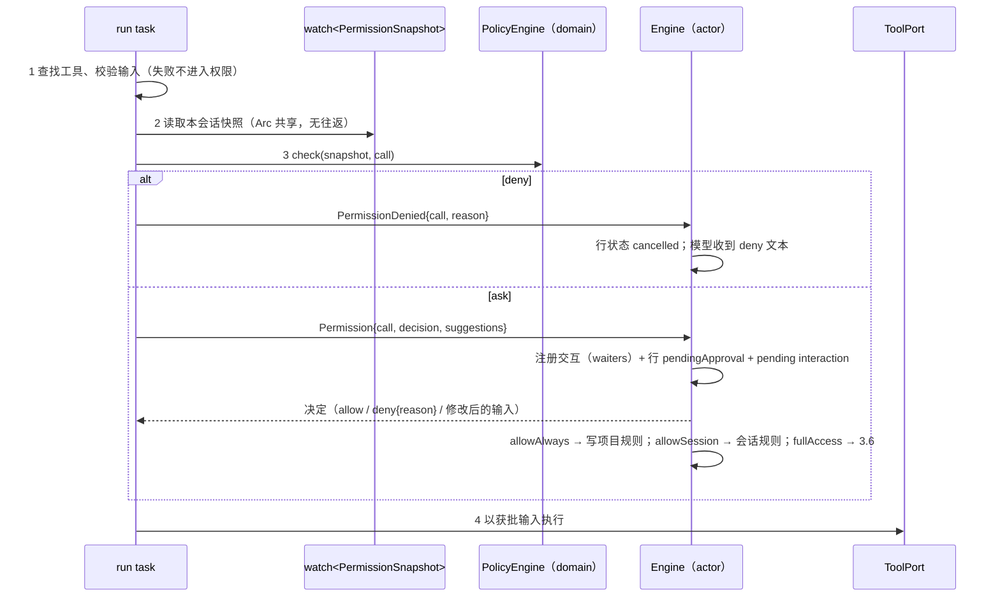
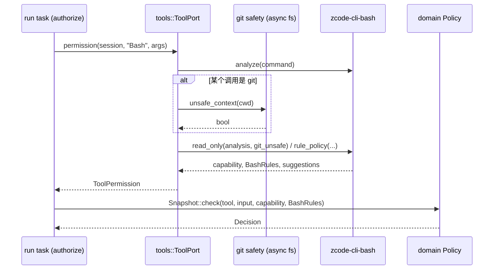

# Rust M2：执行模式、权限、plan、Bash 只读判定、hooks 与工作区信任

总设计见 [P0/P1 架构设计](rust-p0-p1-architecture.md) 4.5、5.5、5.12。

原则：**逐项对齐 Node 现有行为**，包括第 6 节列出的已知缺陷（2026-09-23 确认）。本文引用的 Node 路径以 `apps/zcode-cli/packages/` 为根，`shared/` 指 `packages/shared/src/`。

凡是需要逐字一致的文本、表格与判定结果，都由生成脚本调用 Node 实现导出为 JSON 夹具，再由 Rust 表驱动测试比对，不在 Rust 中手抄：

- 提示词与模型可见文本；
- 工具能力元数据；
- 权限判定矩阵；
- Bash 策略表与命令注册表；
- hook digest 向量。

## 1. 交付顺序与能力声明

| 子项 | 内容                                                                                                  | 完成后声明                                   |
| ---- | ----------------------------------------------------------------------------------------------------- | -------------------------------------------- |
| M2.1 | 执行状态：模式与 plan 开关的唯一变更路径、投影、持久化                                                | —                                            |
| M2.2 | 权限策略、规则、交互选项、全权限                                                                      | —                                            |
| M2.3 | Bash 只读判定、"始终允许"前缀建议、Bash 规则匹配、git 安全检查                                        | `permissionModes: [build, edit, yolo, auto]` |
| M2.4 | Plan 工具、plan 审批、计划文件、提醒、`v4/conversation/plans`                                         | `independentPlanState: true`                 |
| M2.5 | Hooks：7 种事件、执行、输出合并、模型可见结果                                                         | —                                            |
| M2.6 | 项目 hooks 的工作区信任：digest、信任存储、准入、审查流程、4 个 V4 命令、`workspace/hooks/trustGrant` | —                                            |

- M2.2 完成、M2.3 未完成期间，Bash 一律按非只读处理（build 下每条命令都询问）。这是更保守的方向，能力也尚未声明，App 仍按 yolo-only 门禁。
- M2.3 完成后，`runtime/capabilities.independentPlanState` 与执行能力的声明同 Node 等价：
  - Node 不声明执行能力，App 因而视全部模式可用；
  - Rust 声明全部四种模式，效果相同；
  - `rust-app-execution-modes.md` 的"Rust 只声明 yolo"随之更新。

## 2. M2.1 执行状态

依据 `shared/execution-state.ts`、`core/src/runtime/execution-state.ts`、`core/src/runtime/methods/{config,resume,turn-model,subagent}.ts`、`bootstrap/src/zcode-protocol-v4/commands/handlers/{model-config,goal-compact,session-flow}.ts`。

### 2.1 状态与归一化

- `ExecutionState { mode: build | edit | yolo | auto, plan_enabled: bool }`。`plan` 不是存储的模式，只是输入别名。
- `resolve(input, current)` 与 Node `resolveExecutionState` 相同：
  - `mode`：输入 mode 属于四种有效模式时取之，否则保留当前；
  - `plan_enabled` 依次取：
    1. 输入显式给出的值；
    2. 输入 mode 为 `plan` 时为 `true`；
    3. 输入 mode 为有效模式时为 `false`，即只发 `{mode:"edit"}` 会关闭 plan；
    4. 其余情况保留当前值。

### 2.2 唯一变更路径

所有变更都经 Engine 的 `apply_execution_state(session, input, cause)`，`cause` 为 `command` 或 `tool{tool_call_id}`。顺序与 Node `applyRuntimeExecutionState` 一致：

1. 全权限事务进行中时拒绝，错误文本为 `Permission update is busy; retry mode change`。
2. 计算 `next`。若 mode 与 plan 都未变，直接返回，不投影也不持久化。
3. 开启 plan 且会话有 `active` 目标时拒绝，错误文本为 `Plan and Goal cannot be active at the same time.`。暂停的目标允许。
4. 写会话状态。会话元数据本身随持久化事务一起提交，失败时内存不变。
5. plan 发生变化时设置 `needs_plan_exit_reminder = !next.plan_enabled`，供下一次模型请求使用，不落盘。
6. 投影 V4 `config.mode`、`config.planEnabled`；来源为工具时同时写 `config.planTransition = {toolCallId, planEnabled}`。

调用方：

| 路径                                                                     | 行为                                                                                                                                                                                                                                                                        |
| ------------------------------------------------------------------------ | --------------------------------------------------------------------------------------------------------------------------------------------------------------------------------------------------------------------------------------------------------------------------- |
| `switchCollaborationMode {mode: build\|edit\|plan\|yolo}`                | CAS 命令。`mode` 等于当前 mode 且 plan 关闭时，ACK 为 `noop / config.unchanged`。否则调用 `set_mode`：应用 `{mode}`，再写项目模式偏好（保存的是应用后的权限模式，永不为 `plan`，写失败只记 warn）。异常时 ACK 为 `failed / fault.command.executionFailed`，并带 `message`。 |
| `createSession.config.mode/planEnabled`                                  | 仅当 mode ∈ {build, edit, plan, yolo} 或给出了 planEnabled 时应用；不写项目偏好。                                                                                                                                                                                           |
| 输入 intent（`sendText`、`sendGoalCommand`、`createSession.firstInput`） | admission 时把 payload 的 mode/planEnabled 与当前状态合成冻结值（`auto` 视为 `build`）写入 intent；run 开始或引导消息排空时以 `command` 来源应用。                                                                                                                          |
| EnterPlanMode / ExitPlanMode                                             | 见第 5 节。                                                                                                                                                                                                                                                                 |
| 全权限                                                                   | 见 3.6。                                                                                                                                                                                                                                                                    |
| 目标命令                                                                 | intent 带 `planEnabled:true` 的 `sendGoalCommand` 返回 `rejected / guard.planGoalMutuallyExclusive`。其余目标命令先应用 `{mode, planEnabled:false}`。plan 开启时 `resumeGoal` 被拒绝；plan 开启期间跳过目标续跑。                                                           |

### 2.3 持久化与恢复

- 会话的 `mode` 与 `plan_enabled` 已随会话元数据持久化，TS 导入时原样恢复。
- **项目模式偏好**：
  - 新表 `rust_project_setting(workspace, namespace, key, value)`，行 `(permission, mode)`，值 `{"mode": ...}`；
  - TS 导入时读取 Node 的 `local_setting(scope="project", scope_id=<projectID>, namespace="permission", key="mode")`；
    `projectID` 按 Node `projectIdFromDirectory(workspacePath)` 计算（小写后把 `[^a-z0-9._-]+` 替换为 `-`，去掉首尾 `-`，空时为 `session`，截取 80 字符）；
    Rust 已有的同名行优先，导入与会话导入在同一事务中提交。
- 新会话的初始模式为：会话创建参数 → 项目偏好 → 配置 `permission.mode` → `build`，结果经 `resolve` 归一化。

### 2.4 子代理

- 父模式取 `plan`（父会话 plan 开启时）或父会话的 mode。
- 子代理模式按 profile 的 `permissionMode` 决定：
  - `auto` 或 `plan` 时取对应值；
  - 未指定时，内置 Explore 为 `yolo`，其他子代理继承父模式。
- 子会话的状态为 `mode = (子模式为 plan ? 父 mode : 子模式)`，`plan_enabled = (子模式为 plan)`。
- 项目来源的 profile 忽略 `permissionMode`。
- 状态在创建时确定，父会话之后的变化不传递给子代理。

## 3. M2.2 权限策略

依据 `core/src/permission/{service,plan-mode-policy,rule-matching,workflow-draft-path}.ts`、`core/src/tool/executor/permission-*.ts`、`bootstrap/src/permission-options.ts`、`bootstrap/src/zcode-protocol/interaction-broker.ts`、`bootstrap/src/zcode-protocol-v4/{interaction-registry,product-projection}.ts`。

### 3.1 工具能力元数据

- 每个工具的能力元数据由脚本从 Node `builtInTools` 导出为 `crates/domain/fixtures/tool-capabilities.json`，Rust 只加载已实现的工具。字段：
  - `readOnly`、`destructive`、`allowedInPlanMode`、`requiresUserInteraction`、`alwaysAsk`
  - `sideEffectScope`、`riskLevel`、`needsApproval`
  - `permission`（类别名）
- 缺字段时按 `service.ts:583-611` 的默认值推断，与 Node 相同。
- MCP 工具：`readOnly = readOnlyHint === true`，`destructive = destructiveHint === true`，scope 为 `network`，`needsApproval = true`，类别为 `mcp`。风险：destructive 为 high，readOnly 为 low，其余为 medium。
- Bash 的只读命令在运行时改写为 `{readOnly: true, destructive: false, needsApproval: false, riskLevel: low, sideEffectScope: none}`（第 4 节）。

### 3.2 PolicyEngine（domain 纯函数）

输入为一份快照 `{mode, plan_enabled, project_rules, session_rules, allowed_tools, disallowed_tools, auto_approve_high_risk, working_directory}` 和调用视图 `{tool, input, capability}`。输出 `{decision: allow|ask|deny, rule_id, reason, risk_level, side_effect_scope, always_ask?}`。

判定顺序与 Node `checkPermission` 一致：

1. plan 过渡工具：
   - EnterPlanMode 一律 allow；
   - plan 关闭时 ExitPlanMode 为 deny。
2. `requiresUserInteraction`：在 `disallowedTools` 中则 deny，否则 ask。
3. `alwaysAsk` 分支（`checkAlwaysAsk`）：auto 模式、disallowed、项目 deny 判 deny；会话规则判 allow；其余 ask。
4. yolo 且 plan 关闭时 allow。
5. auto 模式 deny，理由为 `Auto mode is reserved but not implemented yet`。
6. `disallowedTools` 精确匹配工具名则 deny。
7. 项目 deny 规则。
8. 项目 ask 规则。
9. plan 开启时进入 plan 阶梯，后续步骤均不再执行：
   - 只读且非破坏性，allow；
   - 非破坏性 MCP，allow；
   - 显式声明的会话能力，allow；
   - 其余 deny。
10. 项目 allow 规则。
11. WebFetch 预批准的 URL（主机表由脚本导出）。
12. 工作流草稿写入。
13. `allowedTools`。
14. edit 模式下，`permission == "edit"` 且 scope 为 `workspace` 的工具 allow；其余落入 build。
15. build 阶梯：
    1. 只读且无需审批，allow；
    2. critical 风险 ask；
    3. high 风险且未开启 `autoApproveHighRisk` 时 ask；
    4. session 范围的低风险状态更新 allow；
    5. 有副作用 ask；
    6. 其余 allow。

策略判定之后的调整：

- PreToolUse hook（M2.5）：`allow` 把 ask 升为 allow（`alwaysAsk` 除外），`ask` 把 allow 降为 ask。
- 记忆目录下 Markdown 文件的写入放行（记忆功能不在 M2 范围，保留入口）。

每一步的 `ruleId` 与 `reason` 文本由脚本从 Node 导出的判定矩阵夹具校验。

### 3.3 规则

- **结构**：`{toolName, ruleContent?}`。项目规则集为 `{version: 1, allow?, deny?, ask?}`，按 `toolName + "\0" + ruleContent` 去重，保留首个。
- **来源**：
  - 项目规则：存于 `rust_project_setting(permission, ruleset)`，TS 导入时读取 Node 的 `local_setting ... key="ruleset"`；
  - 会话规则：只在内存中，只参与 `alwaysAsk` 分支；
  - 配置的 `permission.allowedTools` / `disallowedTools`：按工具名精确匹配。
- **匹配**（`service.ts:233-320`、`rule-matching.ts`）：
  - `toolName` 必须相等，唯一的别名是 `Edit` 规则也匹配 `Write`；
  - 没有 `ruleContent` 的规则直接命中；
  - 匹配对象：
    - 输入本身是字符串时取整个输入；
    - WebFetch 取 `domain:<host 小写且去掉末尾的点>`；
    - 其余取 `command, url, file_path, path, pattern, patch_text` 中第一个字符串字段；
  - 以 `:*` 结尾的规则做前缀匹配，前缀后必须是结尾、空格或制表符；
  - 含 `*` 的规则转为锚定的通配正则；
  - 其余精确相等；
  - Bash 使用专用的规则求值（第 4 节）。
- **写入**：所有规则写入都经 Engine 串行完成，与交互解决在同一持久化事务中提交。这不改变 Node 的判定结果，只是不会像 Node 那样丢失更新。

### 3.4 管线与所有者

- 快照的所有者是 Engine：每个会话一个 `watch::Sender<Arc<PermissionSnapshot>>`。
- 模式变更、规则写入、配置重载时，Engine 发布新快照；run task 每次工具调用只读一次。

### 3.5 交互选项与投影

- **pending interaction**：
  - `kind: "permission"`；
  - `payload` 为 `{kind, toolCallId, toolName, summary: 判定理由, detail: 输入, freeText: true, options, fullAccessOption?, origin?, display?}`。
- **选项**（按顺序）：
  - `allowOnce`（kind `allowOnce`，文案 `Allow once`）；
  - `allowAlways`（kind `allowAlways`，文案 `Always allow in this project`）；
  - `allowSession`（kind `allowAlways`，只在 `askOptions.allowAlways == "session"` 时替代 allowAlways）；
  - `deny`（kind `deny`，文案 `Deny`）。
- **`fullAccessOption`** 为 `{optionId: fullAccess, label: "Full access", kind: custom}`，只在非子代理请求且无选项策略时提供。
- **工具行**：询问时为 `pendingApproval` 并带 `approvalInteractionId`；解决后 allow 为 `running`，deny 为 `cancelled`；策略直接 deny 时也为 `cancelled`。deny 不产生工具错误事件，但模型会收到 deny 文本作为工具结果。
- **`resolveInteraction` 的答案映射**（`interaction-broker.ts:147-193`）：
  - `allowOnce` 为 allow；
  - `allowAlways` 为 allow，并按建议写入项目规则。写入失败时与 Node `permission-flow.ts` 一致：交互仍按允许解决（行回到 `running`），但工具不执行，模型收到 `Failed to persist project permission update`，行为 `error`；内存中的项目规则保持旧值；
  - `allowSession` 为 allow，并写会话规则（整个工具）；
  - `deny` 或无法识别的答案为 deny，理由为 `PERMISSION_DENIED_BY_USER_CONTENT`；非空的 freeText 追加为 ` To tell you how to proceed, the user said:\n<feedback>`。
- **ACK**：一律 `accepted` 且不带 `result`；重复或未知的 id 幂等成功（`snoozeInteractionAutoResolution` 同理）。Rust 保留会话归属检查：发往非宿主会话的应答同样返回 `accepted`，但不产生效果。
- **模型可见的 deny 文本**：
  - 用户拒绝时使用上面的文本，逐字保留；
  - 策略拒绝时使用规则理由；
  - 没有理由时为 `Permission denied for <tool>`；
  - 其余文本折叠空白，超过 500 字符截为 497 个字符加 `...`。
- **建议规则**：
  - Bash 按第 4 节；
  - 其余工具为整个输入字符串，或 `command, url, file_path, path, pattern` 中第一个非空字段；
  - WebFetch 保存完整 URL，因而永不命中（D5，保持 Node）。

### 3.6 全权限

`resolveInteraction{optionId: "fullAccess"}` 由 Engine 在一个持久化事务内完成：

1. 会话 mode 设为 `yolo`，`plan_enabled` 保持不变；
2. 当前排队输入的 `mode` 改写为 `yolo`；
3. 投影 `config.permissionGrant = {interactionId}`；
4. 被选中的交互按 allowOnce 解决。

- 前置条件：没有进行中的全权限、没有队列提升或引导排空；否则 ACK 为 `failed`，错误文本为 `Queue mutation is busy; retry approval`。
- 同一交互重复提交视为幂等。
- 不写项目偏好。
- 与 Node 一致，只放行当前这一条（D6）。

### 3.7 子代理

- Explore 使用独立的空策略：没有会话规则，没有 `allowed` / `disallowed` 列表，模式为 yolo。
- 其余子代理共享父会话的会话规则，模式按 2.4 确定。
- 子代理的询问路由到根会话，payload 带 `origin`，锚定根会话中对应的 Agent 工具行；不提供 `fullAccessOption`。
- 根会话的 run 结束时只清理自己的待决交互；仍由子会话持有的请求保留在根会话上，直到子会话应答或释放（`release_waiters` 同时撤下宿主上的条目）。
- 待决条目先写入宿主会话，再发布工具行与状态，保证同一帧的 `state.updated` 已含该请求。

## 4. M2.3 Bash 只读判定

依据 `core/src/tool/handlers/bash-*.ts`、`unbash@4.0.1`、`generated/bash-command-registry.ts`。

- **解析**：移植 unbash 4.0.1 的词法与语法分析，覆盖以下部分，并逐一复现 Node 的取值与容错行为：
  - 词值：反斜杠保留、ANSI-C 转义；
  - 动态部分识别；
  - 重定向与 heredoc；
  - 语句、`&&` / `||`、管道、`!` 与 `time`；
  - 出错时的恢复。

  复合结构（子 shell、`if`、`for`、函数、`[[ ]]`、`(( ))`、后台 `&` 等）只需识别为不支持，一律判非只读。

- **判定**：`is_read_only(command, cwd)` 与 `isRuntimeReadOnlyBashCommand` 一致：
  - 命令需满足可判定的前提：无解析错误、无不支持语法、无动态词；
  - 同一行里 git 与 `cd`/`pushd`/`popd` 共存时判非只读；
  - 调用 git 时，当前目录的 git 运行环境需安全（`bash-git-runtime-safety.ts`，同步文件检查）；
  - 每个调用都需通过写选项检查与只读策略。
- **策略表**：由脚本从 TS 导出，导出的是解析后的对象：
  - 60 条命令策略、46 条任意参数命令、24 条 git 子命令、24 条多词命令；
  - 1029 项安全参数；
  - fig 命令注册表（707 个根命令）。

  输出为 JSON 并以 `--check` 防止漂移；约 20 个危险回调按名称手工移植，启动时断言每个名称都有实现。

- **"始终允许"建议**（`bash-command-permission-policy.ts`）：
  - 为每个非只读调用计算稳定前缀，形如 `<prefix>:*`，最多 5 条；
  - 无法计算前缀时退回精确命令；
  - 包装命令最多展开两层；
  - 高危根命令不生成前缀；
  - 按深度覆盖表处理子命令深度，其余按命令注册表遍历。
- **规则求值**（`bash-command-rule-evaluator.ts`）：
  - 精确命令或无内容的规则直接命中；
  - 不可判定的命令不匹配任何前缀规则；
  - allow 要求每个非只读调用都被覆盖；
  - deny / ask 只要任一调用命中。
- **保留的 Node 行为**：
  - `sed s/…/w file` 判只读；
  - 带重定向或 `$` 的命令不匹配前缀规则；
  - `git status:*` 放行 `git -C <任意目录> status`；
  - 当前目录含 `refs/` 时，git 命令判非只读；
  - 任意参数命令表遮蔽同名命令的逐条策略；
  - `hostname` 的正则针对完整命令文本。
- **原型链键**：JS 对象查找会命中原型链，例如 `constructor foo` 在 Node 中抛异常。Rust 使用自有键查找，不模拟这个异常，该命令按普通未知命令处理（非只读，使用精确规则）。这一处是唯一的有意差异，原因是异常属于实现崩溃，不是产品行为。
- **夹具**：生成脚本经 tsx 直接调用 Node 的解析、判定与策略模块作为对照源，生成约 300 条命令的 `{analysis, readOnly, suggestions, ruleResults}`，并在临时目录中构造 git 场景。

### 4.1 模块与所有者

- `crates/bash-parse`（`zcode-cli-bash-parse`）：unbash 4.0.1 词法与语法的移植，以及 `bash-command-parser.ts` 的遍历，对外只暴露 `analyze(command) -> Analysis` 与 `is_permission_safe`。纯函数，无 IO。
  - 约束：Node 判为可判定（无解析错误、无不支持语法、无动态词）时，`Analysis` 全部字段逐一相同；Node 判为不可判定时，Rust 也必须判为不可判定，其余字段不参与任何决策。
  - 长度上限与 `trim` 按 JS 语义：10 000 个 UTF-16 单元，`String.prototype.trim` 的空白集合。
- `crates/bash`（`zcode-cli-bash`）：只读策略、策略表、危险参数回调、始终允许建议、fig 命令注册表与 Bash 规则求值。纯函数，无 IO；git 运行环境是否安全作为输入传入。
  - 策略表与注册表由生成脚本从 Node 导出为 JSON（解析后的对象，保留顺序），以 `include_str!` 嵌入并在首次使用时解析；回调按名称绑定，启动测试断言每个名称都有实现。
- `crates/tools`：Bash 工具的权限入口。按会话当前 Bash 工作目录做 git 运行环境检查（异步文件 IO，只在命令调用 git 时执行，同一次判定只查一次），然后调用 `zcode-cli-bash` 得到能力与规则策略。
- `ToolPort::permission(session, name, args)`（异步）返回 `{capability, rules, suggestions}`。默认实现由同步的静态能力 `capability()` 与通用建议组成；工具端口只为 Bash 覆盖它。Core 的 `authorize` 把 `rules` 传给 `Snapshot::check`，替换临时的精确匹配。
- Rust 的 Bash 始终在工作区目录执行（尚未实现 Node 的 `cd` 持久化），git 运行环境检查因此使用工作区目录。

- 声明：M2.3 通过全部夹具与集成测试后，`permissionModes` 改为 `[build, edit, yolo, auto]`。

## 5. M2.4 Plan

依据 `contracts/src/tools/plan-mode.ts`、`core/src/tool/handlers/{plan-mode,plan-mode-prompts}.ts`、`core/src/runtime/helpers/{runtime-reminders,plan-file-continuity}.ts`、`core/src/tool/executor/turn-control.ts`、`bootstrap/src/zcode-protocol/interaction-broker.ts:269-446`。

- **工具**：主会话始终注册，子代理中始终移除。
  - EnterPlanMode：schema 为 `{}`（strict）。
  - ExitPlanMode：`{plan: 1..20000 且非空白, allowedPrompts?}`，允许额外字段。`allowedPrompts` 只回显，不授予任何权限。
  - 描述、模型可见结果与提醒文本全部由脚本从 TS 导出。
- **EnterPlanMode**：权限一律 allow；以 `tool` 来源应用 `{planEnabled: true}`，mode 不变；有进行中的目标时工具失败。
- **ExitPlanMode**：
  - plan 关闭时 deny。
  - plan 开启时询问，pending interaction 为 `kind: "userInput"`，`schema: {interaction: "plan_approval", toolName: "ExitPlanMode"}`，问题文本为权限理由 `Tool ExitPlanMode requires user interaction`，唯一选项为 `approve`，并允许自由文本。
  - 答案映射：
    - `action: accept`：内容为 `approve` 时批准，为其他非空文本时视为反馈；
    - `allowOnce` / `allowAlways`：批准；
    - 非空 freeText：视为反馈；
    - 其余（包括 `optionId: "approve"`）：拒绝。
  - 批准后依次：
    1. 写计划文件 `<workspace>/.zcode/plans/plan-<清理后的会话 id>.md`，原子写，写入失败静默忽略；
    2. 以 `tool` 来源应用 `{planEnabled: false}`，mode 不变；
    3. 返回 `User has approved your plan…## Approved Plan:\n<plan>`。
  - 拒绝且带反馈：工具结果为 `The plan was not approved by the user.`，反馈作为引导消息进入同一轮，plan 保持开启。
  - 拒绝且无反馈：结果为 `Permission denied for ExitPlanMode`，本轮在提交工具结果后结束，同批后续工具以 `Tool cancelled because a previous tool result requested a turn stop.` 取消。
- **提醒**（只在内存中，不落盘）：
  - `runtime_mode`：plan 开启时每次模型请求检查。当没有先前提醒，或自上次提醒后已有至少 5 条真实用户消息时注入：第 1、6、11… 次用完整文本，其余用精简文本。
  - `plan_mode_exit`：plan 关闭后的下一次模型请求注入一次。
- **压缩后**：无论 plan 是否开启，只要计划文件存在且非空，就注入计划文件提醒。读取上限 81024 字节；除文件不存在外的读取错误都会使压缩失败。
- **`v4/conversation/plans`**：返回 `{plans, atSeq, atLogEpoch}`：
  - 取状态为 success / error / cancelled 且 `plan` 非空的 ExitPlanMode 工具行；
  - 按 `rowId` 降序；
  - 不分页。
- **目标**：互斥规则见 2.2。

## 6. M2.5 Hooks

依据 `core/src/hooks/**`、`core/src/tool/executor/{hook-flow,call-runner}.ts`、`core/src/runtime/methods/{hooks,turn,turn-stop}.ts`、`adapters/src/exec/*`、`bootstrap/src/app/runtime-config.ts`。

- **配置与来源**：
  - 用户配置的 `hooks` 已由 M1 合并；插件 hooks 待 M10 接入，本期留接口；
  - 插件提供 hooks 时强制启用 hooks（保持 Node 行为）；
  - 注册顺序：用户 → 项目（需信任，M2.6）→ 插件 → 内部；
  - `enabled: false` 的 hook 跳过；
  - 子代理中不触发任何 hook。
- **7 种事件**：SessionStart、UserPromptSubmit、PreToolUse、PermissionRequest、PostToolUse、PostToolUseFailure、Stop。
  - 各事件的触发时机、输入字段与 stdin 兼容字段同 Node，包括：
    - PostToolUseFailure 中 `error` 被覆盖为字符串；
    - 从不发送 `permission_suggestions`。
  - 同一事件的 hooks 按注册顺序依次执行，不因某个 hook 拦截而中止；`async: true` 的 hook 在后台执行，不合并其输出。
- **匹配**：使用 `regress`（ECMAScript 语义），不加 flag、不锚定：
  - 空 matcher 或 `*` 匹配；
  - 只含 `[A-Za-z0-9_|]` 时按 `|` 分割后精确比较；
  - 非法正则不匹配；
  - UserPromptSubmit 与 Stop 没有匹配值，任何 matcher 都匹配；
  - 工具别名：`Agent` 与 `Task` 互为别名，`ApplyPatch` 对应 `[Write, Edit]`。
- **执行**：
  - command hook 使用 `/bin/sh -c` 或配置的 shell，process hook 按 argv 执行；
  - cwd 为运行时工作目录；
  - 环境变量为 M1 工具环境，加上会话与项目变量，有插件时再加插件变量；
  - `${VAR}` 展开规则同 Node：没有插件时保留 `${CLAUDE_PLUGIN_ROOT}` 原文；skill 变量报 `configuration_error`；
  - stdout 与 stderr 各自截在 `maxOutputBytes`，超出部分丢弃，不杀进程；
  - 单一计时器超时时结果为 `timed_out`，文本为 `Hook timed out after <n>ms`（D10 保持 Node 实际表现）；
  - 终止顺序：先 SIGTERM 进程组，750 ms 后 SIGKILL；根进程退出后 1 s 仍占用输出的子进程会被回收。
- **退出码与输出**：
  - 退出码 0：解析 stdout JSON，截断导致 JSON 无效时静默忽略（D8）；
  - 退出码 2：按事件生成拦截输出；
  - 其余退出码：hook 失败，不拦截。
- **合并**（`output.ts`）：逐字移植，包括：
  - `permissionRequestResult` 后者覆盖前者（D9a）；
  - `preventContinuation` 用空值覆盖 `stopReason`（D9b）；
  - `permissionBehavior` 按 deny > ask > 最后一个 allow 合并。
- **模型可见结果**：
  - PreToolUse 拦截：返回 permission_denied 错误；
  - 附加上下文：追加 `\n\n[Hook additional context]\n#1\n…`；
  - SessionStart、UserPromptSubmit、Stop 的上下文：以 system-reminder 形式注入，截断为 24000 个 UTF-16 单元；
  - UserPromptSubmit 阻止：不写入历史，本轮以阻止理由结束；
  - Stop 续跑：需要 `continue` 且带上下文，每轮最多 3 次。
- **PermissionRequest**：与用户审批竞速，先到者胜，失败方被取消（保持 Node 行为）。
- **投影**：
  - `hookInvocation` 行，lane 为 toolBefore / toolAfter / assistantWork；
  - HookRun 事件；
  - UserPromptSubmit 拦截时写 `lastError`，代码为 `fault.runtime.hookBlocked`。

## 7. M2.6 工作区信任

依据 `shared/{workspace-hook-config,workspace-hook-digest,workspace-hook-trust-store-file,workspace-hook-mutation}.ts`、`adapters/src/storage/workspace-hook-trust-store.ts`、`core/src/hooks/workspace-hook-*.ts`、`bootstrap/src/app/workspace-hook-*.ts`、`bootstrap/src/zcode-protocol/workspace-hook-trust.ts`。

- **发现**：沿用 M1 的项目配置发现顺序。一个项目 hook 条目带：
  - `reviewItemId`，形如 `workspace-hook-<源文件序号>-<事件>-<matcher 序号>-<hook 序号>`；
  - 相对路径与发现序号；
  - 解析后的超时与输出上限；
  - 四个开关：源根启用、声明启用、运行时启用、配置启用。
- **digest**：
  - `sha256(JSON.stringify(payload))`，payload 为声明数组或 bundle 数组；
  - 数字与字符串的序列化与 JS 一致；
  - 用 Node 生成的向量校验，含调研得到的 4 组向量。
- **信任存储**：与 Desktop 共用 `<storageRoot>/security/workspace-hook-trust-v1.json`：
  - 格式、字段顺序与去空白规则同 Node；
  - 锁协议：`wx` 创建锁文件，写入 pid、启动时间与 token；每 10 ms 重试，5 s 超时；锁文件超过 30 s 且持有者已死或启动时间不符时视为过期；
  - 原子写：临时文件 → fsync → rename，文件权限 0600；
  - 文件损坏时改名为 `.corrupt-<ms>`。
- **判定与准入**：
  - 信任状态依次为：
    - `blocked_policy`
    - `blocked_untrusted`（存储损坏）
    - `trusted_persistent`
    - `revoked`
    - `stale_digest`
    - `pending_trust`
  - 策略默认为 `user_decides`；
  - 每次执行项目 hook 前都重新评估准入；
  - 未获准的 hook 只产生一条 blocked 生命周期事件。
- **审查流程**：
  - 每个会话同时只有一个审查流程；流程的状态为 pending、resolved、superseded、cancelled、timed_out，超时 600 s；
  - 请求 payload 与 Node `workspace-hook-review-request.ts` 相同。
- **命令**（ACK 与 reasonCode 同 Node）：
  - `respondWorkspaceHookReview`
  - `toggleWorkspaceHookReviewItem`（改写 `<cwd>/.zcode/config.json` 中对应 hook 的 `enabled`）
  - `revokeWorkspaceHookTrust`
  - `requestWorkspaceHookReview`
- **RPC**：`workspace/hooks/trustGrant`（无会话的预先信任），结果为 `{accepted, reasonCode?}`；成功后同工作区的会话重新加载信任。
- **投影**：
  - pending interaction，`kind: "workspaceHookReview"`；
  - 快照字段 `workspaceHookAdmission`：`{pendingCount, bundleDigest, workspaceIdentity?}`，数量为 0 时为 `null`。
- **范围**：信任只在 app-server 中启用；纯 CLI 下项目 hooks 以 `workspace_hooks_feature_disabled` 阻止，与 Node 相同。

## 8. 保持的 Node 缺陷（本期涉及）

- D1：被隐藏的工具被调用时照常执行。
- D2：用户答复与 PermissionRequest hook 竞速。
- D3：模式与 plan 各自读取。Rust 每次调用读取同一份快照，这是 Node 无竞争时的行为，不构成差异。
- D4：规则的读-合并-写。Rust 串行写入，判定结果不变。
- D5：WebFetch 的"始终允许"保存完整 URL，因而永不命中。
- D6：全权限只放行当前这一条。
- D7：重启后待决权限的收口。按 Node 当前行为：交互随进程丢失，冷恢复时工具行按中断收口。
- D8、D9、D10：见第 6 节。
- yolo 跳过项目 deny 规则与 `disallowedTools`。
- plan 允许非破坏性 MCP 工具。

**移植中新发现、待用户决定（当前保持 Node 行为）**：

- **D14（权限绕过）**：unbash 把带文件描述符前缀的进程替换当作普通参数，例如 `cat 2<(touch x)` 的 argv 为 `["cat", "2<(touch x)"]`，没有动态词，`cat` 又允许任意参数，因此判为只读，build / edit 模式下免审批执行。bash 实际会执行其中的命令（已在本机验证 `touch` 生效）。建议修复：解析层把 `\d+[<>]\(` 形式的词视为动态词（不可判定），并同步修 Node。
- 其余几处 unbash 怪癖不会导致免审批执行，保持 Node 行为：`> $(cmd)` 丢弃重定向但 argv 为空（非只读）；`a=($(cmd)) ls` 的数组元素不检查（赋值名不在白名单，非只读）；`toString; cmd` 因原型链保留字得到零条命令（非只读）；`echo x;; cmd` 丢弃 `;;` 之后的内容（bash 本身报语法错误，不执行）。

## 9. 验收

- **夹具**：
  - 工具能力表；
  - 权限判定矩阵：模式 × 工具 × 规则 × plan；
  - 规则匹配；
  - Bash 解析、只读判定、建议与规则求值，约 300 条命令加 git 场景；
  - plan 文本；
  - hook stdin、合并与 digest 向量。

  全部由 Node 实现生成，Rust 表驱动比对；生成器以 `--check` 纳入 `pnpm test:zcode-cli-rust`。

- **集成测试**（`packages/services/tests/zcode-cli-rust-*.test.ts`），覆盖以下场景：
  - build、edit、yolo 下的询问、允许与拒绝；
  - allowAlways 写项目规则并在重启后生效；
  - allowSession；
  - 用户拒绝的反馈文本；
  - 全权限改写排队输入；
  - plan 开关、EnterPlanMode / ExitPlanMode 的批准、带反馈拒绝与无反馈拒绝，以及计划文件与 plans RPC；
  - 目标互斥；
  - 各事件的 hooks；
  - PreToolUse 拦截与改写输入；
  - Stop 续跑上限；
  - 项目 hooks 从 pending 到信任，再到执行与撤销。

  以上场景在 desktop-continuous 与 web-remote-replayable 两种订阅下都要验证。

- **门禁**：
  - 每个子项提交前执行 `cargo clean` 与 `CARGO_INCREMENTAL=0`；
  - 运行 `pnpm test:zcode-cli-rust`、`cargo test --workspace`、`pnpm check:zcode-cli-rust`；
  - 改动 TS 时加跑 `pnpm typecheck`、`pnpm lint`。
