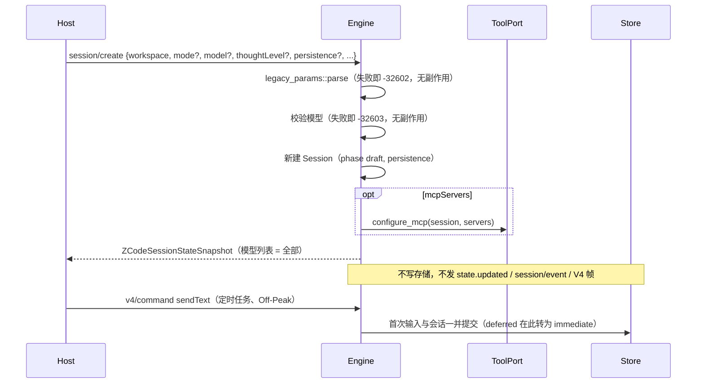
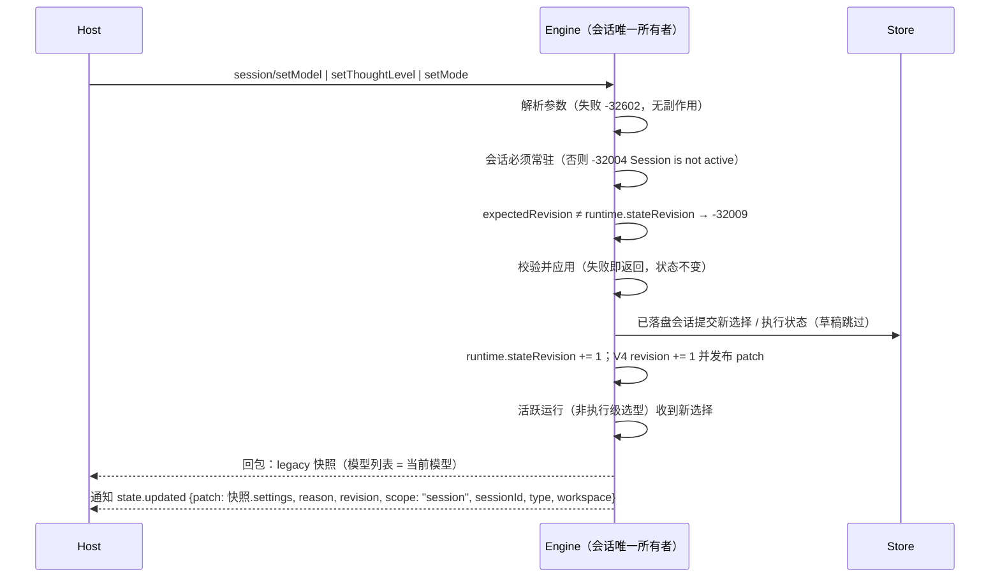
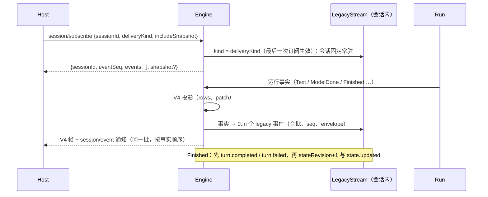
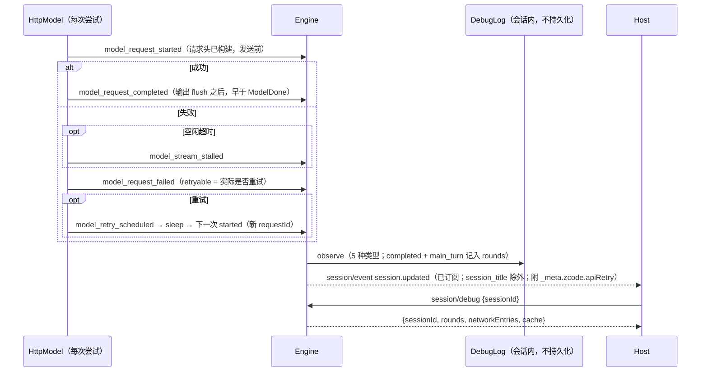

# Rust M3：legacy `session/*` 方法

依据：`scratchpad` 中对 Node app-server 的实测报告（`m3-session-create-resume.md`、`legacy-session.md`），以及 `apps/zcode-cli/packages/bootstrap/src/zcode-protocol/{server-operations,server-types,session-mapper}.ts`、`packages/shared/src/zcode-protocol/index.ts`。下文 `SO` / `ST` / `SM` / `SH` 分别指这四个文件。

## 1. 范围与顺序

| 子项 | 内容                                                                                                                                                        | 优先级 |
| ---- | ----------------------------------------------------------------------------------------------------------------------------------------------------------- | ------ |
| M3.1 | 参数校验与错误文本；普通 `session/create`；`importedHistory.source = "claudeCode"`；`session/resume`                                                        | P0     |
| M3.2 | `session/setModel`、`session/setThoughtLevel`、`session/setMode` 与 `state.updated`；`session/list` 列出未落盘的 immediate 会话（第 8 节）；`session/debug` | P1     |
| M3.3 | 手机链路：`session/subscribe`、`session/event`、legacy 事件日志与 seq；其余 `state.updated` 原因；`session/send`、`compact`、`goal`                         | P1     |

Desktop 的定时任务、Off-Peak 与 Claude 迁移都依赖 M3.1，本文件先定义 M3.1，M3.2 / M3.3 只列出与之相关的约束。

## 2. 参数校验与错误

### 2.1 校验器

- `session/create` 与 `session/resume` 的参数由 domain 的 `legacy_params` 解析，规则与 `zcodeSessionCreateParamsSchema` / `zcodeSessionResumeParamsSchema`（`SH:1562-1601`）一致：
  - 各层对象都是 strict，多余键报 `unrecognized_keys`；
  - `nonEmptyString` 先按 JS `trim` 裁剪再要求非空，解析结果使用裁剪后的值；
  - 枚举、布尔、字符串数组、`int >= 0` 与 `importedHistory` 的判别联合（`claudeCode` | `sharedContext`）；
  - `mcpServers` 的单项不符合 stdio / http 任一分支时，报告 `mcpServers.<i>: Invalid input`。
- 每个问题是一条 zod issue，键顺序与 zod 一致：
  - `unrecognized_keys`：`{code, keys, path, message}`；
  - `invalid_type`：`{expected, code, path, message}`；
  - `too_small`：`{origin, code, minimum, inclusive, path, message}`；
  - `invalid_value`：`{code, values, path, message}`；
  - 联合与判别：`invalid_union`，文本 `Invalid input` / `Invalid discriminator value. Expected 'claudeCode' | 'sharedContext'`。
- 错误为 `-32602`，`message` 按 `ST:200-225` 拼接：`Invalid params — <path 或 (root)>: <message>`，多个问题用 `"; "` 连接，最多 5 条，其余写成 ` (+N more)`；`data` 为 `{name: "ZodError", message: JSON.stringify(issues, null, 2)}`。
  - Host 的兼容重试（`zcodeAgentService.ts:489-577`）依赖 `data.message` 是 issue 数组；Rust 接受 Host 会发送的全部字段，正常情况下不会触发重试。
- `RuntimeError::InvalidParams` 增加可选的 `data`；`Fault` 增加可选的 `data.name`，用于 `ModelProtocolError`。
- 夹具：生成脚本对一组输入调用 Node 的 schema 与格式化函数，导出 `{input, message, data}`；Rust 测试逐条比对。

### 2.2 协议错误

| 场景                                             | code   | message                                                             | data                                                          |
| ------------------------------------------------ | ------ | ------------------------------------------------------------------- | ------------------------------------------------------------- |
| create 不带 `importedHistory` 却给了 `sessionId` | -32602 | `sessionId is only supported for imported history creates`          | 无                                                            |
| resume 找不到会话                                | -32004 | `Session not found: <id>`                                           | 无                                                            |
| 需要活跃会话的方法找不到会话                     | -32004 | `Session is not active: <id>`                                       | 无                                                            |
| Registry 中不存在的模型                          | -32603 | `Provider Registry 中不存在 Model: <provider>/<model>`              | `{name: "ModelProtocolError", code: "model_not_found"}`       |
| 需要推理档位却未提供                             | -32603 | `Reasoning level is required for <provider>/<model>`                | `{name: "ModelProtocolError", code: "invalid_model_request"}` |
| 不支持的推理档位                                 | -32603 | `Reasoning effort "<level>" is not supported by <provider>/<model>` | `{name: "ModelProtocolError", code: "invalid_model_request"}` |
| Provider 不属于 Registry                         | -32603 | `Provider Registry 中不存在 Model: <provider>/<model>`              | `{name: "Error"}`                                             |

Host 用 `/\bSession (not found|is not active):/i` 判断会话缺失（`zcodeTaskServiceAdapter.ts:1235-1238`），两条文本必须逐字一致。

## 3. 普通 `session/create`

### 3.1 所有者与时序

Engine 是会话的唯一所有者；create 只改内存，第一次输入才落盘（与 Node 一致）。

- 失败清理：MCP 配置之后的步骤失败时，撤销该会话的 MCP 配置并从内存移除会话，再返回原错误。

### 3.2 字段语义

- **`workspace`**：必须指向本 runtime 的工作区（身份 key 与路径一致），否则 `-32603 Workspace identity mismatch`；结果中原样回显（裁剪后），不重算 `workspaceKey`。
- **`sessionId`**：新建为 `sess_<uuid v4>`。
- **`mode`**：创建参数 → 项目偏好 → 配置 `permission.mode` → `build`，再经 `ExecutionState::resolve`（`plan` 即 `{build, planEnabled: true}`）。不写项目偏好。
- **`model` 与 `thoughtLevel`**：
  - 给出 `model` 时先按 2.2 校验：Registry 模型必须存在；有推理档位的模型必须带 `options.reasoningLevel`，且档位受支持。
  - 应用时丢弃 `model.options`（Node 以字符串形式调用 `setModel`），会话选择为 `{providerId, modelId}`、无档位。
  - `thoughtLevel` 裁剪后，只有属于当前模型的推理档位才应用；否则忽略（记 warn，不报错）。
  - 未给 `model` 时使用 Registry 默认选择（含其档位），再按上条处理 `thoughtLevel`。
  - 无档位的会话在执行时的取值见 3.4。
- **`persistence`**：默认 `immediate`。
  - `deferred` 与 V4 `createSession` 的草稿相同：不进入 `session/list`，不进入 sessions-index，第一次输入时转为 immediate。
  - `immediate` 在第一次输入前也只在内存中，但：出现在 `session/list`（M3.2）；在其会话话题被订阅或 `rowsRange` 查询后，以 `phase: "draft"` 进入 sessions-index（Host 的索引同步忽略 draft 行）。
  - `session/close {expectedPersistence}` 只关闭 persistence 一致的会话，否则返回 `{closed: false}`。
- **`titleGenerationEnabled`**：记录在会话上，供标题生成使用（Rust 目前没有标题生成请求；首条输入即标题）。
- **`mcpServers`**：非空时替换配置文件中的服务器，作用于 runtime 生命周期，不持久化；为空或缺省时使用配置文件。
- **`toolAllowlist` / `toolDenylist`**：会话级工具过滤，作用于 runtime 生命周期，不持久化。
  - 内置工具：先取与 allowlist 的交集（按别名归一化），再去掉 denylist；MCP 工具按注册名或描述名匹配。
  - 被过滤的工具不出现在工具定义中；模型仍调用时按未知工具处理。
  - 子代理继承父会话的过滤。
- **`offPeakToolEnabled` / `dynamicWorkflowEnabled`**：接受；Rust 没有 OffPeak 与 workflow 工具，二者不产生效果。
- **`parentSessionId`**：记录在会话上；create 结果中不出现（与 Node 一致），`session/list`、sessions-index 与冷 resume 中出现。
- **运行偏好反向请求**（`session/requestRuntimePreferences`）：M3.1 不发送。Host 允许 CLI 不询问；AskUserQuestion 自动解决偏好由 `workspace/updateInteractionPreferences` 提供。

### 3.3 结果快照

create 与 resume 使用同一个快照构建器，模型列表为 Registry 的全部模型；`session/read` 仍只列当前模型。字段规则（未定义的键省略，不写 `null`；Host 按 strict schema 解析）：

- `protocol`：`{name: "ZCode Protocol", version: 1}`。
- `session`：`{sessionId, traceId, workspace, sessionKind: "interactive", status, title, createdAt, updatedAt, mode: "build", target: null, model?}`。
  - `mode` 固定为 `build`（Node 取事件归约的默认值）；实际模式见 `settings`。
  - `model` 为 `{providerId, modelId}`，未绑定时省略。
  - 新建时没有 `titleSource`、`parentSessionId`、`archivedAt`。
- `settings`：
  - `mode.current` 与 `permission.mode` 为运行模式（`plan` 显示为 `build`）；
  - `model.available`：每项 `{ref, label: modelId, providerLabel: providerName ?? providerId, contextWindow, maxOutputTokens, reasoning: {levels, defaultLevel: 最后一个档位}, properties: {inputFormat, outputFormat}}`；
  - `model.current` 为会话选择（含 options），`model.lastUsed` 为 `{providerId, modelId}`；未绑定时二者省略；
  - `thoughtLevel`：`available` 为当前模型的 `[{label, value}]`，`current` 仅在列表中时出现，`enabled = available 非空`，Registry 模型不带 `defaultLevel`。
- `projection`：`{sessionId, status, mode: "build", turnCount, totalTokenCount, contextUsed, contextWindow, pendingPermissions, activeToolCalls, backgroundJobs, target: null}`。
- `runtime`：`{eventSeq, stateRevision, pendingRequestIds, goalVerifications: [], goalVerificationTimeline: []}`。
  - `stateRevision` 为 create 中实际应用的模型与档位变更次数（0–2）。
- `messages`、`todos: []`、`todoGroups: []`、`slashCommands`（与工作区配置一致）。
- 未产生过事件的新会话：`runtime.eventSeq = 0`，`projection.sessionId = "unknown"`，`projection.contextWindow = 200000`（Node 事件归约的默认值）。legacy 事件日志与之后的 `eventSeq` 在 M3.3 定义；此前其余情况沿用现有取值。

### 3.4 执行时的推理档位

create 丢弃 `model.options` 后，会话可能绑定有档位要求的模型而没有档位。Host 的 `createTask` 总是同时发送 `thoughtLevel`，定时任务的 `sendText` 带 `modelSelection`，这两条路径都会得到完整选择。

其余情况与 Node 一致：模型工厂在 Registry 边界校验选择（`provider-registry-model-runtime.ts:45-46`），不做缺省修复。缺少档位时这一轮失败，错误为 `invalid_model_request`、文本 `Reasoning level is required for <provider>/<model>`，与其他模型构建错误走同一条失败路径。输入自带的 `modelSelection` 会覆盖会话选择，不受影响。

## 4. `importedHistory.source = "claudeCode"`

### 4.1 参数

`{source: "claudeCode", title?, createdAt?, updatedAt?, messages: [{role: "user" | "assistant", content, timestamp?}] (≥1)}`；时间为非负整数，`content` 可为空且不裁剪。可同时给出 `sessionId`（Host 使用 `claude-import-<hash>`）与 `persistence`。

### 4.2 行为

1. 3.2 中与导入无关的字段照常处理（模型与档位、工具过滤、MCP 等）。
2. 时间：`createdAt = history.createdAt ?? messages[0].timestamp ?? now`；逐条消息的时间取 `timestamp`，缺省为 `createdAt + i`，并强制严格递增（不大于前一条时取前一条 + 1）。
3. 会话：
   - 新建或覆盖同 id 会话（覆盖时允许会话已活跃，Host 的历史修复依赖这一点）；
   - `title = title.trim() || "Imported session"`，`titleSource = "custom"`；
   - 已存在时保留原 `createdAt` 与 `traceId`；
   - 不记录 `parentSessionId`，`sessionKind` 为 `interactive`；
   - 模式按 3.2 解析，`plan` 记为 `build`。
4. 删除该会话中此前导入的消息（带 `migrationSource: "claudeCode"` 标记）及其行，保留用户之后追加的对话。
5. 写入消息：
   - id 为 `msg_<sessionId>_import_<i>`，不得生成 `msg_import_<i>` 形式（Host 修复逻辑以此识别旧数据）；
   - user 消息带 `migrationSource: "claudeCode"`；assistant 消息以最近的 user 消息为父消息；
   - 模型历史中是普通的 user / assistant 文本消息。
6. V4 行：每个 user 消息开启一轮：`turnHeader`（`origin: userInput`、`state: completedSuccess`、`startedAt` / `endedAt` 为该轮首尾消息时间、`historyRoundCount: 1`）、`userInput`（`origin: realUser`）与其后的 `assistantText`（`state: complete`，`assistantResponseId` 为消息 id）。`canEdit` 只在最后一个用户输入上，`canRetry` 只在最后一条 assistant 行上（与普通对话的规则相同）。
7. `updatedAt` 为导入完成时的时钟（Node 在写入消息时刷新会话时间）。
8. 会话、消息与行在一个存储事务中提交；失败时内存保持导入前的状态。
9. 导入后模型解绑（Node 恢复时找不到模型选择记录）：结果中没有 `session.model`、`settings.model.current` / `lastUsed`，`thoughtLevel` 为 `{available: [], enabled: false}`；之后的输入需要带 `modelSelection`。
10. 结果快照按 3.3，另外：`session.titleSource = "custom"`，`projection.sessionId` 为真实 id。

## 5. `session/resume`

- 参数：`{sessionId, workspace?, thoughtLevel?, mcpServers?, toolAllowlist?, toolDenylist?, offPeakToolEnabled?, dynamicWorkflowEnabled?}`；`mode`、`model`、`persistence`、`titleGenerationEnabled` 作为多余键拒绝。
- 会话已活跃：原样返回快照，忽略全部参数，不增加 revision。Host 在每次切换模型或模式后都会调用 resume，这一路径必须是无副作用的重新附着。
- 会话不存在（未活跃且存储中没有）：`-32004 Session not found: <id>`。已归档的会话与 Node 一致在恢复时失败：`-32603 Session not found: <id>`，`data.code` 为 `SESSION_NOT_FOUND`。
- 冷恢复：
  1. 从存储加载并激活会话（与 V4 激活相同的恢复与校验）；
  2. `mcpServers`、工具过滤与两个开关按 3.2 应用；`thoughtLevel` 忽略；
  3. 模式：若最后一条 assistant 消息记录了模式（`plan | build | edit | yolo | auto`），使用该模式且 `planEnabled = false`；否则沿用会话保存的执行状态；
  4. `workspace` 缺省时由会话保存的身份与路径重建（身份为空时省略）；
  5. 模型取会话保存的选择，无效时解绑。
- 结果快照按 3.3，另外：`createdAt` / `updatedAt` 为持久化的值，出现 `titleSource` 与 `parentSessionId`（如有），`projection.sessionId` 为真实 id。

为实现第 3 步，Rust 在追加 assistant 消息时记录当时的模式（`last_assistant_mode`），随会话持久化；TS 导入时由最后一条 assistant 消息的 `mode` 回填。

## 6. 与 Node 的差异（需要用户确认）

以下 Node 行为会丢失数据、留下无法清理的状态或在运行中改写历史，Rust 不复制：

1. Node 会在空闲 10 分钟或超过 16 个时淘汰尚未落盘的 immediate 会话，之后 resume 返回 `Session not found`。Rust 不淘汰草稿。
2. Node 冷恢复失败或对活跃 id 重新导入时，旧记录留在内存或被覆盖而不关闭。Rust 失败时清理，覆盖前先关闭旧运行。
3. Node 在 create 时写模型选择记录会因外键失败（只记日志）。Rust 没有这一步。
4. Node 允许在会话运行中重新导入 Claude 历史（直接覆盖记录）。Rust 在运行中拒绝导入。

以下差异来自 Rust 的传输或配置形态，不影响 Host：

- transport 无法区分缺省 params 与显式 `null`，二者都按缺省处理（`received undefined`）。
- serde_json 的对象按键排序，同一对象的多个未知键在错误文本中按字母序排列（Node 按输入顺序）。
- 无 Registry 的配置文件模型（Rust 开发与测试配置）在 create 中保留其推理档位。
- 执行时缺少推理档位的失败使用 `invalid_model_request` 的固定文本，而非带模型名的 Node 文本。
- 重新导入 Claude 历史时，模型上下文与行序号整体重建（新 log epoch）。

## 7. 验收

- **夹具**：参数校验的 message 与 data 与 Node 逐条一致（每类问题至少一例，含超过 5 条的截断）。
- **集成测试**（`packages/services/tests/zcode-cli-rust-legacy-session.test.ts`）：
  - 普通 create 的结果通过 strict snapshot schema，逐项检查 3.3 的字段（模型列表为全部、revision 计数、`mode: "build"`、`sessionId: "unknown"` 等）；
  - `model` + `thoughtLevel` 的组合结果与 3.2 的表一致；模型错误的 code、message 与 data；
  - deferred 创建后立即 V4 `sendText` 能执行，且之前不出现在 `session/list` 与 sessions-index；
  - 工具过滤体现在模型请求的工具列表中，且子代理继承；
  - Claude 导入：消息 id、时间递增、V4 行、重新导入替换旧消息且保留之后的对话、模型解绑；
  - resume：活跃会话原样返回且忽略参数；冷恢复的模式推导与工作区重建；缺失时的错误文本；
  - `desktop-continuous` 与 `web-remote-replayable` 两种订阅看到的 V4 行一致。
- **门禁**：`cargo clean` 与 `CARGO_INCREMENTAL=0`；`pnpm test:zcode-cli-rust`、`cargo test --workspace`、`pnpm check:zcode-cli-rust`、`pnpm typecheck`、`pnpm lint`。

## 8. M3.2：legacy 设置方法与 `session/list` 草稿

依据：`SO:2672-2706`（三个设置方法）、`SO:3995-4049`（`afterStateMutation` / `emitStateUpdated`）、`SO:1621-1670`（`listSessions`）、`app/session-facade.ts:423-548`（`setMode` / `setModel` / `setThoughtLevel`）、`app/provider-registry-selection.ts:100-182`。

### 8.1 参数

均由 `legacy_params` 按 zod 规则解析（2.1 的错误格式）：

| 方法                      | 参数（strict）                                                                                                  |
| ------------------------- | --------------------------------------------------------------------------------------------------------------- |
| `session/setModel`        | `{sessionId: nonEmpty, model: ModelSelection, expectedRevision?: int ≥ 0, persistAsWorkspaceLastUsed?: bool}`   |
| `session/setThoughtLevel` | `{sessionId: nonEmpty, thoughtLevel?: nonEmpty, expectedRevision?: int ≥ 0, persistAsWorkspaceLastUsed?: bool}` |
| `session/setMode`         | `{sessionId: nonEmpty, mode: plan \| build \| edit \| yolo \| auto, expectedRevision?: int ≥ 0}`                |

- `ModelSelection` 与 create 的 `model` 相同。`persistAsWorkspaceLastUsed` 接受但不使用（Node 同样忽略）。
- setThoughtLevel 解析成功但没有 `thoughtLevel` 时：`-32602 thoughtLevel is required`（无 `data`），先于会话检查。

### 8.2 公共流程

- `-32009`：`message = "Session state revision mismatch"`，`data = {actualRevision, expectedRevision}`；比较对象是 legacy `stateRevision`（与 V4 revision 无关）。
- 三个方法的 `reason` 分别为 `model_changed`、`thought_level_changed`、`mode_changed`，都属于"仅配置"变更：不刷新 `updatedAt`。
- 无论值是否变化都执行上述流程（Node 没有 noop 分支），`stateRevision` 每次加一。
- 快照使用 3.3 的构建器，区别只在 `settings.model.available`：只列当前会话模型（Registry 中 `ref` 与会话选择的 provider/model 相同的一项；未绑定或不在 Registry 时为空）。
- `state.updated` 的 `workspace` 为会话的 legacy workspace ref（create / resume 时记录）；缺省时按 5 的规则由会话身份重建。

### 8.3 `session/setModel`

Node `app.setModel(selection)`（对象形式）：先整体校验，再一次性替换会话选择。

1. Registry 校验（与 create 的 2.2 表相同）：
   - provider 不在 Registry：普通 `Error`，文本为 `Provider Registry 中不存在 Model: [object Object]`（Node 把对象插入模板字符串，保留原样），`data = {name: "Error"}`；
   - 模型不存在：`model_not_found`；有推理档位的模型缺少 `options.reasoningLevel` 或档位不受支持：`invalid_model_request`，文本同 2.2。
2. 会话选择替换为 `{providerId, modelId, options?}`，保留请求中的档位（与 create 丢弃档位不同）；`thoughtLevels` 随模型更新。
3. 不追加 V4 `timelineMarker` 行（Node 只在 V4 `switchModelConfig` 中产生该行）。
4. 无 Registry 的 Rust 开发配置：只接受配置文件模型本身，否则 `model_not_found`。

### 8.4 `session/setThoughtLevel`

Node `app.setThoughtLevel(level)`：

- 会话未绑定模型，或其 provider 不在 Registry：`Error "当前 Session Model 不属于 Provider Registry"`；
- 模型不在 Registry：`model_not_found`（文本同 2.2）；
- 档位不在该模型的档位列表中：`Error "Unsupported reasoning effort: <level>"`；
- 否则只替换会话选择的 `options.reasoningLevel`。
- 无 Registry 的 Rust 开发配置：按配置文件模型的档位列表校验，模型不同时视为不属于 Registry。

### 8.5 `session/setMode`

与 V4 `switchCollaborationMode` 共用 `set_mode`（Node `app.setMode`）：`ExecutionState::resolve`（`plan` 保留当前权限模式并开启 plan，legacy 设置显示权限模式；Plan 与 Goal 互斥的错误文本不变），随后写项目权限模式偏好（失败只记 warn）。主要调用方是定时任务与 Off-Peak 的 `auto` 模式。

### 8.6 `session/list` 中的常驻会话

`sessionIds` 查询只返回存储中的会话。其他查询在存储结果之后追加不在存储结果中的常驻会话（Node 遍历 `context.sessions`），条件：

- 不是 deferred（V4 草稿与 legacy deferred 草稿不列出；legacy immediate 草稿与已落盘会话列出）；
- 会话类型属于任务列表：`interactive`、`fork`、`workflow_parent`；
- 给出 `workspace` 时，其 `workspaceKey` 与会话的 legacy workspace ref（缺省时按 5 重建）的 `workspaceKey` 相同。

每项按 Node `mapSessionInfo({app, workspace, taskType, parentSessionId})`：`createdAt = updatedAt = 本次查询时间`、`mode` 为运行模式、`model = {providerId, modelId}`（未绑定时省略）、`status: "idle"`、`title: ""`、`parentSessionId` 与 `traceId`（如有），无 `titleSource` 与 `archivedAt`。追加项不受 `limit` 限制，也计入帧大小上限。

与 Node 一致，超出 `limit` 或已归档（未请求 `includeArchived`）的常驻已落盘会话也会以这种形式追加。

### 8.7 与 Node 的差异

- `state.updated` 在回包之后发出（Node 先通知再回包）；二者属于同一批输出，Host 的处理互不依赖。
- 设置方法同时发布 V4 patch，V4 订阅者立即看到新的模型与模式；Node 要等下一次 V4 发布。
- Node 在 setModel / create 指定模型后，于下一轮开始时写入一条隐藏的 `model_change` 时间线 assistant 消息，只出现在 legacy `messages` 中（Host 过滤为不可见）。Rust 不写这条消息。
- `setMode` 实际改变模式时 Node 产生 `session_mode_changed` 事件，使 legacy 快照的 `eventSeq` / `projection.sessionId` 离开初始值；Rust 在 M3.3 引入 legacy 事件日志之前保持初始值。

### 8.8 验收

- 夹具：三个方法的参数错误（缺字段、多余键、类型、空字符串、非法 mode）与 Node 逐条一致。
- 集成测试（`zcode-cli-rust-legacy-setters.test.ts`）：
  - setModel：档位保留、`stateRevision` 递增、`settings.model.available` 只含当前模型、`state.updated` 的字段与 reason、`updatedAt` 不变；三类 Registry 错误的 code、message、data；
  - `expectedRevision` 不符时 `-32009` 及 `data`；会话不常驻时 `-32004`；
  - setThoughtLevel：缺 `thoughtLevel`、不支持的档位、成功后 `current`；
  - setMode：`auto` 生效且写入项目偏好，`plan` 在设置中显示为当前权限模式；
  - `session/list`：immediate 草稿出现、deferred 不出现、workspace 过滤、`sessionIds` 查询不含常驻会话；
  - V4 `desktop-continuous` 与 `web-remote-replayable` 订阅都收到新的模型选择。

## 9. M3.3：legacy 事件流（`session/subscribe`、`session/event`、`state.updated`）

依据：`scratchpad/research/legacy-events.md`（下称 LE），`SO:1889-1915`（subscribe）、`SO:3000-3117`（实时投影与合批）、`SM:320-533`（事件映射）、`SH:1040-1517`（strict schema）、`TA:3045-3075`、`TA:3832-4713`（Host 消费）。

### 9.1 用途与范围

- Host 的 `onDynamicTaskEvent`（`TA:3045-3075`）是手机远控 `replayable` 读路径的最后一个消费者：Host 镜像把 legacy 事件映射成 `ZCodeStreamEvent` 转给手机。Desktop 的对话界面走 V4，不依赖本流。
- Host 从不传 `afterSeq`，也不读 `eventSeq`；只依赖 strict 合法的订阅回包、唯一的 `eventId`、文本增量与 `turn.completed` 的 `turnId` 一致、正确的 `sessionId`（LE §0.3）。
- 分步实现：
  - M3.3a：订阅、envelope 与 seq、增量合批、`turn.started` / `turn.completed` / `turn.failed`、`model.streaming` 文本与推理、`session.titleUpdated`、`model_complete`、`state.updated`（`prompt_completed` / `prompt_failed`）；
  - M3.3b：`tool.updated`、`permission.*`、后台任务、hook、压缩、目标、steer；
  - M3.3c：模型网络状态（`session.updated` 与 `session/debug`）；
  - M3.3d：legacy `session/send`、`session/compact`、`session/goal`。

### 9.2 所有者与时序

Engine 是唯一所有者：每个会话的 legacy 流状态放在 `RuntimeOptions.legacy`（只在本次激活内存在，不持久化，冷恢复重置）。投影与 V4 投影在同一个 `apply_event` 步骤中进行，输出进入同一个有序 outbox。

- 未订阅（`kind` 为空）时不产生任何 legacy 事件，也不累积（Node `SO:3045`）。
- 只投影会话自身的事实；子代理会话只走 V4。
- 已订阅的会话不被常驻淘汰（Node `hasLegacySubscriber`）。

### 9.3 `session/subscribe`

- 参数（strict）：`{sessionId: nonEmpty, deliveryKind: desktop-continuous | web-remote-replayable, afterSeq?: int ≥ 0, includeSnapshot?: bool}`，错误格式同 2.1。
- 会话必须常驻，否则 `-32004 Session is not active: <id>`。
- 结果：`{sessionId, eventSeq, events, snapshot?}`：
  - `eventSeq` 为该 deliveryKind 域当前的最后 seq；
  - `events` 恒为 `[]`（差异，见 9.8）；
  - `includeSnapshot` 为真时附快照：3.3 的构建器、模型列表为当前模型，`runtime.deliveryKind` 为本次 kind，`runtime.eventSeq` 为域 seq，`runtime.stateRevision` 为 legacy 计数。

### 9.4 Envelope、seq 与合批

- Envelope：`{eventId, sessionId, turnId?, seq, traceId?, timestamp, deliveryKind, type, payload?}`。
  - `eventId`：每个事件一个新 UUID；合批事件用最后一个并入增量的 id。
  - `turnId`：当前运行的 turn id，运行外省略（从不写 `""`）。
  - `traceId`：会话 runtime trace（Node 的 root trace）。
  - `timestamp`：事实时刻（毫秒整数）。
- Seq：每个（会话，deliveryKind）一个计数器，每次激活从 0 开始，每发出一个事件加一。切换 deliveryKind 后原域的计数保留。
- 合批（LE §5.3，`SO:3046-3104`）：
  - 可合批：`text_delta`、`reasoning_delta`（非空 delta）；键为 `kind:assistantMessageId`；
  - 同键的第一个增量立即发出；之后在 `delta` 累计达到 2048 个 UTF-16 码元，或距该键上次发出 ≥ 250 ms（按事实时间，不用定时器）时发出；
  - 键变化时先发出待发批次；
  - 任何其他事实（包括不产生 legacy 事件的事实，如 V4 专用事实、运行结束）先发出待发批次，并清空"已首发"与"上次发出时间"记录。Rust 没有 `text_end` / `finish` 标记，因此每个非 `Text` 运行事实都按此处理。

### 9.5 M3.3a 事件映射

| Rust 事实                 | legacy 事件                         | payload                                                                                                                                                                                       |
| ------------------------- | ----------------------------------- | --------------------------------------------------------------------------------------------------------------------------------------------------------------------------------------------- |
| 首条输入给会话定标题      | `session.titleUpdated`              | `{previousTitle: "", source: "first_input", title}`，在该轮 `turn.started` 之前                                                                                                               |
| V4 `renameSession`        | `session.titleUpdated`              | `{previousTitle, source: "custom", title}`                                                                                                                                                    |
| 根会话开始运行            | `turn.started`                      | `{turnNumber, input, inputId?, queryId?, messageId?, executionStartedAt}`；目标续跑另有 `inputSource: "goal-continuation"`、`inputVisibility: "model-only"`、`targetId`（D16）                |
| `Event::Text`             | `model.streaming`                   | `{assistantMessageId, delta, done: false, kind: text_delta \| reasoning_delta}`，合批                                                                                                         |
| `Event::ModelDone`        | `session.updated`（model_complete） | `{content, contextWindow, querySource: "main_turn", stopReason, usage, toolCallCount}`                                                                                                        |
| `Event::Finished`（成功） | `turn.completed`                    | `{response, tokenCount, usage, toolCallCount, historyRoundCount, duration, resultType: "success", inputId?}`                                                                                  |
| `Event::Finished`（取消） | `turn.completed`                    | `{response: "", tokenCount: 0, usage, toolCallCount: 0, historyRoundCount, duration, resultType: "cancelled", inputId?}`                                                                      |
| `Event::Finished`（失败） | `turn.failed`                       | `{error: {type, message, code?, attribution?, retryable?}, turnPhase: "execution", inputId?}`                                                                                                 |
| 运行结束（上两行之后）    | `state.updated`                     | `stateRevision += 1`，`updatedAt` 刷新；`reason` 为 `prompt_completed`（成功）或 `prompt_failed`（失败与取消：Node 的 completion 在两种情况下都 reject）；`patch` 为当前模型快照的 `settings` |

- `turnNumber`：本次激活中已完成的轮数（从 0 开始）。
- `input`：用户原文（显示文本）；`inputId` 与 `queryId` 为提交该输入的 command id；`messageId` 为该轮用户消息 id。
- `usage`（turn 汇总）：`{source: "provider", modelRequestCount, inputTokens, outputTokens, totalTokens, cacheReadTokens, cacheWriteTokens, reasoningTokens, webSearchRequests: 0, webFetchRequests: 0}`，由本轮每个 `ModelDone.usage` 累加；`tokenCount` 为各步 `totalTokens` 之和。
- `response`：本轮全部 assistant 文本（不含推理）的拼接。
- `stopReason`：有工具调用时为 `tool-calls`，否则为 `stop`（输出上限截断为 `length`）。
- 失败 `error`：`type` 与 `code` 取与 V4 `lastError` 相同的错误码，`message` 为同一文本，模型失败带 `attribution` 与 `retryable`。
- `state.updated` 的 `workspace` 为会话的 legacy workspace ref；没有时省略（V4 创建的会话）。

### 9.6 D16：Host 会丢弃的 Node 字段

Node 的 `turn.started` 带 `executionStartedAt`、`tool.updated started` 带 `readOnly` / `sideEffectScope`，均不在 strict schema 中，Host 因此丢弃整条事件（LE §0.1）。按"对齐 Node"的既定原则，Rust 默认同样发送这些字段（Host 行为一致：手机收不到 `task_run_started` 与工具 started 更新）。若改为按 schema 过滤，只需去掉这些字段；这是待用户确认的决定（D16）。

### 9.7 快照修正

legacy 快照（create、resume、设置方法、subscribe）与 `state.updated` 的 `settings` 由同一个构建器生成，不输出空的 `options.reasoningLevel`（strict schema 要求非空）；`runtime.stateRevision` 为 legacy 计数，`runtime.eventSeq` 为当前 deliveryKind 域的 seq（未订阅为 0）。`session/read` 保持现状。

### 9.8 与 Node 的差异

- `afterSeq` 回放恒为空：Host 从不使用；Node 从内存事件库重放。
- Seq 只计订阅后发出的事件；Node 还计入订阅前已产生的可见事件（Host 不读 seq）。
- Rust 模型层不流式输出工具参数：没有 `model.streaming tool_input_*` / `tool_call`，M3.3b 的 `tool.updated scheduled` 带完整 `input`（Host 由此创建工具卡片）。
- 只读工具在 Node 中边流式边执行，事件夹在 `model_complete` 之前；Rust 在模型步骤结束后执行。
- `model_complete` 暂无 `cacheHit` 与 `contextUsageBreakdown`；`turn.completed` 暂无 `cacheStats`。
- `session.updated` 的 `model_request`（请求开始的精简载荷）与网络状态在 M3.3c 补齐。

### 9.9 验收（M3.3a）

- 集成测试（`zcode-cli-rust-legacy-events.test.ts`）：所有 `session/event` 与 `state.updated` 通过 `zcodeSessionEventSchema` / `zcodeStateUpdatedNotificationSchema`，`turn.started` 除外（D16：断言它恰好因 `executionStartedAt` 不合法）；
  - 一轮文本对话的事件顺序：`session.titleUpdated` → `turn.started` → `model.streaming`（首个增量立即发出）→ `session.updated`（model_complete）→ `turn.completed` → `state.updated prompt_completed`；
  - 合批：多个同键增量合并，合并事件的 `delta` 为拼接结果；
  - 未订阅时不发出；`desktop-continuous` 与 `web-remote-replayable` 各自计数；
  - `includeSnapshot` 快照通过 strict schema，`eventSeq` 与回包一致；
  - 失败轮：`turn.failed` 与 `state.updated prompt_failed`；取消轮：`turn.completed resultType: "cancelled"`；
  - 已订阅会话不参与常驻淘汰（`trim_resident` 的固定条件，与 V4 订阅同一处）。
- 域单元测试：合批规则（首发、阈值、键切换、非增量事实清空）按 LE §5.3 的例子逐条验证。

### 9.10 M3.3b：工具与权限

新增两个运行事实（只供 legacy 流使用，V4 投影忽略）：`ToolExecuting { id }`（钩子与权限之后、处理器开始前，对应 Node `tool_call_started`）与 `ToolBatch { ids }`（`run_calls` 的一个并发组提交完毕，对应 `tool_batch_complete`）。`PermissionRequest` 增加 `risk_level`。

| Rust 事实                                        | legacy 事件                          | payload                                                                                                                                                                                                                     |
| ------------------------------------------------ | ------------------------------------ | --------------------------------------------------------------------------------------------------------------------------------------------------------------------------------------------------------------------------- |
| `ModelDone` 带工具调用（在 model_complete 之后） | `tool.updated scheduled`（每个调用） | `{toolCallId, toolName, input, parallelGroupIndex, canRunParallel, schedule: {parallelGroups, executionOrder}, assistantMessageId?}`；分组与 `run_calls` 相同（连续的并发安全调用一组）                                     |
| `Event::Permission`                              | `permission.requested`               | `{requestId, toolCallId, toolName, riskLevel, reason, input, suggestedPermissionUpdates, options}`；options 为 legacy 版本（两种 always-allow 策略都只去掉项目选项）；提供全权限入口时带 `fullAccessSupported: true`（D16） |
| 权限应答（用户、hook、全权限）                   | `permission.resolved`                | `{requestId, toolCallId, decision: allow \| deny, reason?}`                                                                                                                                                                 |
| `ToolExecuting`                                  | `tool.updated started`               | `{toolCallId, toolName, startedAt, readOnly}`（D16：`readOnly` 取工具的并发安全属性，不发 `sideEffectScope`）                                                                                                               |
| `ToolDone` 成功                                  | `tool.updated result`                | `{toolCallId, result: {success: true, content}, duration}`，`duration` 从 started 起算                                                                                                                                      |
| `ToolDone` 失败                                  | `tool.updated error`                 | `{toolCallId, error: {type: "tool_execution_failed", message}}`                                                                                                                                                             |
| `ToolDone` 被策略或 hook 拒绝（无提示）          | `permission.resolved`                | `{toolCallId, toolName, reason, inputSummary, decision: "deny"}`（Node `permission_denied`）；有提示的拒绝已在应答时发出，不再有工具事件                                                                                    |
| `ToolBatch`                                      | `tool.updated batch`                 | `{toolCallIds, successCount, errorCount}`                                                                                                                                                                                   |

与 Node 的差异：结果不带 `display`（Rust 的展示载荷不是 legacy 允许的三种之一，带上会被 strict schema 拒绝）；没有 `dependencies`；只读工具不在流式阶段提前执行（见 9.8）。

### 9.11 M3.3c：模型网络状态与 `session/debug`

依据：`scratchpad/research/network-status.md`（下称 NS）；Node `adapters/src/model/runner-{stream,status,network-headers}.ts`、`bootstrap/src/zcode-protocol/session-debug.ts`、`packages/shared/src/{zcode-network-debug-status,zcode-api-retry-status,session-debug}.ts`。

#### 所有者与时序

模型层按物理尝试产生状态事实（`Event::ModelStatus(payload)`），引擎是唯一消费者：根会话的每个状态先进入 `session/debug` 观察（不依赖订阅），再按订阅发出 legacy `session.updated`。子代理与无会话请求（generateText、连接测试）的状态不进入任何会话。

#### 载荷（NS §2）

- 公共字段：`type`、`timestamp`（ISO-8601 UTC 毫秒）、`traceId`（运行 trace）、`queryId`、`sessionId`、`turnId`（引擎补上）、`querySource`、`requestId`（每次尝试新的 UUID，与 `x-request-id` 头相同）、`providerId`、`modelId`、`baseURL`（配置原值）、`providerKind`（`anthropic` / `openai` / `openai-compatible`）、`transport: "sse"`、`attempt`（从 1 开始）、`maxAttempts`。
- `RequestOrigin` 增加 `query_source`：主轮 `main_turn`、子代理 `subagent`、压缩 `compact`，其余为空（不输出）。
- 请求头视图：身份头、OpenRouter 头、配置头、requestAuth 头与归因头（不含 content-type、accept、anthropic-version 与由 key 生成的鉴权头），名称转小写，命中固定名单或包含 `authorization` / `api-key` / `token` / `secret` / `cookie` 的值替换为 `"[redacted]"`；响应头同样处理，重复值以 `", "` 连接。
- `started`：`timestamp` 为尝试开始（鉴权往返之前），带请求头与数量。
- `completed`：`durationMs`、`finishReason`（`stop` / `length` / `tool-calls`）、`usage`（Node `ModelUsage`，提供方未给的字段省略）、`providerRequestId`（响应头 `x-request-id` › `request-id` › `x-amzn-requestid` › `x-amz-request-id` › `cf-ray`）、`timeToFirstProviderEventMs`、`timeToFirstContentMs`、`timeToFirstTextMs`、`streamStallCount: 0`、`streamOutputCommitted`、请求与响应头。
- `failed`：`durationMs`、`reason`（Node `ModelFailureReason`）、`retryable`（实际重试决定）、`message`（Node 文本；提供方业务错误用提供方消息，空白折叠、超过 1000 字符截断并加 `...`）、`statusCode`、`errorCode`、`providerErrorCode` / `providerErrorMessage` / `providerRequestId`（来自错误响应体）、`retryAfterMs`、`errorPhase`（发送前 `prepare`，之后 `stream`，退避期间取消为 `connect`）、`exceptionType`（近似）、`streamOutputCommitted`、请求与响应头。空响应重试：`reason: "unknown"`、`errorCode: "invalid_model_response"`、Node 的固定文本。
- `retry_scheduled`：`delayMs`、`nextAttempt`、`reason`（重试原因）、`message`、`statusCode`、`errorCode`、`retryAfterMs`、请求与响应头。
- `stalled`：`idleMs`、`timeoutMs`、`message = "Model stream stalled: no event received for {timeoutMs}ms."`、请求头；随后同一尝试的 `failed`。
- 取消：发送后取消为 `failed{reason: "cancelled", errorCode: "model_request_cancelled", message: "Model request was cancelled.", errorPhase: "stream", retryable: false}`。

#### legacy 与 `_meta.zcode.apiRetry`（NS §6）

`retry_scheduled` 附归一化的重试状态；`started` 在第 1 次尝试附 `null`、之后不附；`completed` 附 `null`；`failed` 不重试时附 `null`、重试时不附；`stalled` 不附。`querySource === "session_title"` 的状态不进入 legacy 流（Rust 没有标题生成请求，规则保留）。

#### `session/debug`（NS §5）

- 参数 `{sessionId: string (min 1)}`（strict，不裁剪）；Node 直接 `parse`，失败为 `-32603` ZodError；会话必须常驻（`-32004`）。
- `networkEntries`：5 种类型，按 Node `zcodeTaskNetworkDebugStatusFromPayload` 取字段（`providerId` / `modelId` 由观察者补上），`recordedAt` 为 `timestamp` 解析值，`maxAttempts` 原值，头部最多 32 项、键值各截 512 字符，`message` 截 2048 字符；保留最近 100 条，事件 id 去重（最近 2000）。
- `rounds` 与 `cache`：只统计 `completed` 且 `querySource === "main_turn"`、`requestId` 未出现过的请求；按 Node 规则计算命中率、生成耗时与输出速率；保留最近 200 轮。

#### 与 Node 的差异

- 没有 `model_request_queued` / `model_request_admitted`（无准入队列）、`model_first_*`（仅遥测）、`streamRecovery`、`spanId` / `parentSpanId`、`modelCall`。
- `exceptionType` 为近似值；`durationMs` 不含准入排队。
- 空闲超时计时会扣除 stdout 背压时间（Rust 既有行为）。
- serde_json 的对象按键排序，头部截取的"前 32 项"按名称排序而非插入顺序（Host 的请求头通常少于 32 项）。
