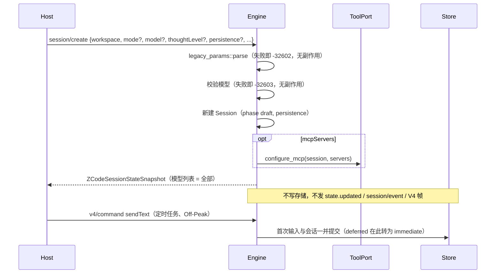

# Rust M3：legacy `session/*` 方法

依据：`scratchpad` 中对 Node app-server 的实测报告（`m3-session-create-resume.md`、`legacy-session.md`），以及 `apps/zcode-cli/packages/bootstrap/src/zcode-protocol/{server-operations,server-types,session-mapper}.ts`、`packages/shared/src/zcode-protocol/index.ts`。下文 `SO` / `ST` / `SM` / `SH` 分别指这四个文件。

## 1. 范围与顺序

| 子项 | 内容                                                                                                                                                     | 优先级 |
| ---- | -------------------------------------------------------------------------------------------------------------------------------------------------------- | ------ |
| M3.1 | 参数校验与错误文本；普通 `session/create`；`importedHistory.source = "claudeCode"`；`session/resume`                                                     | P0     |
| M3.2 | `session/list` 列出未落盘的 immediate 会话；创建时的隐藏 `model_change` 消息；`session/debug`；`session/setMode`（auto）                                 | P1     |
| M3.3 | 手机链路：`session/subscribe`、`session/event`、`state.updated`、legacy 事件日志与 seq；`session/send`、`compact`、`goal`、`setModel`、`setThoughtLevel` | P1     |

Desktop 的定时任务、Off-Peak 与 Claude 迁移都依赖 M3.1，本文件先定义 M3.1，M3.2 / M3.3 只列出与之相关的约束。

## 2. 参数校验与错误

### 2.1 校验器

- `session/create` 与 `session/resume` 的参数由 domain 的 `legacy_params` 解析，规则与 `zcodeSessionCreateParamsSchema` / `zcodeSessionResumeParamsSchema`（`SH:1562-1601`）一致：
  - 各层对象都是 strict，多余键报 `unrecognized_keys`；
  - `nonEmptyString` 先按 JS `trim` 裁剪再要求非空，解析结果使用裁剪后的值；
  - 枚举、布尔、字符串数组、`int >= 0` 与 `importedHistory` 的判别联合（`claudeCode` | `sharedContext`）；
  - `mcpServers` 的单项不符合 stdio / http 任一分支时，报告 `mcpServers.<i>: Invalid input`。
- 每个问题是一条 zod issue，键顺序与 zod 一致：
  - `unrecognized_keys`：`{code, keys, path, message}`；
  - `invalid_type`：`{expected, code, path, message}`；
  - `too_small`：`{origin, code, minimum, inclusive, path, message}`；
  - `invalid_value`：`{code, values, path, message}`；
  - 联合与判别：`invalid_union`，文本 `Invalid input` / `Invalid discriminator value. Expected 'claudeCode' | 'sharedContext'`。
- 错误为 `-32602`，`message` 按 `ST:200-225` 拼接：`Invalid params — <path 或 (root)>: <message>`，多个问题用 `"; "` 连接，最多 5 条，其余写成 ` (+N more)`；`data` 为 `{name: "ZodError", message: JSON.stringify(issues, null, 2)}`。
  - Host 的兼容重试（`zcodeAgentService.ts:489-577`）依赖 `data.message` 是 issue 数组；Rust 接受 Host 会发送的全部字段，正常情况下不会触发重试。
- `RuntimeError::InvalidParams` 增加可选的 `data`；`Fault` 增加可选的 `data.name`，用于 `ModelProtocolError`。
- 夹具：生成脚本对一组输入调用 Node 的 schema 与格式化函数，导出 `{input, message, data}`；Rust 测试逐条比对。

### 2.2 协议错误

| 场景                                             | code   | message                                                             | data                                                          |
| ------------------------------------------------ | ------ | ------------------------------------------------------------------- | ------------------------------------------------------------- |
| create 不带 `importedHistory` 却给了 `sessionId` | -32602 | `sessionId is only supported for imported history creates`          | 无                                                            |
| resume 找不到会话                                | -32004 | `Session not found: <id>`                                           | 无                                                            |
| 需要活跃会话的方法找不到会话                     | -32004 | `Session is not active: <id>`                                       | 无                                                            |
| Registry 中不存在的模型                          | -32603 | `Provider Registry 中不存在 Model: <provider>/<model>`              | `{name: "ModelProtocolError", code: "model_not_found"}`       |
| 需要推理档位却未提供                             | -32603 | `Reasoning level is required for <provider>/<model>`                | `{name: "ModelProtocolError", code: "invalid_model_request"}` |
| 不支持的推理档位                                 | -32603 | `Reasoning effort "<level>" is not supported by <provider>/<model>` | `{name: "ModelProtocolError", code: "invalid_model_request"}` |
| Provider 不属于 Registry                         | -32603 | `Provider Registry 中不存在 Model: <provider>/<model>`              | `{name: "Error"}`                                             |

Host 用 `/\bSession (not found|is not active):/i` 判断会话缺失（`zcodeTaskServiceAdapter.ts:1235-1238`），两条文本必须逐字一致。

## 3. 普通 `session/create`

### 3.1 所有者与时序

Engine 是会话的唯一所有者；create 只改内存，第一次输入才落盘（与 Node 一致）。

- 失败清理：MCP 配置之后的步骤失败时，撤销该会话的 MCP 配置并从内存移除会话，再返回原错误。

### 3.2 字段语义

- **`workspace`**：必须指向本 runtime 的工作区（身份 key 与路径一致），否则 `-32603 Workspace identity mismatch`；结果中原样回显（裁剪后），不重算 `workspaceKey`。
- **`sessionId`**：新建为 `sess_<uuid v4>`。
- **`mode`**：创建参数 → 项目偏好 → 配置 `permission.mode` → `build`，再经 `ExecutionState::resolve`（`plan` 即 `{build, planEnabled: true}`）。不写项目偏好。
- **`model` 与 `thoughtLevel`**：
  - 给出 `model` 时先按 2.2 校验：Registry 模型必须存在；有推理档位的模型必须带 `options.reasoningLevel`，且档位受支持。
  - 应用时丢弃 `model.options`（Node 以字符串形式调用 `setModel`），会话选择为 `{providerId, modelId}`、无档位。
  - `thoughtLevel` 裁剪后，只有属于当前模型的推理档位才应用；否则忽略（记 warn，不报错）。
  - 未给 `model` 时使用 Registry 默认选择（含其档位），再按上条处理 `thoughtLevel`。
  - 无档位的会话在执行时的取值见 3.4。
- **`persistence`**：默认 `immediate`。
  - `deferred` 与 V4 `createSession` 的草稿相同：不进入 `session/list`，不进入 sessions-index，第一次输入时转为 immediate。
  - `immediate` 在第一次输入前也只在内存中，但：出现在 `session/list`（M3.2）；在其会话话题被订阅或 `rowsRange` 查询后，以 `phase: "draft"` 进入 sessions-index（Host 的索引同步忽略 draft 行）。
  - `session/close {expectedPersistence}` 只关闭 persistence 一致的会话，否则返回 `{closed: false}`。
- **`titleGenerationEnabled`**：记录在会话上，供标题生成使用（Rust 目前没有标题生成请求；首条输入即标题）。
- **`mcpServers`**：非空时替换配置文件中的服务器，作用于 runtime 生命周期，不持久化；为空或缺省时使用配置文件。
- **`toolAllowlist` / `toolDenylist`**：会话级工具过滤，作用于 runtime 生命周期，不持久化。
  - 内置工具：先取与 allowlist 的交集（按别名归一化），再去掉 denylist；MCP 工具按注册名或描述名匹配。
  - 被过滤的工具不出现在工具定义中；模型仍调用时按未知工具处理。
  - 子代理继承父会话的过滤。
- **`offPeakToolEnabled` / `dynamicWorkflowEnabled`**：接受；Rust 没有 OffPeak 与 workflow 工具，二者不产生效果。
- **`parentSessionId`**：记录在会话上；create 结果中不出现（与 Node 一致），`session/list`、sessions-index 与冷 resume 中出现。
- **运行偏好反向请求**（`session/requestRuntimePreferences`）：M3.1 不发送。Host 允许 CLI 不询问；AskUserQuestion 自动解决偏好由 `workspace/updateInteractionPreferences` 提供。

### 3.3 结果快照

create 与 resume 使用同一个快照构建器，模型列表为 Registry 的全部模型；`session/read` 仍只列当前模型。字段规则（未定义的键省略，不写 `null`；Host 按 strict schema 解析）：

- `protocol`：`{name: "ZCode Protocol", version: 1}`。
- `session`：`{sessionId, traceId, workspace, sessionKind: "interactive", status, title, createdAt, updatedAt, mode: "build", target: null, model?}`。
  - `mode` 固定为 `build`（Node 取事件归约的默认值）；实际模式见 `settings`。
  - `model` 为 `{providerId, modelId}`，未绑定时省略。
  - 新建时没有 `titleSource`、`parentSessionId`、`archivedAt`。
- `settings`：
  - `mode.current` 与 `permission.mode` 为运行模式（`plan` 显示为 `build`）；
  - `model.available`：每项 `{ref, label: modelId, providerLabel: providerName ?? providerId, contextWindow, maxOutputTokens, reasoning: {levels, defaultLevel: 最后一个档位}, properties: {inputFormat, outputFormat}}`；
  - `model.current` 为会话选择（含 options），`model.lastUsed` 为 `{providerId, modelId}`；未绑定时二者省略；
  - `thoughtLevel`：`available` 为当前模型的 `[{label, value}]`，`current` 仅在列表中时出现，`enabled = available 非空`，Registry 模型不带 `defaultLevel`。
- `projection`：`{sessionId, status, mode: "build", turnCount, totalTokenCount, contextUsed, contextWindow, pendingPermissions, activeToolCalls, backgroundJobs, target: null}`。
- `runtime`：`{eventSeq, stateRevision, pendingRequestIds, goalVerifications: [], goalVerificationTimeline: []}`。
  - `stateRevision` 为 create 中实际应用的模型与档位变更次数（0–2）。
- `messages`、`todos: []`、`todoGroups: []`、`slashCommands`（与工作区配置一致）。
- 未产生过事件的新会话：`runtime.eventSeq = 0`，`projection.sessionId = "unknown"`，`projection.contextWindow = 200000`（Node 事件归约的默认值）。legacy 事件日志与之后的 `eventSeq` 在 M3.3 定义；此前其余情况沿用现有取值。

### 3.4 执行时的推理档位

create 丢弃 `model.options` 后，会话可能绑定有档位要求的模型而没有档位。Host 的 `createTask` 总是同时发送 `thoughtLevel`，定时任务的 `sendText` 带 `modelSelection`，这两条路径都会得到完整选择。

其余情况与 Node 一致：模型工厂在 Registry 边界校验选择（`provider-registry-model-runtime.ts:45-46`），不做缺省修复。缺少档位时这一轮失败，错误为 `invalid_model_request`、文本 `Reasoning level is required for <provider>/<model>`，与其他模型构建错误走同一条失败路径。输入自带的 `modelSelection` 会覆盖会话选择，不受影响。

## 4. `importedHistory.source = "claudeCode"`

### 4.1 参数

`{source: "claudeCode", title?, createdAt?, updatedAt?, messages: [{role: "user" | "assistant", content, timestamp?}] (≥1)}`；时间为非负整数，`content` 可为空且不裁剪。可同时给出 `sessionId`（Host 使用 `claude-import-<hash>`）与 `persistence`。

### 4.2 行为

1. 3.2 中与导入无关的字段照常处理（模型与档位、工具过滤、MCP 等）。
2. 时间：`createdAt = history.createdAt ?? messages[0].timestamp ?? now`；逐条消息的时间取 `timestamp`，缺省为 `createdAt + i`，并强制严格递增（不大于前一条时取前一条 + 1）。
3. 会话：
   - 新建或覆盖同 id 会话（覆盖时允许会话已活跃，Host 的历史修复依赖这一点）；
   - `title = title.trim() || "Imported session"`，`titleSource = "custom"`；
   - 已存在时保留原 `createdAt` 与 `traceId`；
   - 不记录 `parentSessionId`，`sessionKind` 为 `interactive`；
   - 模式按 3.2 解析，`plan` 记为 `build`。
4. 删除该会话中此前导入的消息（带 `migrationSource: "claudeCode"` 标记）及其行，保留用户之后追加的对话。
5. 写入消息：
   - id 为 `msg_<sessionId>_import_<i>`，不得生成 `msg_import_<i>` 形式（Host 修复逻辑以此识别旧数据）；
   - user 消息带 `migrationSource: "claudeCode"`；assistant 消息以最近的 user 消息为父消息；
   - 模型历史中是普通的 user / assistant 文本消息。
6. V4 行：每个 user 消息开启一轮：`turnHeader`（`origin: userInput`、`state: completedSuccess`、`startedAt` / `endedAt` 为该轮首尾消息时间、`historyRoundCount: 1`）、`userInput`（`origin: realUser`）与其后的 `assistantText`（`state: complete`，`assistantResponseId` 为消息 id）。`canEdit` 只在最后一个用户输入上，`canRetry` 只在最后一条 assistant 行上（与普通对话的规则相同）。
7. `updatedAt` 为导入完成时的时钟（Node 在写入消息时刷新会话时间）。
8. 会话、消息与行在一个存储事务中提交；失败时内存保持导入前的状态。
9. 导入后模型解绑（Node 恢复时找不到模型选择记录）：结果中没有 `session.model`、`settings.model.current` / `lastUsed`，`thoughtLevel` 为 `{available: [], enabled: false}`；之后的输入需要带 `modelSelection`。
10. 结果快照按 3.3，另外：`session.titleSource = "custom"`，`projection.sessionId` 为真实 id。

## 5. `session/resume`

- 参数：`{sessionId, workspace?, thoughtLevel?, mcpServers?, toolAllowlist?, toolDenylist?, offPeakToolEnabled?, dynamicWorkflowEnabled?}`；`mode`、`model`、`persistence`、`titleGenerationEnabled` 作为多余键拒绝。
- 会话已活跃：原样返回快照，忽略全部参数，不增加 revision。Host 在每次切换模型或模式后都会调用 resume，这一路径必须是无副作用的重新附着。
- 会话不存在（未活跃且存储中没有）：`-32004 Session not found: <id>`。已归档的会话与 Node 一致在恢复时失败：`-32603 Session not found: <id>`，`data.code` 为 `SESSION_NOT_FOUND`。
- 冷恢复：
  1. 从存储加载并激活会话（与 V4 激活相同的恢复与校验）；
  2. `mcpServers`、工具过滤与两个开关按 3.2 应用；`thoughtLevel` 忽略；
  3. 模式：若最后一条 assistant 消息记录了模式（`plan | build | edit | yolo | auto`），使用该模式且 `planEnabled = false`；否则沿用会话保存的执行状态；
  4. `workspace` 缺省时由会话保存的身份与路径重建（身份为空时省略）；
  5. 模型取会话保存的选择，无效时解绑。
- 结果快照按 3.3，另外：`createdAt` / `updatedAt` 为持久化的值，出现 `titleSource` 与 `parentSessionId`（如有），`projection.sessionId` 为真实 id。

为实现第 3 步，Rust 在追加 assistant 消息时记录当时的模式（`last_assistant_mode`），随会话持久化；TS 导入时由最后一条 assistant 消息的 `mode` 回填。

## 6. 与 Node 的差异（需要用户确认）

以下 Node 行为会丢失数据、留下无法清理的状态或在运行中改写历史，Rust 不复制：

1. Node 会在空闲 10 分钟或超过 16 个时淘汰尚未落盘的 immediate 会话，之后 resume 返回 `Session not found`。Rust 不淘汰草稿。
2. Node 冷恢复失败或对活跃 id 重新导入时，旧记录留在内存或被覆盖而不关闭。Rust 失败时清理，覆盖前先关闭旧运行。
3. Node 在 create 时写模型选择记录会因外键失败（只记日志）。Rust 没有这一步。
4. Node 允许在会话运行中重新导入 Claude 历史（直接覆盖记录）。Rust 在运行中拒绝导入。

以下差异来自 Rust 的传输或配置形态，不影响 Host：

- transport 无法区分缺省 params 与显式 `null`，二者都按缺省处理（`received undefined`）。
- serde_json 的对象按键排序，同一对象的多个未知键在错误文本中按字母序排列（Node 按输入顺序）。
- 无 Registry 的配置文件模型（Rust 开发与测试配置）在 create 中保留其推理档位。
- 执行时缺少推理档位的失败使用 `invalid_model_request` 的固定文本，而非带模型名的 Node 文本。
- 重新导入 Claude 历史时，模型上下文与行序号整体重建（新 log epoch）。

## 7. 验收

- **夹具**：参数校验的 message 与 data 与 Node 逐条一致（每类问题至少一例，含超过 5 条的截断）。
- **集成测试**（`packages/services/tests/zcode-cli-rust-legacy-session.test.ts`）：
  - 普通 create 的结果通过 strict snapshot schema，逐项检查 3.3 的字段（模型列表为全部、revision 计数、`mode: "build"`、`sessionId: "unknown"` 等）；
  - `model` + `thoughtLevel` 的组合结果与 3.2 的表一致；模型错误的 code、message 与 data；
  - deferred 创建后立即 V4 `sendText` 能执行，且之前不出现在 `session/list` 与 sessions-index；
  - 工具过滤体现在模型请求的工具列表中，且子代理继承；
  - Claude 导入：消息 id、时间递增、V4 行、重新导入替换旧消息且保留之后的对话、模型解绑；
  - resume：活跃会话原样返回且忽略参数；冷恢复的模式推导与工作区重建；缺失时的错误文本；
  - `desktop-continuous` 与 `web-remote-replayable` 两种订阅看到的 V4 行一致。
- **门禁**：`cargo clean` 与 `CARGO_INCREMENTAL=0`；`pnpm test:zcode-cli-rust`、`cargo test --workspace`、`pnpm check:zcode-cli-rust`、`pnpm typecheck`、`pnpm lint`。
