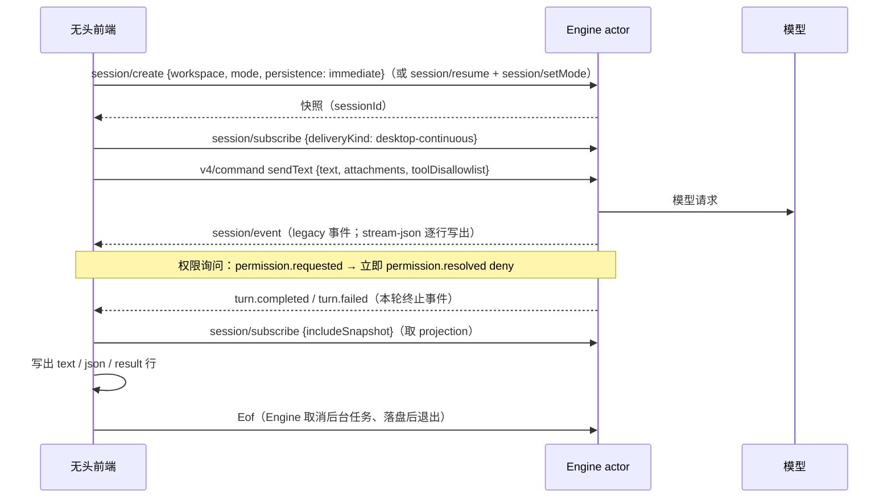

# Rust M4：`-p` 无头模式

依据：`scratchpad/research/headless-print.md`（下称 HP）；Node `apps/zcode-cli/packages/cli/src/{arguments.ts,run.ts,prompt-command.ts,headless-workflow.ts,shutdown.ts,cwd.ts,resume.ts}`、`core/src/permission/broker.ts`、`core/src/runtime/helpers/turn-errors.ts`。架构约束见 `rust-p0-p1-architecture.md` §5.7。

## 1. 范围

- M4a（本步）：顶层 `-p/--prompt`、参数校验、三种输出格式、无头权限、`--attach`、`--resume` / `--continue`、退出码与信号。
- M4b：差分脚本 `scripts/diff-zcode-cli-node-rust.mjs`（Node `zcode -p` 与 Rust 同 fixture 比较）。
- 不做：workflow（dwf 等待、`workflow.run.progress`）、`--browser-use`、`--memory-bench`、`--target`、斜杠命令预路由（`/help`、`/skill`、`/login`、`/goal`、`/expert`）、hook 信任诊断输出。前四个选项显式报错，不静默忽略；斜杠文本按普通输入发送（`/compact` 仍按压缩执行）。

## 2. 入口与参数

### 2.1 路由

- 第一个参数是 `app-server` 或 `tui` 时走现有子命令（clap），行为不变。
- 其余情况走 Node 兼容的顶层解析器（`util.parseArgs` strict 语义）：
  1. `-h/--help`：帮助写 stdout，退出 0；`-v/--version`：版本写 stdout，退出 0。二者先于 `-p` 检查。
  2. 有 `-p`：无头运行；多余的位置参数忽略（Node 同样忽略）。
  3. 否则：TUI 占位（与 `tui` 子命令相同的提示与退出码 2）。
- 不读取 stdin。

### 2.2 选项

| 选项                                               | 说明                                                                                                                                                 |
| -------------------------------------------------- | ---------------------------------------------------------------------------------------------------------------------------------------------------- |
| `-p, --prompt <text>`                              | 本次输入                                                                                                                                             |
| `--output-format <text\|json\|stream-json>`        | 显式值优先于 `--json`；缺省为 text（有 `--json` 时为 json）                                                                                          |
| `--json`                                           | 旧别名                                                                                                                                               |
| `--mode <build\|edit\|plan\|yolo>`                 | 大小写不敏感，缺省 `yolo`；总是覆盖配置与会话中保存的模式（恢复会话时同样覆盖）                                                                      |
| `--cwd <path>`                                     | 工作区；相对路径按进程 cwd 解析                                                                                                                      |
| `--attach <path>`（可重复）                        | 按扩展名：`.gif .jpeg .jpg .png .webp` 图片，`.mp4 .m4v .mov .webm .mkv .avi` 视频，`.pdf` PDF，其余文件；相对路径按工作区解析；不存在的文件静默丢弃 |
| `--resume <sessionId>` / `-c, --continue`          | 恢复指定会话 / 工作区最近更新的根会话                                                                                                                |
| `--disallowed-tools, --disallowedTools <tools...>` | 贪婪读取其后所有非选项参数；以逗号或空白分隔；`web_search` 归一为 `WebSearch`；只作用于本轮                                                          |
| `--surface <terminal\|desktop>`                    | 系统提示的展示面，缺省 `terminal`                                                                                                                    |
| `--locale <en-US\|zh-CN\|auto>`                    | 只校验（Rust 提示词不区分语言）                                                                                                                      |
| `--verbose`                                        | 错误时追加 `Cause:` 行                                                                                                                               |
| `--data-dir <path>`、`--config <path>`             | Rust 独有：数据目录与静态模型配置（无 `--config` 时读 Registry 环境变量）                                                                            |

### 2.3 校验顺序与文本（stderr，退出 1）

`+help` 表示追加一个空行和完整帮助。

1. 解析错误（`+help`）：
   - `--disallowed-tools requires at least one tool.`
   - `Unknown option '<opt>'. To specify a positional argument starting with a '-', place it at the end of the command after '--', as in '-- "<opt>"`
   - `Option '-p, --prompt <value>' argument missing`（其他带值选项同格式，如 `Option '--cwd <value>' argument missing`）
   - `-p` 的值以 `-` 开头：`Option '-p' argument is ambiguous.\nDid you forget to specify the option argument for '-p'?\nTo specify an option argument starting with a dash use '--prompt=-XYZ' or '-p-XYZ'.`
2. `Unsupported --locale value: <v>. Supported locales: en-US, zh-CN, auto.`
3. `Unsupported --mode value: <v>. Supported modes: build, edit, plan, yolo.`
4. `Unsupported --browser-use value: <v>. Supported value: headless.`
5. `Unsupported --surface value: <v>. Supported surfaces: terminal, desktop.`
6. `--browser-executable requires --browser-use=headless.`
7. `--resume and --continue cannot be used together.`
8. `--output-format must be one of text, json, stream-json (received: <v>).`
9. `--target-replace requires --target.` / `--target requires non-empty text.` / `--target cannot be used with --prompt. Use either --target <objective> or --prompt "/goal <objective>".`
10. `--surface can only be used with --prompt, --target, app-server, or agent-server.`
11. `--help` / `--version`（输出到 stdout，退出 0）。
12. `--memory-bench can only be used with -p/--prompt.`；`--browser-use=headless can only be used with --prompt, --target, or tui.`；`--force-mcs can only be used with --prompt, --target, or tui.`
13. Rust 未实现的选项：`<option> is not supported by the Rust runtime yet.`（`--target`、`--browser-use`、`--memory-bench`、`--force-mcs`）。
14. 没有 `-p`：TUI 占位。
15. `--cwd requires a non-empty path.` / `--cwd path is not accessible: <abs>` / `--cwd must point to a directory: <abs>`
16. `--prompt requires non-empty text.`（裁剪后为空）

## 3. 执行

### 3.1 所有者与时序

无头前端（`crates/headless`）只经传输契约（`ClientMsg` / `ServerMsg`）驱动与 app-server 相同的 `Engine` actor，不持有会话状态。Engine 以 `with_headless()` 构建：每个权限询问立即拒绝（见 3.2）。



- `--continue`：`session/list {workspace}` 中无 `parentSessionId`、`updatedAt` 最大的会话；没有时 `Error: No resumable session found for <cwd>`。
- `--resume` 的会话不存在：`Error: Session not found: <id>`（Engine 的恢复错误原样输出）。
- Host 反向请求（如 `interaction/requestProviderRuntimeHeaders`）一律以 `null` 应答，与 Host 返回错误时相同（登录属 P2）。
- 工作区锁与 app-server 相同：同一工作区已有 Rust runtime 时失败退出（`Workspace runtime is already owned or cannot be locked`）。Node CLI 允许并发，这是差异。

### 3.2 无头权限（Node `createHeadlessPermissionBroker`）

- 每个到达询问（ask）的工具调用：先发出 `permission.requested`，随即 `permission.resolved {decision: "deny", reason}`；模型读到的工具结果正是 `reason`：`No permission client configured for <Tool>`。
- `AskUserQuestion` 在无头模式下走权限询问（Node 的 `requiresUserInteraction`），不进入问答等待与自动作答。
- plan 下的 `ExitPlanMode` 被拒绝后该步结束本轮（已有的计划拒绝停轮规则）。
- 策略直接拒绝（如 plan 的写工具）保持原文本，不发 `permission.requested`。
- PermissionRequest hook 仍先于拒绝运行（与现有竞速一致）。

## 4. 输出

### 4.1 text

本轮 `turn.completed.response`（最后一个模型步骤的文本）加 `\n`；为空时只输出 `\n`。运行期间不输出。

### 4.2 json 与 stream-json 的 result

字段顺序固定（Node `prompt-command.ts`）：

```
{sessionId, traceId, turnId, response, usage?, eventCount, projection: {status, turnCount, totalTokenCount, contextUsed, contextWindow}}
```

- `usage`：`turn.completed.usage`，键序 `source, modelRequestCount, inputTokens, outputTokens, totalTokens, cacheReadTokens, cacheWriteTokens, reasoningTokens, webFetchRequests, webSearchRequests`。
- `traceId`：本轮事件 envelope 的 `traceId`；`turnId`：终止事件的 `turnId`。
- `projection`：结束后快照的 `projection` 对应字段，`contextUsed` / `contextWindow` 为 0 时输出 `null`。
- `eventCount`：本轮写出的事件行数，不计 `session.titleUpdated` 与 `permission.*`（Node 的内部事件数无法对齐，差分不比较）。
- json：两空格缩进加 `\n`；stream-json：`{"type":"result",…}` 单行，是流的最后一行。

### 4.3 stream-json

每个 legacy `session/event` 一行 JSON（去掉 `deliveryKind`），收到即写出。与 Node 的差异：

- 事件来自 legacy 投影：文本增量按 9.4 合批（首个增量立即发出），`seq` 为本进程内连续序号；
- 没有 Node 的内部行：`model_request` 摘要、`model.streaming` 的 `start` / `text_start` / `text_end` / `finish` / `tool_input_*`、工具台账、`checkpoint.created`、`streamRecovery.updated`、`session.resumed`。

### 4.4 错误（所有格式）

- stderr：`Error: <message>[ (traceId: <id>)]\n`；`--verbose` 时再写 `Cause: <cause>\n`。stdout 不写结果（stream-json 已写出的事件保留，没有 result 行）。退出 1。
- `turn.failed` 的 `<message>`（Node `createTurnFailureError`）：
  - 带模型归因且 `reason` 为 `context_exceeded`：`Model request exceeded the provider context window.`；
  - 带模型归因且 `reason` 为 `model_output_limit_exceeded`：失败自身的消息；
  - 其余（提供方、网络、运行时故障）：`Turn execution failed`；`Cause:` 为失败自身的消息。
- 轮被取消（`resultType: "cancelled"`，信号触发）：`Turn was cancelled.`。
- 请求级错误（创建、恢复、admission）：错误消息原样，不带 traceId。

## 5. 退出码与信号

- 成功 0（包括工具失败或被拒绝）；其他错误 1。
- SIGINT / SIGTERM / SIGHUP（Windows 只有前两个）：发 `stop` 命令取消本轮；stream-json 照常写出 `turn.completed resultType: "cancelled"`；写 `Error: Turn was cancelled. (traceId: …)`；Eof 后最多等待 2 秒清理；以 130 / 143 / 129 退出。清理期间再次收到信号立即退出。

## 6. 与 Node 的差异

1. 模型不可用、附件不可读等 admission 错误输出 Engine 的消息（Node 为 `Model creation failed` 或占位）。
2. 文本附件按 Rust 的附件文本注入（`Attached file: <name>`），不是 Node 的合成 Read 提醒。
3. 会话标题取首条输入的前 80 个字符（Node 为 60 字符规则）。
4. 同一工作区不能与另一个 Rust runtime 并发（见 3.1）。
5. stream-json 差异见 4.3；`eventCount` 口径不同。
6. 不支持的选项显式报错（第 2.3 节第 7 条）。

## 7. 验收

- 单元测试：参数解析（每条 2.3 文本、贪婪 `--disallowed-tools`、`--output-format` 与 `--json` 优先级、`--help` 先于 `-p`）；错误消息映射；usage 键序。
- 集成测试（`zcode-cli-rust-headless.test.ts`，直接运行二进制）：
  - text / json / stream-json 的输出与退出码（json 键序、result 为最后一行）；
  - 多步回答只输出最后一步文本；
  - build 模式的 Write 被拒绝（`permission.resolved` 的 reason 与工具结果文本），yolo 写入文件；
  - `AskUserQuestion` 被拒绝且不等待；
  - `--attach` 图片进入请求、缺失文件被丢弃；
  - `--continue` 带上历史并沿用 sessionId；
  - 401 失败：`Error: Turn execution failed (traceId: …)`、退出 1；
  - 参数错误文本与退出 1；
  - SIGTERM：退出 143，stream-json 最后一行为 cancelled 的 `turn.completed`。
