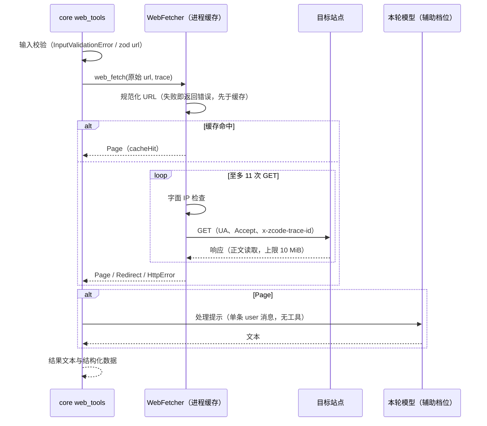
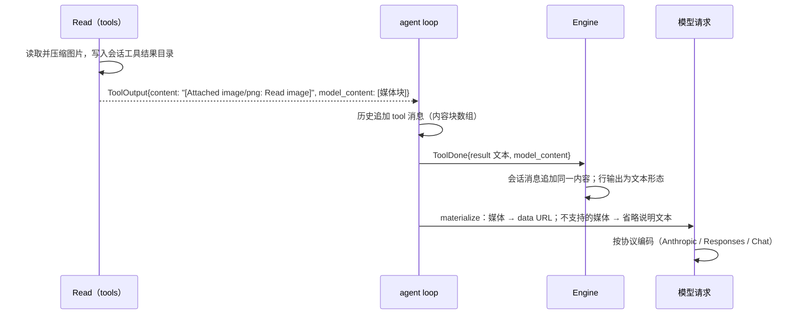

# Rust M5：编码工具对齐

依据：`apps/zcode-cli/packages/core/src/tool/{edit-matchers.ts,handlers/edit.ts}`、`packages/contracts/src/tools/edit.ts`。本文件按子项逐步补充；未列出的工具行为保持 `rust-coding-tools.md` 的现状。

## 1. Edit 匹配（M5.1）

### 1.1 所有者

匹配是纯函数（domain `edit_match`），输入为已统一为 `\n` 行尾的文件内容、`old_string`、`replace_all`；Edit 适配器（tools crate）负责读取、读后编辑检查、写回与结果投影。

### 1.2 匹配顺序（`findEditMatch`）

1. `exact`：非重叠子串匹配。
2. 依次尝试，首个产生候选的策略决定结果；`replace_all` 时跳过 3 个宽泛策略（`line_trimmed`、`indentation_flexible`、`block_anchor`）：
   - `quote_normalized`：弯引号 `‘’“”` 与直引号视为相同，候选取文件中的原片段；
   - `line_number_prefix_stripped`：每行都带 Read 行号前缀（`^\d+: ` 或 `^\d+\t`，其后内容不含行终止符）时去掉前缀再匹配；
   - `escape_normalized`：`\n` `\t` `\r` `\"` `\'` `` \` `` `\\` `\$` 反转义后匹配；
   - `unicode_escape_normalized`：`\uXXXX` 解码（`\\` 保持原样）后匹配；解码出不成对代理项时无候选；
   - `line_trimmed`：逐行按 JS `trim` 比较（忽略末尾空行）；
   - `indentation_flexible`：至少 2 行，去掉公共缩进（只计 tab 与空格）后相等；
   - `block_anchor`：至少 3 行，首尾行 trim 后相等，中间行的平均相似度（`1 - 编辑距离 / 较长长度`，按 UTF-16 码元计算）不低于 0.8。
3. 候选去重后只有一个值为 `matched`（带候选数），多个值为 `ambiguous`，没有候选为 `not_found`。

字符串语义与 JS 一致：`trim` 使用 JS 的空白集合（含 U+FEFF，不含 U+0085），编辑距离与长度按 UTF-16 码元，字母判断为 `\p{L}`。

### 1.3 替换文本

- `escape_normalized` 命中时，`new_string` 也按同样规则反转义。
- 引号风格：命中片段与 `old_string` 不同时，若片段含弯双引号则把替换文本中的 `"` 按上下文换成 `“` / `”`；含弯单引号时同理处理 `'`，两侧都是字母的 `'` 视为撇号 `’`。开引号上下文为：位于开头，或前一字符是空白、`(`、`[`、`{`、`—`、`–`。

### 1.4 Edit 处理顺序与文本（`handlers/edit.ts`）

失败以 `ToolFailure { code, message }` 返回（Node `ToolHandlerFailure`，`EditErrorCode`）；模型可见的包装在结果管线统一处理（M5.2），本节只定义 message。

1. `old_string === new_string`（原始字符串）：`1`，`No changes to make: old_string and new_string are exactly the same.`
2. `file_path` 为空：`13`，`Tool path must not be empty`
3. 文件不存在且 `old_string` 非空：`4`，`File does not exist. Note: your current working directory is <cwd>.`，同目录有同名不同扩展名的文件，或文件名编辑距离（UTF-16）不超过 3 的文件时追加 ` Did you mean <name>?`（按名称排序取第一个）。文件不存在且 `old_string` 为空时直接创建。
4. `old_string` 为空但文件内容（JS `trim` 后）非空：`3`，`Cannot create new file - file already exists.`
5. `.ipynb`：`5`，`File is a Jupyter Notebook. Use the NotebookEdit to edit this file.`
6. 读后编辑：没有读取记录或上次读取为部分视图：`6`，`File has not been read yet. Read it first before writing to it.`；读取后内容变化：`7`，`File has been modified since read, either by the user or by a linter. Read it again before attempting to write it.`
7. 匹配（第 1.2 节）：未找到：`8`，`String to replace not found in file.\nString: <old_string>`；歧义或精确命中多于 1 处且未设 `replace_all`：`9`，`Found <n> matches of the string to replace, but replace_all is false. To replace all occurrences, set replace_all to true. To replace only one occurrence, please provide more context to uniquely identify the instance.\nString: <old_string>`（`n` 为 0 时为 `old_string is not unique in the file. Provide more surrounding context or set replace_all to true.`）。
8. 替换：`new_string` 为空且 `old_string` 不以换行结尾、文件含 `old_string + "\n"` 时连同换行一起删除；替换文本按字面插入。
9. 写回：已有文件按多数行尾（CRLF 多于 LF 才用 CRLF）写回，新建文件为 LF；保留 BOM。
10. 成功结果：`The file <file_path> has been updated successfully. (file state is current in your context — no need to Read it back)`；`replace_all` 时为 `The file <file_path> has been updated. All occurrences were successfully replaced. (file state is current in your context — no need to Read it back)`。`file_path` 为模型给出的原值。结构化结果带 `matchStrategy` 与 `matchCandidateCount`。

与 Node 的差异：只支持 UTF-8（Node 还识别 GBK 等旧编码）；可编辑文件上限沿用 8 MiB（Node 为 1 GB）；新鲜度按内容哈希判断（Node 按 mtime 与大小，内容相同的完整读取例外），两者在内容不变时结论一致。

### 1.5 验收

- 集成测试（`zcode-cli-rust-edit.test.ts`）：弯引号回退写回、删除行连同换行、CRLF 保持、第 1.4 节的失败文本与成功文本。
- 夹具：生成脚本调用 Node 的 `findEditMatch`、`normalizeReplacementForMatch`、`preserveQuoteStyle`，覆盖每种策略、歧义、`replace_all` 跳过、UTF-16 与代理项、弯引号上下文；Rust 逐条比较状态、策略、候选数、命中片段与替换文本。

## 2. 工具结果管线（M5.2）

依据：`scratchpad/research/tool-result-pipeline.md`（下称 TR）；Node `core/src/tool/executor/{errors.ts,call-runner.ts,result-serialization.ts}`、`core/src/errors/error-payload.ts`。

### 2.1 失败渲染（M5.2a）

所有工具失败在 `tool_execution.rs` 一处渲染（Node `createErrorResult`），不再加 `Tool failed:` 前缀：

- 处理器失败（`ToolError::Handler { code, message }`，Node `ToolHandlerFailure`）：`<tool_use_error>{message}</tool_use_error>`，消息原样。Edit 的 `EditErrorCode` 失败走这一类。
- 预先渲染的内容（`ToolError::Rendered`）：原样使用（留给输入校验信封）。
- 其余错误（Node 的抛出错误）：消息按 `sanitizeText` 规整——空白序列（JS `\s`）折叠为一个空格并去首尾，超过 500 个 UTF-16 码元时保留前 497 个并加 `...`；为空时为 `Turn execution failed`。
- 未注册的工具：`Tool not found: {name}`（纯文本）。
- Read 不存在的文件：`File does not exist. Note: your current working directory is {cwd}.`，可加 ` Did you mean {name}?`（与 Edit 相同的建议规则）。
- PostToolUseFailure hook 收到的 `error` 为规整后的消息。
- 成功但内容在 JS `trim` 后为空：`({ToolName} completed with no output)`，在追加 hook 上下文之前替换。
- 失败标志只来自结果本身（历史中的 `_zcode_tool_failed`）；microcompact 不再按文本前缀判断失败。Anthropic 请求只在失败时写 `is_error: true`（与 AI SDK 一致）。

### 2.2 Bash、TaskOutput、TaskStop 文本（M5.2b）

依据：Node `bash-model-content.ts`、`bash-semantics.ts`、`task-output.ts`、`task-output-bash.ts`、`task-output-projection.ts`、`task-stop.ts`、`result-persistence-format.ts`。

- **Bash 结果对象**用 Node `BashOutput` 字段：`stdout` 为按到达顺序合并的两路输出的前 30 000 字节（Node posix-bash 把两路写入同一文件），`stderr` 只放执行器消息（超时 `Command timed out after {时长}`、取消 `Execution cancelled`、输出超限 `Execution output exceeded the persisted output limit`），`persistedOutputSize` 为合并输出总字节数。时长按 Node `formatTimeoutDuration`（`500ms`、`30s`、`1.5m`、`2m`、`2h`）。
- **模型文本**（`formatBashModelContent`）：以下部分去掉空项后用 `\n` 连接：
  1. 仅当"提供方错误"时为 `Exit code {n}`；
  2. stdout：去掉开头的空白行并去尾部空白；总字节超过 30 000 且不是后台任务时换成 Bash 版 `<persisted-output>` 信封（1024 进制、无空格的大小，预览 2000 个字符，超过一半处有换行时在该换行截断）；
  3. stderr 去首尾空白，被中断（超时或取消）时追加 `<error>Command was aborted before completion</error>`；
  4. 后台任务：`Command running in background with ID: {id}. Output is being written to: {path}. You will be notified when it completes. To check interim output, use Read on that file path.`
- **提供方错误与 `is_error`**：状态为 failed、退出码为非 0 数字，且不是"语义上的非错误"；最后一条命令（`git grep` / `git diff` 按子命令）为 `grep`、`egrep`、`fgrep`、`rg`、`find`、`diff`、`test`、`[` 且退出码为 1 时不算错误。解析失败或含不支持的语法时不做语义判断。`is_error` = 提供方错误或被中断。
- 空命令返回空结果（通用占位 `(Bash completed with no output)`）。
- **TaskOutput**：块之间用空行连接：`<retrieval_status>`、`<task_id>`、`<task_type>local_bash</task_type>`、`<status>`（running / completed / failed / killed）、有退出码时 `<exit_code>`、输出非空时 `<output>\n{内容}\n</output>`。运行中的任务读输出文件前 30 000 字节，已结束的读最后 8 MiB（有省略时前缀 `[{KB}KB of earlier output omitted]`）；内容超过 32 000 个 UTF-16 码元时保留尾部并前缀 `[Truncated. Full output: {path}]`。缺 `task_id` 与不存在的任务为处理器失败：`Task ID is required`（1）、`No task found with ID: {id}`（2）。
- **TaskStop**：成功为紧凑 JSON `{"message":"Successfully stopped task: {id} ({command})","task_id":…,"task_type":"local_bash","command":…}`；失败为抛出错误：`Missing required parameter: task_id`、`No task found with ID: {id}`、已结束的任务 `Task {id} is not running (status: {status})`（Node strict）。

与 Node 的差异：超时仍终止进程（Node 把多数前台命令转入后台，属 Bash 项）；未实现 cwd 重置提示、读后修改提示、gh 限流提示、图片输出与 `TASK_MAX_OUTPUT_LENGTH`；启动失败按抛出错误处理。

后续子项（TR §6.5）：Grep、Write、Read 文本与输入校验信封、预算与持久化信封（M5.2c 起）。

### 2.3 结果预算层（M5.2c）

依据 Node：

- `core/src/tool/executor/{result-serialization,result-content-projection}.ts`
- `core/src/tool/result-persistence-format.ts`
- 各工具的 `resultBudget`
- `adapters/src/storage` 的 `writeToolResultArtifact`

**所有者**：

- `domain::result_budget` 是纯逻辑：预算表、按字节裁剪、hook 追加的预算投影。
- `core::tool_execution` 在空结果占位之后、hook 之前应用预算，追加 hook 上下文时使用同一预算。
- 落盘经 `ToolPort::persist_result` 写入会话产物目录。

**预算表**：有效上限为 `min(maxModelBytes, maxInlineBytes)`，按 UTF-8 字节计。

| 工具                                                                               | 有效上限 | 策略 |
| ---------------------------------------------------------------------------------- | -------- | ---- |
| Grep                                                                               | 20 000   | 落盘 |
| Glob                                                                               | 100 000  | 落盘 |
| Agent                                                                              | 120 000  | 落盘 |
| WebFetch                                                                           | 100 000  | 落盘 |
| Read                                                                               | 262 144  | 截断 |
| Edit、Write                                                                        | 100 000  | 截断 |
| Skill、TodoRead、TodoWrite、TaskStop、AskUserQuestion、EnterPlanMode、ExitPlanMode | 100 000  | 截断 |
| SendMessage                                                                        | 4 096    | 截断 |
| WebSearch                                                                          | 10 000   | 截断 |
| MCP 工具（`mcp__…`）                                                               | 50 000   | 截断 |
| 其他工具                                                                           | 100 000  | 截断 |

- 预览方向都是 head。
- Bash 与 TaskOutput 在工具内部完成自己的落盘与截断（§2.2），本层不再处理，避免二次落盘。

**规则**：

- 内容（结构化内容取其文本形式）不超过上限时原样返回，包括图片等结构化块。
- **落盘策略**：
  - 文件写入会话产物目录，文件名为 `<toolCallId>-tool-result-<uuid>.json`。Node 对非字符串输出使用 `application/json`，所以扩展名是 `.json`。
  - 模型内容为通用 `<persisted-output>` 信封：
    - 第一行为 `Output too large (<十进制大小>). Full output saved to: <path>`；
    - 预览取前 2000 个字符，超过一半处有换行时在该换行截断，被截断时加 `...`。
  - 写入失败时退回截断，工具结果仍然可见。
- **截断策略**：
  - 保留头部，尾部追加 `\n\n[Tool output truncated by resultBudget: originalBytes=<n>, maxModelBytes=<m>, strategy=<truncate|artifact>]`；
  - 追加说明后总长仍不超过上限（`fitContentWithSuffix`）；
  - 按 Unicode 码点二分，不切断字符；
  - 截断后结构化块退化为这段文本。
- **hook 上下文**（`appendHookAdditionalContexts`）：
  - 追加后仍不超过上限：原样追加（结构化内容追加为结尾文本块）。
  - 超过上限且为落盘信封：信封保持完整，只把 hook 后缀裁到上限以内。
  - 超过上限的其他情况：用 `fitContentWithSuffix` 同时容纳内容与 hook 后缀；结构化内容保留非文本块，文本部分按同样规则裁剪。

**与 Node 的差异**：

- 产物目录沿用 M5.2b 的会话目录（会话 id 的 sha256），不同于 Node 的 `<sanitized sessionId>/`。
- 官方 CUA 帧与 `maxModelChars` 只在 Node 的 workflow、CUA 工具上出现，Rust 不涉及。

**验收**：

- 单测：
  - 按字节裁剪：head 与 tail、多字节字符；
  - `fitContentWithSuffix` 的边界：后缀超过上限、上限为 0；
  - 预算表；
  - hook 追加的三种情形。
- 集成（`zcode-cli-rust-result-budget.test.ts`）：
  - MCP 工具返回超过 50 000 字节时截断到恰好 50 000 字节，并带说明；
  - Grep 结果超过 20 000 字节时落盘：信封中的十进制大小正确，路径可读且内容完整。
  - SendMessage 的 4 096 上限由预算表单测覆盖。

## 3. WebFetch（M5.4a）

依据：`scratchpad/research/webfetch-websearch.md`（下称 WW）；Node `core/src/tool/handlers/webfetch*.ts`、`core/src/tool/webfetch-preapproved.ts`、`contracts/src/tools/webfetch.ts`。

### 3.1 所有者与分层

- `domain::web`（纯逻辑，Node 夹具逐条比对）：URL 规则、字面 IP 出网检查、可读内容抽取、模型文本。
- `tools::web_fetch::WebFetcher`（每进程一个，属于 `WorkspaceTools`）：重定向循环、响应上限、进程级缓存、大页面的原文保存。经 `ToolPort::web_fetch` 暴露。
- `core::web_tools`（核心内置工具，与 `Skill` 同层）：输入校验、调用 `ToolPort::web_fetch`、用本轮模型处理页面、组装结果。需要本轮模型，因此 `tool_execution::Scope` 携带 `model`。
- `net::Purpose::WebFetch`：独立的客户端；手动重定向；显式代理或 shell 捕获的代理（Node `resolveWebFetchProxyForRequest`）；自定义 CA 替换根证书；连接超时 10 秒；不发送 `accept-encoding`、不解压。

### 3.2 规则（与 Node 一致）

- **URL**（`webfetch-url.ts`）：UTF-16 长度超过 2000 为 `URL is too long`；JS `trim` 后 WHATWG 解析失败为 `Invalid URL: <原值>`；非 http/https 为 `WebFetch only supports http and https URLs`；带凭据为 `WebFetch URLs must not include credentials`；http 升级为 https（`:443` 视为默认端口去掉）；`localhost` / `*.localhost` / `*.local` 为 `WebFetch requires a public hostname`；非 IP 且少于两段为 `Invalid URL`。IP 字面量留给出网检查。
- **出网检查**（`webfetch-egress-guard.ts`，每次 GET 前）：`localhost` 类为 `WebFetch cannot access private or local hostnames`；IP 字面量按 ipaddr.js 1.9.1 的非 unicast 表加 198.18.0.0/15、IPv6 特殊用途表判断，IPv4 映射与 DNS64 地址先还原为 IPv4；不通过为 `WebFetch cannot access private or local IP addresses`。不解析域名（D12）。
- **重定向**：301/302/303/307/308；缺少 Location 按 HTTP 错误；Location 无法解析为 `Redirect Location is not a valid URL: <location>`；同协议、同端口、同主机（忽略 `www.`）、无凭据、公网主机才继续跟随，否则返回 `REDIRECT DETECTED` 文本；11 次后仍是重定向为 `WebFetch exceeded the safe redirect limit`。
- **响应**：`x-proxy-error: blocked-by-allowlist` 为 JSON 文本 `{"error_type":"EGRESS_BLOCKED","domain":…,"message":"Access to <host> is blocked by the network egress proxy."}`；非 2xx 为 HTTP 错误文本（`Retry-After` 仅保留 1–6 位数字）；正文超过 10 MiB 为 `HTTP response is too large: content-length=<n>, max=10485760` 或 `… bytes>10485760`（重定向与错误响应同样读取正文）。
- **内容**（`webfetch-content.ts`）：MIME 白名单（空、`text/*`、JSON、XML、XHTML、JavaScript、`+json`、`+xml`），否则 `Unsupported WebFetch content type: <mime|unknown>`；总是按 UTF-8 解码（去 BOM，非法字节为 U+FFFD）；HTML 走 Node 的正则管线（JS 语义：ASCII `\b`、只做 ASCII 大小写折叠），实体按 Node 顺序解码，`String.fromCodePoint` 越界为 `Invalid code point <n>`。
- **缓存**：以原始输入 URL 为键，15 分钟，总计 50 MiB，最久未用先淘汰，只缓存可读页面，进程内所有会话共享。
- **处理**（`webfetch-processing.ts`）：预批准站点且内容类型含 `text/markdown`、长度小于 100 000 时直接返回原文；否则内容超过 100 000 个 UTF-16 码元时截断并追加 `\n\n[WebFetch content truncated before prompt processing]`，以 Node 的模板作为单条 user 消息、无工具，请求本轮模型的辅助版本（最低推理档位、输出上限 `min(4096, max)`）；请求归属 `other`，`querySource: "web_fetch_processing"`。结果为去首尾空白的文本，空时为 `WebFetch completed, but the extraction model returned no text.`；模型失败为其消息（空时 `WebFetch prompt processing failed`）。
- **模型可见结果**：只有 `result`。结构化数据：`url, finalUrl, status, statusText, contentType, bytes, durationMs, result, cacheHit, redirects, artifactPath?, truncated`；`statusText` 取 Node `http.STATUS_CODES`（生成资产 `schema/http-status.json`），没有时为 `Unknown Status`。
- **输入校验**：缺少 `url` / `prompt` 或类型不是字符串时为 `<tool_use_error>InputValidationError: WebFetch failed due to the following issue(s):\n…</tool_use_error>`（缺失行在前、类型行在后）；未知键忽略（schema 非 strict）；`url` 不能被 WHATWG 解析时为折叠空白后的 ZodError JSON。
- **限时与取消**：整次调用 60 秒，超时为 `Tool execution timed out after 60000ms`；取消为 `WebFetch was cancelled before the page could be processed`。
- 其他：并发安全；microcompact 可压缩；权限沿用已有策略（build/edit 询问、plan 允许、预批准站点允许）。

### 3.3 与 Node 的差异

1. 网络错误文本：常见类别映射为 Node 形态（`fetch failed: getaddrinfo ENOTFOUND <host>`、`fetch failed: connect ECONNREFUSED <host>:<port>`、`fetch failed: read ECONNRESET`、`Connect Timeout Error (<port>, timeout 10000ms)`、`HTTP request timed out after 60000ms`），其余为 `fetch failed: <底层消息>`。
2. 请求头为一套固定集合（UA、Accept、`accept-language: *`、`sec-fetch-mode: cors`、`x-zcode-trace-id`），不请求压缩；Node 直连与代理两条路径的头不同。
3. `statusText` 总是取状态码表（Rust 取不到服务器的原始短语；HTTP/2 与标准短语时与 Node 相同）。
4. 未配对的代理项实体以 U+FFFD 代替（Node 保留孤立代理项）；UTF-16 截断落在代理对中间时丢弃半个字符。
5. 没有 `NetworkRequestStatus` 事件（桌面与 V4 都不消费）；处理请求的网络状态不带 `toolCallId`。
6. 直接返回的 markdown 超过 100 000 字节时 Node 走结果预算信封，Rust 暂不处理（结果预算层属 M5.2c）。
7. 处理请求为流式（Node 为非流式 `generateText`），文本相同。

### 3.4 验收

- 夹具（`scripts/zcode-cli-rust-web-fixtures.mjs` → `fixtures/web.json`）：URL 规范化、重定向判定与脱敏、出网检查、内容抽取（含实体、BOM、非法 UTF-8、MIME）、截断、处理提示与直接返回。
- 集成测试（`zcode-cli-rust-webfetch.test.ts`）：TLS 站点经 CONNECT 代理（通过 `ZCODE_TOOL_ENV_PASSTHROUGH_JSON` 的 `https_proxy` 注入，CA 由 `ZCODE_AGENT_CA_CERT` 提供）；http 升级、处理提示、缓存命中不出网、同主机与跨主机重定向、404 与 `Retry-After`、不支持的内容类型、字面 IP、`Invalid URL`、zod url 与 InputValidationError 文本。

## 4. WebSearch（M5.4b）

依据：WW §1.2、§3；Node `core/src/tool/handlers/websearch*.ts`、`adapters/src/model/tool-transform.ts`、`anthropic-stream-compat.ts`。

### 4.1 暴露与所有者

- 只有模型属性 `supportsNativeWebSearch` 为真时提供给模型（静态配置 `supportsNativeWebSearch`，或 Registry 的 `properties.supportsNativeWebSearch`）；未提供时模型若仍调用，结果为 `Current model does not support native WebSearch`。
- 描述由生成的模板在每次构建工具定义时填入本地时间的当前月份（英文月份名与年份）。
- 执行在 `core::web_tools`：用本轮模型的辅助版本（最低推理档位、输出上限 4096）发起一次内部请求，归属 `other`，`querySource: "web_search_tool"`，与 WebFetch 共用 `context::hidden_request`（重试、鉴权与网络状态转给本轮）。

### 4.2 内部请求与模型层

- 消息：system `You are an assistant for performing a web search tool use.`，user `Perform a web search for the query: <query>`。
- 工具：provider 原生工具 `{"type":"web_search_20260209","name":"web_search","max_uses":8,"allowed_domains"?,"blocked_domains"?}`，空的域名列表省略；两个列表同时给出时都发送（Node 行为）。
- 模型层：非 `function` 的工具原样编码进 Anthropic 请求，并加 `anthropic-beta: code-execution-web-tools-2026-02-09`（已有 beta 时逗号追加）；Chat / Responses 协议遇到原生工具时失败，文本为 `Provider API kind openai-compatible|openai does not encode provider-native WebSearch`。
- Anthropic 流在请求带原生工具时接受并跳过 `server_tool_use`、`web_search_tool_result`、`web_fetch_tool_result`、各类 `*_code_execution_tool_result`、BigModel 的裸 `tool_result` 块及其增量、`citations_delta`；`pause_turn` / `refusal` 按正常结束收取文本。普通请求的严格校验不变。

### 4.3 结果

- 来源只取回答文本中的 markdown 链接（http/https，跳过 `` 图片，URL 大小写不敏感去重）；`results` 恒为空（Node 流式路径丢弃搜索结果与引用事件）；不读取 `server_tool_use` 用量。
- 模型可见文本（Node `formatWebSearchModelContent`）：`Web search results for query: "<query>"`、可选的 `Summary:` 段、`Links:`（至多 20 条，无链接时 `- No links found.`）与 REMINDER 行；超过 10 000 字节时按结果预算截断并追加 `[Tool output truncated by resultBudget: originalBytes=<n>, maxModelBytes=10000, strategy=truncate]`。
- 结构化数据：`query, results, sources, summary?, durationMs, modelUsage?`。
- 输入校验与 Node 相同（`domain::tool_input`，与 WebFetch 共用）：`query` 至少 2 个字符、两个域名列表为字符串数组、不接受其他参数（包括 `maxUses`）；参数问题（缺失、多余、类型）成句，其余为 zod issue JSON。
- 限时 60 秒；取消为 `WebSearch was cancelled`。

### 4.4 与 Node 的差异

1. 内部请求的用量不计入会话用量（Node 以 `ModelComplete{stopReason:"tool_internal"}` 计入；属 M9 用量）。
2. system 以字符串发送（AI SDK 为块数组）；不发送 `tool_choice: auto`（等价）。
3. 描述中的月份按每次运行计算（Node 在工具缓存建立时计算一次）。
4. 不按字母序排列 provider 可见的工具顺序。

### 4.5 验收

- 夹具：`buildWebSearchOutput` / `formatWebSearchModelContent`（链接、图片、去重、无链接、超过 20 条、长文本）与两个工具的 InputValidationError 文本（Node `prepareInitialToolExecutionInput` + `validateInitialModelToolInput`）。
- 集成测试（`zcode-cli-rust-websearch.test.ts`）：Anthropic 协议 fixture；工具定义中的月份、内部请求的 beta 头与原生工具、`max_tokens ≤ 4096`、服务器工具块与引用增量被跳过、模型可见文本；不支持原生搜索的模型不提供 WebSearch，调用时返回不支持的文本。

## 5. 多媒体工具结果与 Read 图片、视频（M5.3a）

依据：TR §2.7、§4.1；Node `core/src/tool/handlers/{read.ts,read-image.ts,read-video.ts}`、`adapters/src/image/*`、`adapters/src/model/{transform.ts,tool-result-media-projection.ts,media-transform-policy.ts}`、`contracts/src/model/{index.ts,media-policy.ts}`。

### 5.1 所有者与数据

- 工具返回 `ToolOutput`：`content` 是文本形态（行、hook、legacy 事件、空结果判断都用它），新增 `model_content`：给模型的内容块数组。媒体块沿用用户附件的表示 `{"type":"_zcode_attachment","asset":<StoredAttachment>,"name":…,"placeholder":…}`，字节已写入会话的工具结果目录（不内联进会话 JSON）。
- `tool_execution::commit` 把 `model_content`（没有时用 `content`）写入本轮历史，并随 `Event::ToolDone` 交给 Engine 写入会话消息；hook 追加的上下文同时作为结尾的文本块追加（Node 结构化内容的规则）。
- 请求时 `request_attachments::materialize` 把媒体块展开为 data URL；工具消息里模型不支持的媒体换成 Node 文本：`[Attached <mime>: <placeholder>]\n[Media omitted from provider request because the selected model does not support image input|PDF input|video input.]`（用户消息仍按原规则失败）。

### 5.2 协议编码（Node `transform.ts`、`tool-result-media-projection.ts`）

- **Anthropic**：`tool_result.content` 为块数组：文本、`image`（base64 source）、PDF `document`。
- **Responses**：`function_call_output.output` 为数组：`input_text`、`input_image`（data URL）、`input_file`。
- **Chat**：工具消息为文本形态（媒体为 `[Attached <mime>: <placeholder>]`，块之间空一行），媒体放到紧随这组工具消息之后的 user 消息：`[{"type":"text","text":"Tool result media from <工具名>:"}, …媒体]`，每个带媒体的工具结果一条。
- **视频**：任何协议都按 Chat 的方式处理（工具结果为文本，媒体放在随后的 user 消息），因为工具结果没有视频块。
- 失败的工具结果总是文本形态。

### 5.3 Read 图片与视频

- 按扩展名判断（不区分大小写）：`.jpg/.jpeg` → `image/jpeg`，`.png`，`.gif`，`.webp`；视频 `.mp4 .m4v .mov .webm .mkv .avi`（Node `VIDEO_INPUT_MIME_BY_EXTENSION`）。
- 图片：输入上限 20 MiB，超过为 `File content (<size>) exceeds maximum allowed size (20MB). Use a smaller file.`（Node `formatByteCount`：`NB` / `N.NKB` / `N.NMB`）；空文件为 `Image file is empty (0 bytes)`；无法解码为 `Unable to decode image data`。
- 图片预算（Node `image-budget.ts`）：原始字节 ≤ 3 932 160、base64 ≤ 5 MiB、估算 token（base64 字符 × 0.125，向上取整）≤ 25 000；最长边 ≤ 2000。在预算与尺寸内时原样使用；否则按 Node 的候选顺序搜索（原尺寸保持格式 → 缩到 2000 保持格式 → JPEG 质量 80/60/40/20 → 按 0.75/0.5/0.25 逐级缩小 → 激进 JPEG 最长边 1000…200），取第一个满足预算的结果；都不满足为 `Unable to compress image (<n> bytes) within the requested model image budget`。WebP 不转码：超出预算为 `WebP image exceeds the model image budget and the current image adapter cannot transcode WebP`。
- 视频：输入上限 30 MiB（同样的超限文本），空文件为 `Cannot read an empty video file.`，原样作为视频块。
- 模型内容：只有媒体块，占位名为 `Read image` / `Read video`；文本形态为 `[Attached <mime>: Read image]`。结构化数据：`{type:"image", mimeType, originalSize, transformedSize, resized, compressed, dimensions}` / `{type:"video", mimeType, originalSize}`。

### 5.4 与 Node 的差异

1. 压缩结果的字节与 Jimp 不同（编码器不同）；候选顺序、预算与尺寸规则相同。
2. PDF（整份文件与 `pages`）属于 M5.3b。
3. 媒体文件保存在会话的工具结果目录（Node 为 data URL 内联在会话事件中）。

### 5.5 验收

- 单元测试：图片预算判断、候选顺序（大 PNG 转 JPEG、超尺寸缩放、小图原样）、WebP 超限、字节格式。
- 集成测试（`zcode-cli-rust-read-media.test.ts`）：Anthropic 的 `tool_result` 带 `image` 块；Chat 的工具文本占位与随后的 `Tool result media from Read:` user 消息；不支持图片的模型得到省略说明；视频在 Anthropic 下也走随后的 user 消息；行输出为文本形态。

## 6. Read PDF（M5.3b）

依据：Node `core/src/tool/handlers/read-pdf.ts`、`contracts/src/tools/read-pdf.ts`、`adapters/src/pdf/index.ts`（Poppler）。

### 6.1 暴露与分支

- 只有模型的 `inputFormat.supportsPdf` 为真时，Read 的定义换成 Node 的 PDF 版本（schema 增加 `pages`，描述追加 PDF 一行），`.pdf` 文件走 PDF 分支；否则 `.pdf` 按普通文件读取（与 Node 相同）。
- 模型能力由 core 在执行 Read 时附在参数里（内部键 `_zcode_model_input`，不经过 hook 与权限），工具读取后丢弃；`pages` 在非 PDF 文件上忽略（Node 非 strict）。
- 失败均为处理器失败（`<tool_use_error>…</tool_use_error>`），代码为 Node `ReadErrorCode`：不是普通文件 `Path is not a regular file: <path>`（12），空文件 `PDF file is empty: <path>`（12）。

### 6.2 整份 PDF（无 `pages`）

- 超过 20 MiB：`PDF file exceeds maximum allowed size of 20MB.`（13）。
- `pdfinfo` 可用且页数超过 10：`This PDF has <n> pages, which is too many to read at once. Use the pages parameter to read specific page ranges (e.g., pages: "1-5"). Maximum 20 pages per request.`（14）；`pdfinfo` 缺失或失败时不检查页数。
- 缺少 `%PDF-` 头：`File is not a valid PDF (missing %PDF- header): <path>`（12）。
- 模型内容：`PDF file read: <path> (<size>)` 文本块，加 PDF 文件块（名称与占位为文件名）。大小格式为 Node `formatFileSize`（`N bytes`、`1.5KB`、`2MB`、`…GB`）。

### 6.3 按页（`pages`）

- 超过 100 MiB：`PDF file exceeds maximum allowed size for text extraction (100MB).`（13）。
- 页码格式 `N`、`N-M`、`N-`（1 起）；非法为 `Invalid pages parameter: "
". Use formats like "1-5", "3", or "10-20". Pages are 1-indexed.`（12）；超过 20 页或开放区间为 `Page range "
" exceeds maximum of 20 pages per request. Please use a smaller range.`（12）。
- 模型支持 PDF 但不支持图片：`The current model supports PDF input but does not support image input; remove the pages parameter.`（10）。
- `pdftoppm -v` 探测（5 秒，成功后进程内缓存）；缺失为 `pdftoppm is not installed. Install poppler-utils (e.g. \`brew install poppler\` or \`apt-get install poppler-utils\`) to enable PDF page rendering.`（11）。
- 渲染 `pdftoppm -jpeg -r 100 -f <first> -l <last> <file> <临时目录>/page`（120 秒）；失败按 Node 的 stderr 分类：密码（16）、页码越界（17，含 Node 的范围提示）、0 页（12）、I/O（19）/ 权限（18）、损坏（12）、超时（15）、其他 `pdftoppm failed: <detail>`（20）；没有输出页为 `pdftoppm produced no output pages. The PDF may be invalid.`（12）。临时目录总是删除。
- 每页按 5.3 的图片预算处理；模型内容：`PDF pages extracted: <n> page(s) from <path> (<size>)` 文本块，加各页图片块（占位 `PDF page <k>`）。

### 6.4 验收

- 单元测试：页码解析、大小格式、Poppler stderr 分类、输出页名排序。
- 集成测试（`zcode-cli-rust-read-media.test.ts`）：支持 PDF 的模型拿到带 `pages` 的 Read 定义与 PDF 文件块；缺头、页数过多、页码参数错误、加密的处理器失败文本；按页渲染为图片块；不支持 PDF 的模型把 `.pdf` 当普通文件读取（忽略 `pages`）。Poppler 由 PATH 上的假 `pdfinfo` / `pdftoppm` 脚本代替，结果与本机是否安装 Poppler 无关（Windows 跳过）。

## 7. Bash 超时转后台（M5.5）

依据：Node `tool/handlers/bash.ts`、`bash-background-policy.ts`、`adapters/src/exec/node-execution-adapter-lifecycle.ts`（`auto_on_timeout`）。

- 条件（Node `isBashAutoBackgroundEligible`）：
  - 不是 `run_in_background`。
  - 命令去空白后非空，且第一个词不是 `sleep`。
  - 有会话 owner（后台任务需要登记）；没有 owner 的调用照旧在超时时终止。
- 过程：
  - 命令照常在前台运行，输出写入同一个输出文件。
  - 到达超时（默认 120 秒，最多 600 秒）仍未结束时，不终止进程，而是登记为后台任务。登记规则与显式后台相同，包括运行中最多 16 个。
  - 工具随即返回 `status: "backgrounded"` 的结果，模型文本与显式后台相同（`Command running in background with ID: …`），完成后照常发出后台完成通知，TaskOutput / TaskStop 可用。
  - 转入后台之前，本轮取消会结束进程树（结果为 cancelled）；转入之后，本轮结束或取消不再影响该进程。
  - 调用在转入后台之前被丢弃时，同样结束进程树，不留下孤儿进程。
  - 登记失败（达到上限、owner 已停止）时结束进程并返回错误。
- 修复：旧实现在超时时一律终止前台命令，长时间运行的开发服务器等会被杀掉；Node 把它们转入后台。
- 验收：集成测试（`zcode-cli-rust-shell-lifecycle.test.ts`）覆盖超时后转后台并继续写完输出，以及 `sleep` 开头的命令照旧超时终止。
