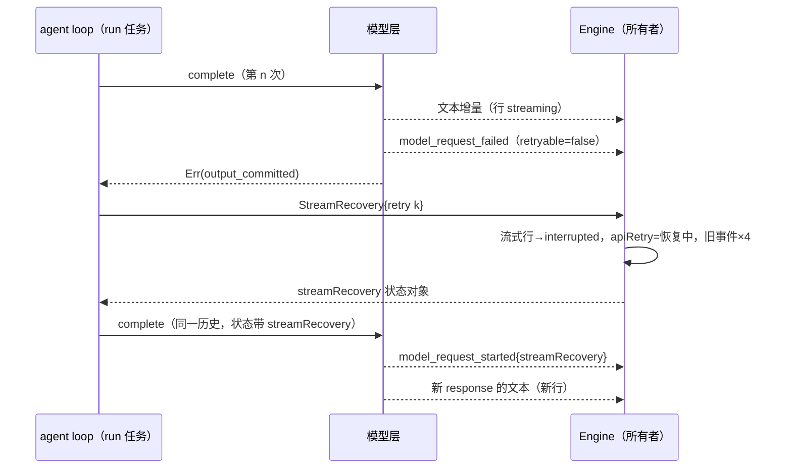

# Rust M7：流式恢复与异常防护

依据：Node `core/src/runtime/methods/streaming-recovery.ts`、`streaming-tool-coordinator.ts`、`turn-model-step.ts`、`helpers/model-errors.ts`、`bootstrap/src/zcode-protocol-v4/product-projection.ts`（apiRetry 与恢复投影）、`bootstrap/src/zcode-protocol/session-mapper.ts`（旧事件）、`packages/shared/src/zcode-api-retry-status.ts`。架构见 `rust-p0-p1-architecture.md` §5.13。

## 1. 重试状态（v4 `control.apiRetry`）

### 1.1 所有者与来源

- 所有者是 Engine。它从活动 run 的事件推导重试状态，写入会话的 `apiRetry`，随 `state.updated` 发布；值变化时才发布。
- 旧实现由模型层直接发送 `Retry` 事件，现在改为从网络状态推导，模型层不再发送该事件。

| 事件                                         | 结果                                                                                         |
| -------------------------------------------- | -------------------------------------------------------------------------------------------- |
| `model_retry_scheduled`                      | 设为重试中：attempt、maxAttempts（至少 attempt+1）、nextRetryAt = 当前 + delayMs、reasonCode |
| `model_request_started`，带 `streamRecovery` | 设为恢复中（见 2.4）                                                                         |
| `model_request_started`，attempt ≤ 1         | 清除                                                                                         |
| `model_request_started`，attempt ≥ 2         | 不变（重试请求已发出不代表已恢复）                                                           |
| `model_request_completed`                    | 清除                                                                                         |
| `model_request_failed`，retryable 为 false   | 清除；retryable 为 true 时不变                                                               |
| 首个非空文本或推理增量、assistant 消息提交   | 清除                                                                                         |
| 断流恢复开始                                 | 设为恢复中（见 2.4）                                                                         |
| run 开始、run 结束                           | 清除                                                                                         |

### 1.2 reasonCode

- 与 Node `modelRetryReasonCode` 一致：
  - `rate_limited`、`offpeak_queued` 映射为 `fault.provider.rateLimited`。
  - `provider_overloaded`、`server_error` 映射为 `fault.provider.serverError`。
  - `timeout` 映射为 `fault.network.timeout`，`stream_idle_timeout` 映射为 `fault.network.sseStalled`。
  - `stale_connection` 映射为 `fault.network.sseDisconnected`，`network_error` 映射为 `fault.network.unreachable`。
  - 其他（含 `auth_refresh`）映射为 `fault.provider.requestFailed`。
- 修复：旧实现把原始 reason（如 `rate_limited`）直接作为 reasonCode，UI 按 `fault.*` 展示的文案无法命中。
- 旧 `session/read` 的 `runtime.apiRetry.error` 同样取这里的 reasonCode。

## 2. 断流恢复（已有可见输出）

### 2.1 条件

- 模型请求在已经流出文本或推理之后失败（`output_committed`），适配层因此不再重试。
- 失败可恢复，满足以下任一：分类为可重试；或 reason 为 `stream_idle_timeout`、`rate_limited`、`server_error`、`network_error`、`timeout`。
- 本 run 的恢复次数小于 10（Node `STREAM_RECOVERY_MAX_RETRIES`，按轮计数），且 run 未被取消。
- 只有 agent step 的请求会恢复（main_turn、subagent），压缩等隐藏请求不恢复。

### 2.2 过程

- 历史：失败响应的部分输出从不进入 provider 历史，也不进入会话消息，重试用同一份历史。Node 提交一条带 `stream_recovery_discarded` 标记的 assistant 消息；该消息同样不进入 provider 历史，Rust 省略它。
- v4 投影：本轮 `streaming` 状态的文本与推理行改为 `interrupted`；重试的响应用新的 response id 打开新行，不会接到旧行上。
- 下一次请求：网络状态带上 `streamRecovery` 对象 `{attemptId, anchorId, maxRetries: 10, retryNumber, recoveredFromRequestId?}`。其中：
  - attemptId 为 `<失败响应 id>:end-of-stream`。
  - anchorId 为 `<失败响应 id>:previous-message-anchor`。
  - recoveredFromRequestId 为该步骤最近一次失败或停顿状态的 requestId，没有时取最近一次开始状态的 requestId。
- 空闲超时：请求的空闲超时按“恢复次数 + attempt − 1”每次加 30 秒（Node `streamIdleTimeoutRetryNumber`）。
- 恢复不计入子代理 maxTurns 以外的任何预算；每次恢复都是 agent loop 的一次新迭代（与 Node `continue` 相同）。

### 2.3 旧事件

订阅了旧事件流的根会话按顺序收到 4 个 `streamRecovery.updated`：

| 顺序 | Node 事件               | payload                                                                                                            |
| ---- | ----------------------- | ------------------------------------------------------------------------------------------------------------------ |
| 1    | stream_recovery_started | `{attemptId, assistantMessageId, failureKind, message, retryNumber, maxRetries, failedRequestId?}`                 |
| 2    | anchor_selected         | `{attemptId, anchorId, reason: "no_tool_committed", committedToolCallIds: []}`                                     |
| 3    | tail_discarded          | `{attemptId, anchorId, assistantMessageId, discardedReasoningBytes, discardedTextBytes, discardedToolCallIds: []}` |
| 4    | retry_started           | `{attemptId, anchorId, retryNumber, maxRetries, streamMode: "sse", failedRequestId?}`                              |

- 带 retryNumber 的 payload 附 `_meta.zcode.apiRetry`：`{kind: "api_retry", attempt: retryNumber, maxRetries, retryDelayMs: 0, errorStatus: null, error: message 或 "Model stream recovery retry started"}`。
- message 取失败状态的 message。failureKind 分类：
  - reason 为 `stream_idle_timeout` 或 `timeout`，或 message 含 timeout / timed out / stalled：`provider_timeout`。
  - reason 为 `network_error`，或 message 含 ECONNRESET / EPIPE / ETIMEDOUT：`provider_network_error`。
  - 其他：`provider_stream_error`。
- 丢弃字节数为失败响应已流出的文本与推理的 UTF-8 字节数。
- 带 `streamRecovery` 的 `model_request_started` 状态，其 `_meta.zcode.apiRetry` 同样取恢复次数（Node `zcodeApiRetryFromModelNetworkStatusPayload`）。

### 2.4 恢复中的 apiRetry

- 恢复开始：`{attempt: retryNumber, maxAttempts: maxRetries + 1, nextRetryAt: 当前, reasonCode}`，reasonCode 按 failureKind 映射：
  - `provider_timeout` 映射为 `fault.network.timeout`。
  - `provider_network_error` 映射为 `fault.network.unreachable`。
  - `provider_stream_error` 映射为 `fault.network.sseDisconnected`。
- 带 `streamRecovery` 的开始状态：同样的形状，reasonCode 沿用当前值，没有时为 `fault.network.sseDisconnected`。

### 2.5 与 Node 的差异

- 工具调用锚点恢复不实现。Node 在流中执行只读工具，并显示工具参数流；断流时以已提交的工具结果为锚点继续，未执行的调用给出 `not_executed` 合成结果。
- Rust 在流结束后才执行工具，也不显示工具参数流，因此：
  - 只有工具参数、没有文本的断流不可见，由适配层按普通重试处理（`output_committed` 为 false）。
  - 文本之后才出现工具调用的断流，与文本一起丢弃后重试。

## 3. 空响应

- 终止的空完成（无文本、无工具调用、无 usage，重试一次后仍然为空）的失败文本为 Node 的 `Model returned no text, no tool calls, and no usage before completing the turn.`。
- `lastError.attribution.reason` 为 `empty_model_response`，UI 据此展示空响应文案与恢复动作。网络状态中的 reason 仍按 Node 为 `unknown`。
- 修复：旧实现的文本是 `Provider response was invalid or incomplete.`，UI 会把它归为无效响应。

## 4. 用户停止时的部分输出

- 依据：Node `turn-model-step.ts` 取消分支与 `cancelled-stream-persistence.ts`。
- run 被取消时，如果 agent step 的请求已经流出文本或推理、但还没有提交 assistant 消息，Engine 把已流出的内容作为一条 assistant 消息写入会话历史：
  - content 为文本；推理非空时附 `reasoning_content`。
  - 附带请求模型的 `_zcode_origin`，换模型后推理按既有规则剥离。
  - 下一轮请求的历史与用户看到的一致：用户消息之后是这段部分回复，再是新的用户消息。
- 已经提交（`ModelDone`）的步骤不再重复写入；压缩等隐藏请求没有流式输出，不受影响。
- Anthropic 只从带签名的 thinking 块重放推理，部分推理没有签名，因此只重放文本；Chat 协议按原有规则回传 `reasoning_content`。
- v4 行保持 `interrupted`，与 Node 相同。

## 5. 验收

- 单元测试：
  - reasonCode 映射。
  - failureKind 分类。
  - 恢复条件（可见输出、可恢复、次数上限、取消）。
- 集成测试（`zcode-cli-rust-stream-recovery.test.ts`）：
  - 文本流出后断开：自动恢复，第二次请求与第一次历史相同。
  - 旧行为 `interrupted`，新行为 `complete`，最终回复只含恢复后的文本。
  - 第二次请求的网络状态带 `streamRecovery`；`apiRetry` 在恢复后清除。
  - 旧事件依次为 4 个 `streamRecovery.updated`。
  - 超过 10 次后失败。
  - 适配层重试的 reasonCode 为 `fault.*`。
  - 空响应的 lastError。
  - 流式输出中停止：下一轮请求的历史包含停止前的部分回复。
