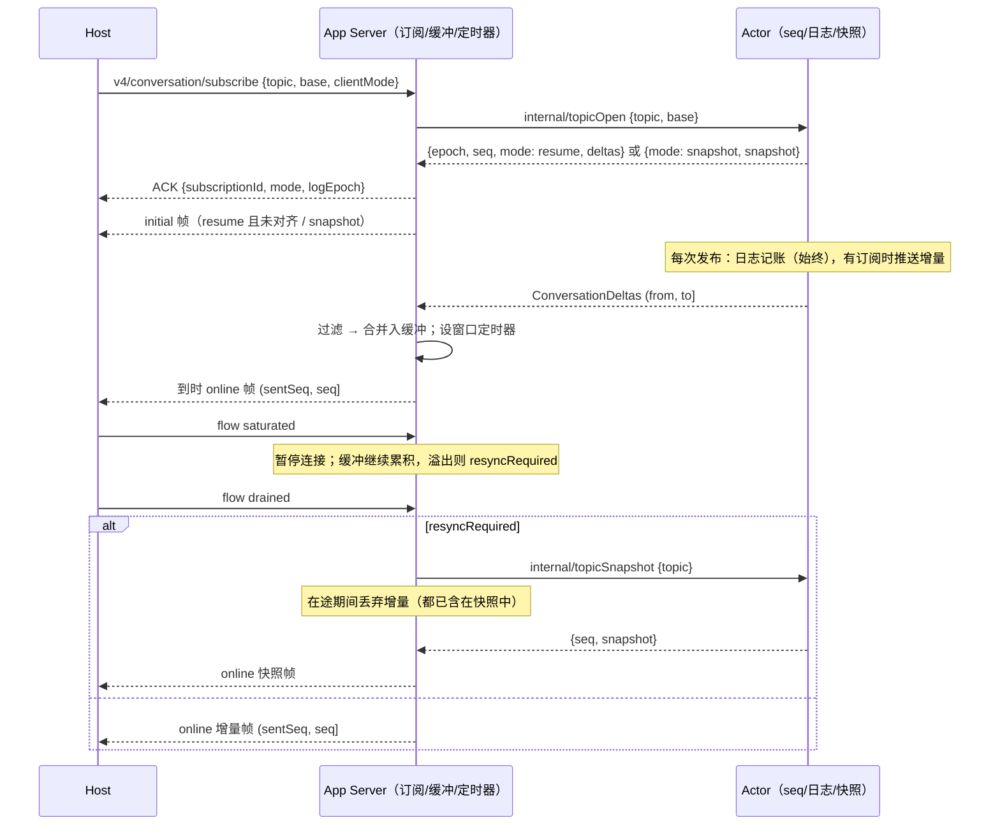

# Rust M8：订阅回放与流控

依据：Node `bootstrap/src/zcode-protocol-v4/conversation-topic-publisher.ts`、`sessions-index-publisher.ts`、`workspace-config-publisher.ts`、`v4-gateway.ts`（`scheduleFlush`、`setConnectionFlowState`、`subscribeReserved`、`resyncReserved`），以及 `packages/shared/src/zcode-protocol-v4/{core,profiles,coalesce,apply}.ts`。架构见 `rust-p0-p1-architecture.md` §5.15。

## 1. Node 契约

### 1.1 Delivery profile

- profile 只由 Host attachment 注入的 `clientMode` 决定：`desktop-continuous` 对应 continuous，其他值对应 replayable。客户端不能自选 profile。

| profile    | 刷新窗口 | `row.delta` 推送的 path                           |
| ---------- | -------- | ------------------------------------------------- |
| continuous | 30 ms    | `text`、`inputText`、`output.text`、`summaryText` |
| replayable | 150 ms   | 只推 `text`                                       |

- 过滤只作用于 `row.delta`，其他 op 两个 profile 都照发。path 不在表内的 `row.delta` 两个 profile 都丢弃（Node `streamPaths[path]` 为 undefined）。
- `desktopOnlyRows`、`toolProgress`、`streamOutputCapBytes` 在 Node 中没有读取方，Rust 不实现。

### 1.2 合并规则（`coalesceConversationDeltas`）

对一个窗口内的增量按日志序左折叠：

1. 相邻、同 `(rowId, path)` 的 `row.delta`：拼接 `append`。
2. 相邻的 `state.updated`：patch 顶层键浅合并，后者覆盖。
3. `row.upserted` 吞掉同 rowId 更早的 `row.delta`：向前回溯，遇到 `row.removed` 或同 rowId 的 `row.upserted`/`row.appended` 就停。
4. `row.removed` 是屏障，任何规则都不跨越它。
5. 相邻、同 rowId 的 `row.upserted`：只保留后一条。

### 1.3 订阅与恢复

- **保留日志**：conversation 保留最近 2000 条，sessions-index 保留 512 条。
- **subscribe(base)**：满足以下条件时 resume，否则发 snapshot：
  - `base.logEpoch` 等于当前 epoch；
  - `floor ≤ base.seq ≤ current`。
- **resume 的初始帧**：
  - `base.seq == current` 时不发初始帧，ACK 的 `mode` 为 `resume`；
  - 否则发一帧 `initial`，区间为 `(base.seq, current]`，内容是日志中 base 之后的增量，先按 profile 过滤再合并。
- **snapshot**：只带尾部 60 行。
- **resync(base, forceSnapshot)**：按同一规则裁决，但总会发一帧 `recovery`；已对齐时发 `(N, N]` 的空增量帧，让客户端收口。
  - 发帧前清空该订阅的缓冲。
  - 同一订阅的新恢复会取代在途的旧恢复。
- **重订阅**：同一连接对同一 topic 再次 subscribe，会替换旧订阅，旧订阅不再产帧。

### 1.4 每订阅者缓冲与刷新

- **入缓冲**：每个增量先按 profile 过滤，再与缓冲合并。
- **溢出**：合并后超过 500 个 op，或超过 1 MiB（按 `{"kind":"deltas","deltas":[...]}` 的 UTF-8 字节计），就清空缓冲并标记 `resyncRequired`。此后不再为该订阅积压增量。
- **定时器**：会话有新事件时，为每个未暂停、没有在途定时器的订阅设一个窗口定时器。
- **到时刷新**：
  - 若 `resyncRequired`，发一帧 `online` 快照。
  - 否则若缓冲为空且 `sentSeq == current`，不发帧。
  - 否则发 `(sentSeq, current]` 的增量帧。被过滤的 seq 也在区间内，客户端的连续性判定不受 profile 影响。
- **sessions-index**：变更后立即刷新，不走定时器。日志断档时退化为快照。
- **workspace-config**：整体替换态。

### 1.5 连接流控

| 状态        | Node 行为                                                               |
| ----------- | ----------------------------------------------------------------------- |
| `saturated` | 暂停该连接，清除其定时器；缓冲继续累积，直到溢出后转为 `resyncRequired` |
| `drained`   | 解除暂停，立即刷新该连接的全部订阅（conversation、index、config）       |
| `closed`    | 解除暂停、清理上传；Host 随后逐个 `unsubscribe`                         |

## 2. 所有者与事件顺序

- **Actor（Engine）**负责：
  - 分配 seq；
  - 维护保留日志：每个会话一份，另有一份 index 日志；
  - 计算 `state.updated` 的差量；
  - 裁决 resume 还是 snapshot，并生成快照或回放。
- **App Server** 负责：
  - 订阅注册表与 profile；
  - 每个订阅者的缓冲与定时器；
  - 连接暂停；
  - stdout 拥塞阀；
  - 打帧与分片。
- **Host** 负责上报 `saturated`、`drained`、`closed`。
- 本方案不涉及 Main 和 relay。

- **顺序保证**：Actor 的回复与事件走同一条有序通道。
  - Actor 处理 `topicOpen`/`topicSnapshot` 之前发出的增量，都在回复之前到达，且已含在快照或回放中。
  - 之后发出的增量从回复的 seq 开始。
  - 因此恢复在途期间收到的增量一律丢弃；回复到达后，把 `sentSeq` 和已缓冲水位都设为回复的 seq。

## 3. 保留日志（Actor）

- **为什么放在 Actor**：这是对 §5.15 原稿"app-server 持有 TopicLog"的刻意调整。
  - seq 由 Actor 分配，而无人订阅时 Actor 不向 App Server 推送增量。
  - 如果日志放在 App Server，无人订阅期间就会断档，手机重连只能退化为快照。
  - 日志放在 Actor 就与会话同寿命，不依赖订阅是否存在。
- **与 epoch 绑定**：记账时，若日志的 epoch 与会话当前 epoch 不同，或本次区间不接续日志末尾，就先重置日志（floor = 本次 from）。因此以下情况都会自动让旧日志失效：
  - 历史重写；
  - 冷恢复；
  - fork 出的子会话；
  - 导入。
- **上限**：
  - 会话日志最多 2000 条、8 MiB（按 serde_json 紧凑序列化的字节计）。
  - 超出时从最旧的条目淘汰，floor 前移到被淘汰条目的 to。
  - 日志字节计入会话驻留估算，空闲会话仍受 LRU 预算（8 个 / 16 MiB）约束；会话被淘汰后日志随之释放，重新加载会换新 epoch。
- **index 日志**：最多 512 条，与 Node `maxDeltaLog` 相同。
- **config**：不保留日志。base 与当前 seq 对齐时 resume，否则发 snapshot；config 是整体替换态，两者等价。
- **条目边界**：Rust 一次发布覆盖多个 seq，所以 resume 要求 `base.seq` 落在条目边界上，即等于 current，或等于某个条目的 from；否则发 snapshot。客户端的水位只来自帧的 toSeq 或快照的 seq，天然都在边界上。

## 4. `state.updated` 只发变化的顶层键

- **规则**：
  - Actor 为每个会话记住本 epoch 内最后发布的 patch。
  - 每次发布只带值发生变化的顶层键；全部未变时不发 `state.updated`。
  - epoch 变化后，下一次发布带完整 patch。
- **为什么等价**：
  - 客户端按"在场键整体替换"应用 patch（`apply.ts`：`{...snapshot, ...delta.patch}`），只发变化的键与发完整 patch 结果相同。
  - 快照等于 patch 加 rows，两者同源，所以从快照水位接续差量也正确。
  - 从 patch 中消失的键与之前一样不下发，行为不变。
- **效果**：
  - 旧实现每个流式文本块都附带约 1.5 KB 的完整 patch。
  - 改动后，文本块只剩 `row.delta`，相邻块可以按规则 1 合并；线上字节和日志字节都大幅下降。
  - 发布内容为空时（没有增量，也没有变化的键），不推进 seq。
- **基线与快照对齐**：
  - 取 conversation 快照（`topicOpen`/`topicSnapshot`）前，先发布尚未发布的 state 变化，使差量基线等于快照中的 state。
  - 否则会出现一种漏发：某个值从 A 变为 B 但没有发布，快照订阅者拿到 B；之后又变回 A 并发布，差量判定"未变化"，快照订阅者就一直停在 B。
  - 历史重写（`ConversationReset`）时，所有订阅者都以这份新快照为准，所以只把基线直接对齐到当前 state，不另发 patch。

## 5. 刷新管线（App Server）

| 输入                                | 动作                                                                                                                                                                                                                                                |
| ----------------------------------- | --------------------------------------------------------------------------------------------------------------------------------------------------------------------------------------------------------------------------------------------------- |
| `ConversationDeltas`/`IndexChanged` | 对该 topic 的每个订阅：恢复在途或已 `resyncRequired` 时跳过；from 小于水位的旧增量丢弃；from 大于水位时标记 `resyncRequired`（断档）；否则过滤、合并入缓冲，推进水位，溢出则清空并标记；未暂停且没有定时器时设 `due = now + 窗口`（index 窗口为 0） |
| 定时器到期、每批 runtime 输出之后   | 对到期且未暂停的订阅：`resyncRequired` 时向 Actor 请求快照（在途标记），否则水位前进或缓冲非空时发 online 增量帧                                                                                                                                    |
| `ConversationReset`/`ConfigChanged` | 未暂停的订阅立即收到快照，同时清空缓冲、对齐水位；已暂停的订阅标记 `resyncRequired`                                                                                                                                                                 |
| runtime 输出结束                    | 退出前刷新全部未暂停订阅的缓冲                                                                                                                                                                                                                      |

- 窗口从第一个进入缓冲的事件开始计时，与 Node 的 `scheduleFlush` 相同：已有定时器时不重设。

## 6. 流控（App Server）

- **`saturated`**：按连接暂停（与 Node 的 `pausedConnections` 相同，暂停期间新建的订阅也受影响），清除该连接各订阅的 due。增量继续进缓冲，溢出后转为 `resyncRequired`。
  - 修复：旧实现在 saturated 时直接丢弃增量，drained 后一律发快照；现在按 Node 保留有界缓冲，drained 后发增量帧。
- **`drained`**：解除暂停，立即刷新该连接的全部订阅。
- **`closed`**：Rust 仍直接移除该连接的全部订阅，并释放它们的 pin 与上传。Host 在 closed 之后总会逐个 unsubscribe，终态与 Node 相同，只是更早释放内存。
- **stdout 拥塞阀**（保留）：写队列积压超过 64 MiB 时，清空全部缓冲、标记 `resyncRequired` 并停止刷新；降到 16 MiB 以下后逐个快照恢复。这是 Node 没有的安全阀，防止 Host 读不动 stdout 时无界积压。

## 7. 与 Node 的差异

- **seq 粒度**：Rust 的 seq 按 delta 计数，Node 按事件计数。对客户端不透明，恢复条件见 §3。
- **日志字节上限**：会话日志额外有 8 MiB 上限，作为安全阀。
- **编码失败**：
  - subscribe/resync 的首帧超过 16 MiB 时，返回错误，且不登记新订阅；旧订阅保留，相当于 Node 的 rollback。
  - online 快照编码失败时，结束该订阅并释放 pin。
  - 旧实现遇到这类失败会让整个 App Server 退出。
- **共享编码**：同 profile 的多个订阅者共享一次编码的优化没有做。每个订阅者的缓冲独立，桌面加手机最多两份。
- **`openTiming`**：ACK 不提供 `openTiming`。

## 8. 验收

- **单测（domain / app-server）**：
  - profile 过滤；
  - 合并规则 1–5，对照 Node `coalesce.ts` 的语义；
  - 缓冲的 op 上限与字节上限；
  - 日志的边界、淘汰、epoch 重置与断档重置；
  - patch 差量；
  - 订阅水位与断档；
  - 暂停时累积，恢复后刷新。
- **集成（`packages/services/tests/zcode-cli-rust-delivery.test.ts`）**：
  1. 桌面（continuous）与手机（replayable）同时订阅：一轮结束后，两者应用帧得到的终态一致；流式文本块被合并，帧数少于文本块数。
  2. 手机以 base 重订阅：
     - 未对齐时 ACK 为 resume，initial 帧从 base.seq 开始；
     - 已对齐时 ACK 为 resume，且没有 initial 帧；
     - epoch 不同时发 snapshot。
  3. resync：
     - 带 base 时得到 recovery 增量帧；
     - 已对齐时得到 `(N, N]` 空帧；
     - `forceSnapshot` 时得到快照。
  4. `saturated` 期间改名，`drained` 后收到增量帧，且水位连续；超过 500 op 后，`drained` 收到快照。
  5. sessions-index 以 base 重订阅时 resume。
- **既有用例的读法按新语义调整**：
  - 同一窗口内，`row.upserted` 会吞掉同行的 `row.delta`；
  - 未变化的键不再重复下发，比如 `config.mode`、`goal` 这类未变字段由快照承载；
  - 各订阅者的窗口互不同步，fixture 的 `completed()` 以默认桌面订阅为准；
  - 相邻的重试状态会在窗口内合并；
  - saturated 之后，drained 发送的是增量帧。
- **既有用例**：recovery、transport、session-close 等全部通过。desktop-continuous 与 web-remote-replayable 两条链路都要覆盖。
