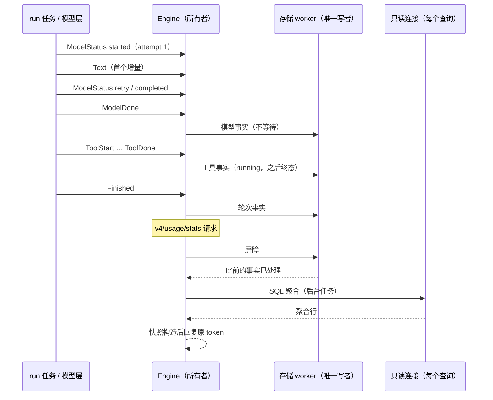
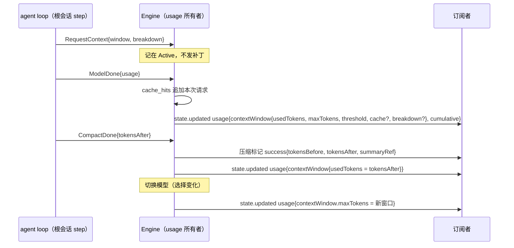
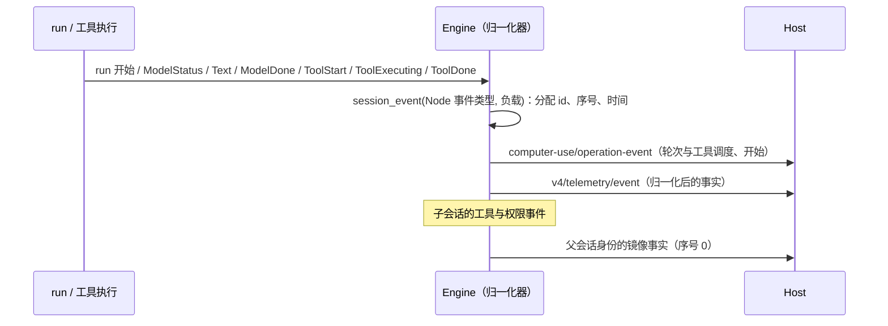
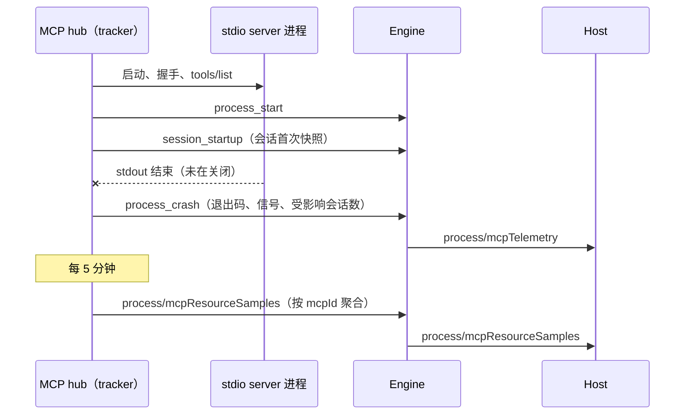

# Rust M9：用量与日志保留

依据：`apps/zcode-cli/packages/adapters/src/logging/retention.ts`、`bootstrap/src/log-retention.ts`；架构见 `rust-p0-p1-architecture.md` §5.16–5.17。用量见第 2 节。

## 1. 日志保留（M9.1）

- 目录：`ZCODE_LOG_DIR`，缺省为 `~/.zcode/cli/log`（与写入相同）。
- 文件：只处理本 runtime 的日文件 `zcode-rust-YYYY-MM-DD.jsonl`；名称必须严格为 4-2-2 位数字且是合法日期（例如 `2026-02-30` 不处理）。Node 的 `zcode-YYYY-MM-DD.jsonl` 由 Node 自己清理，Rust 不触碰。
- 规则：保留 7 天。截止日期为本地日期 `今天 - 7 + 1`，日期早于截止日期的文件删除；目录不存在视为完成。
- 时机：app-server 启动 60 秒后执行一次，后台任务，不阻塞请求与退出。
- 日志：调度时 `info`（`log.retention.cleanup.scheduled`），完成时 `debug`（`log.retention.cleanup.completed`，含扫描、删除与失败数量），读取目录或删除失败时 `warn`（`log.retention.cleanup.failed` / `log.retention.delete.failed`，只记录文件名与错误类别，不记录路径以外的内容）。
- 验收：单元测试覆盖截止日期边界、非法与他人文件名、删除失败不影响其余文件。

## 2. 用量（M9.2）

依据：Node `adapters/src/storage/session-store/repositories/usage.ts`（表、upsert、30 天保留、两类查询）、`bootstrap/src/zcode-protocol/usage-stats-builder.ts`（快照）、`server-operations.ts` 的 `getUsageStats` / `getTaskTokenUsage`、`core/src/runtime/methods/usage-observability.ts`、`turn-tool-usage.ts`、`turn.ts` / `compact.ts`（记录时机）。

### 2.1 状态所有者与事件顺序

- 事实由 Engine（唯一所有者）从 run 事件推导：模型请求来自 `ModelStatus`、`Text`、`ModelDone`，工具调用来自 `ToolStart`、`Permission`、`ToolExecuting`、`ToolDone`，轮次来自 run 开始与 `Finished`。run 任务与模型层不接触存储。
- 每个 run 的进行中状态（请求探针、工具探针、轮次累计）挂在 `Active` 上，随 run 结束丢弃。取消后被丢弃的 run 事件仍先经过用量观察，终态才能记为 cancelled。
- 写入：Engine 把事实发给存储 worker（与会话提交同一有序队列，不等待写入结果）。写入失败只记 `warn`（`usage.write.failed`），不影响会话（Node：观测失败不能改变 Agent 业务语义）。
- 查询：Engine 同步校验参数，之后在后台任务中执行。先经过存储 worker 的屏障，保证本进程此前发出的事实已经落库；再用请求级只读连接做 SQL 聚合，按原请求 token 回复。Engine 不因查询阻塞。

### 2.2 表与保留

- Rust 库新增 `rust_model_usage`、`rust_turn_usage`、`rust_tool_usage`，列、检查约束、主键与索引同 Node 迁移 `0010_usage_observability`。不加会话外键：Rust 会话以 `(workspace, id)` 为键，且只删除没有历史的草稿，不会产生孤儿用量。
- upsert 规则同 Node：模型请求按 id 整行覆盖；轮次按 `(session_id, turn_id)` 合并（started_at 取小，首个时刻保留，终态字段覆盖）；工具按 id 合并（终态不被 running 覆盖，字节取大，错误字段保留首个非空值）。
- 保留 30 天：按 started_at 删除三表中早于 `now - 30 天` 的行。Node 每次写入后执行；Rust 在写入时最多每分钟执行一次，过期行最多多保留 1 分钟。

### 2.3 记录规则（M9.3 按 Node 实测对齐）

对照依据是 `scripts/zcode-cli-rust-usage-diff.mjs`（§3）：同一本地模型下真实 Node CLI 与 Rust 跑相同场景，三张表的行归一化 id 与时刻后逐字段比较。以下规则都来自 Node 源码并经该脚本核对。

**模型请求（`model_usage`，Node `recordModelUsageFact`）**

- 记录的来源：`main_turn`（根会话的 agent step）、`subagent`（子会话的 step）、`compact`（手动与自动压缩摘要）、`target_completion_verification`、`session_title`、`goal_summary_title`。WebSearch（`web_search_tool`）、WebFetch 处理（`web_fetch_processing`）与连通性测试不记录，Node 同样不记录。
- 一个逻辑请求从 attempt 1 的 `model_request_started` 开始，每个 `model_retry_scheduled` 使 retry_count 加 1。
- 身份：
  - step 请求：`assistant_message_id` 为该步骤的 Node assistant 消息 id，`parent_user_message_id` 为本轮的 user 消息 id，`logical_request_id` 取 assistant 消息 id。
  - 其他来源：`logical_request_id` 取该请求的 span id；标题请求的 `parent_user_message_id` 为触发标题的 user 消息 id，压缩与目标验证为空。
  - `id` 为 `usage_model_<来源>_<logical_request_id>_<attempt_index>`；`attempt_index` 为压缩在 prompt-too-long 之后的重试序号，其余为 0。
  - `span_id`：每个逻辑请求一个 Node 格式的 span id（`randomUUID().slice(0, 16)`）。
- 终态：
  - `model_request_completed`：status 为 completed。token 取 Node `ModelUsage`（`raw_usage_json` 与 `provider_total_tokens` 都用这一归一化形态，标题请求也一样），finish_reason 取归一化的 finishReason，`provider_metadata_json` 为 `{rawFinishReason}`（供应商原始结束原因）。step 请求在随后的 `ModelDone` 落库，tool_call_count 为该 assistant 消息的工具调用数；其他来源立即落库，tool_call_count 为 0。
  - `retryable` 为 false 的 `model_request_failed`：reason 为 `cancelled` 时 status 为 cancelled（cancelled_by_user 为 1），否则为 error。error_type 取 reason，error_code 为空（Node 的模型适配器错误不是 CoreError，没有 code），error_message 为该 reason 的通用失败文案（Node 适配器错误的 message，例如 `Provider rejected the model request.`），不是供应商原文。reason 为 `context_exceeded` 时 context_exceeded 为 1。
  - run 结束时仍未终结的请求：run 被取消时记 cancelled，否则记 error。
- 时刻：started_at 为 Engine 收到 attempt 1 开始状态的时刻。first_token_at 为该请求首个非空文本或推理增量的时刻；只有 step 请求有流式增量，其他来源为空（与 Node 相同）。
- token：computed_total_tokens 为输入侧加 outputTokens，其中输入侧在 inputTokens 大于 0 时取 inputTokens，否则取 cache 读写之和。retryable 为 retry_count 大于 0。
- 归属：provider_id、model_id 取请求开始时的模型快照；variant 为会话当前的推理档位；mode 为会话权限模式；agent 为 `zcode-agent`，子会话为 `zcode-<子代理类型>`（Node 子代理 runtime 的 `agentName`）；task_type 根会话为 `interactive`，子会话为 `subagent_child`；turn_id、trace_id 为 run 的轮次与 trace，标题请求取触发它的轮次。

**轮次（`turn_usage`，Node `recordTurnUsageFact`）**

- 记录时机（Node `turn.ts`、`compact.ts`）：普通输入与目标续跑的 run 在成功、失败、取消时都记录；UserPromptSubmit hook 拦截的输入按成功记录；手动压缩的 run 在每种结局都记录。
- 字段：
  - `user_message_id` 为本轮 user 消息 id，手动压缩为空。
  - started_at 为 run 开始时刻，completed_at 与 duration_ms 取结束时刻。
  - model_request_count 与 model_retry_count 为本轮事件中的模型请求数与重试数：agent step 与轮内压缩计入，目标验证（自有事件列表）、标题（旁路）与 WebSearch 的内部请求不计入。
  - tool_call_count 为调度的工具调用数。tool_error_count 只数本轮事件里的 ToolCallError：Node 执行器的工具事件不进入轮次事件列表，只有 run 结束时合成的中断调用计入（Rust 为 run 结束时仍未完成的调用），普通失败与拒绝不计。
  - token 为本轮所有 ModelComplete 的 usage 之和：agent step、轮内压缩，以及工具内部请求的嵌套用量（§2.3.1）；目标验证不计入。computed_total_tokens 按 Node `getModelUsageTotalTokens` 累加。
  - 失败信息同 Node `createTurnFailureError`：取消为 `turn_cancelled` / `TURN_CANCELLED`（cancelled_by_user 为 1）；超出上下文为 `model_context_exceeded` / `MODEL_CONTEXT_EXCEEDED`、retryable 为 1、context_exceeded 为 1；其他失败为 `unknown_error` / `UNKNOWN_ERROR`。

**工具（`tool_usage`，Node `recordToolUsageFromEvent` 与 `recordToolUsageFromResult`，经同一 upsert 合并）**

- id 为 `usage_tool_<session>_<callId>`。
- `side_effect_scope`、`read_only`、`destructive` 取 Node 工具注册元数据：Read、Glob、Grep、TaskOutput、TodoRead 为 `none`/只读；Write、Edit 为 `workspace`；Bash 为 `system`；WebFetch、WebSearch 为 `network`/只读；TodoWrite、Skill、Agent 为 `session`/只读；SendMessage、TaskStop、EnterPlanMode、ExitPlanMode 为 `session`；AskUserQuestion 为 `userInteraction`/只读；MCP 工具为 `network`（宿主 `node_repl` 的 `js` 为 `system`），只读与破坏性取 annotations 的 `readOnlyHint === true`、`destructiveHint === true`。
- 状态：调度时 running；成功为 completed，失败与拒绝为 error，run 取消导致的失败为 cancelled（cancelled_by_user 为 1）。run 结束时仍未完成的调用按 run 的结局收口。
- approval_status：权限事件依次写 `requested`、`allowed` / `denied`，但 Node 的结果记录器最后写入 `none`，upsert 的 coalesce 让它覆盖前值；有结果的调用最终都是 `none`（照 Node 保留）。
- 字段：
  - started_at 为调度时刻；duration_ms 为执行时长，被拒绝的调用从调度算起（Node 结果记录器总有时长）。
  - first_output_at 为首次输出时刻：Bash 输出的首个增量，其他工具为完成时刻；time_to_first_output_ms 为完成时刻减执行开始时刻（Node 结果记录器）。
  - exit_code 为 Bash 的退出码，其他工具为 0（Node 结果事件对缺失的退出码写 0）。
  - output_bytes 为结果文本的字节数，失败与拒绝为 0（没有序列化输出）；truncated 为结果是否被预算截断。
  - 失败时 error_type 为 Node 的错误类型（`tool_execution_failed`、`tool_cancelled`、`permission_denied`），error_code 为 CoreError 的大写类型（`TOOL_EXECUTION_FAILED`、`TOOL_CANCELLED`），权限拒绝没有 code；error_message 为错误文本。

#### 2.3.1 工具内部请求的嵌套用量（Node `appendNestedToolModelUsage`）

- 工具结果带 `modelUsage` 时（WebSearch 的内部模型请求），Node 在本轮追加一条 `ModelComplete {stopReason: "tool_internal"}`。Rust 在工具结果提交时把这份用量计入：
  - 本轮 `turn_usage` 的 token（不计入 model_request_count）；
  - 旧协议 `turn.completed` 的 usage，其中 `webSearchRequests`、`webFetchRequests` 累加 `serverToolUse`；
  - 目标的 `tokensUsed`（Node `accountTargetTurnCompletion` 取本轮 usage 的 totalTokens）；
  - 子代理返回给父会话的用量（Node `aggregateModelUsage` 汇总子会话本次运行的全部 ModelComplete）。
- 不计入 `model_usage`（所以不进入 `v4/conversation/usage` 与 `v4/usage/stats`），也不计入 v4 `usage` 状态与上下文用量，与 Node 相同。
- WebSearch 输出的 `modelUsage` 为内部请求的 Node `ModelUsage`（input/output/total、cache 读写、reasoning、`serverToolUse.webSearchRequests/webFetchRequests`），并带顶层 `webSearchRequests`。

#### 2.3.2 标题的时机

- app-server（Node 协议模式）：Node 的 `providerRuntimeHeadersPort.shouldRefreshBeforeModelRequest` 恒为 true，首条输入的标题总是推迟到该轮成功结束后生成；失败或取消的首轮不生成，推迟的标题也随之丢弃，之后第一条成功的轮次生成。Rust 原先只对账号类供应商推迟，现与 Node 相同。
- `turnNumber === 0` 的判定：本次激活之前已存的输入（加载时的历史）加上本次激活成功结束的 run（压缩除外）为 0；本次激活开始的输入与 `/goal` 目标不计入（原先按消息里的输入条数判断，失败的首轮会让之后永远不生成标题）。
- 标题用量的 turn_id、trace_id 为触发它的 run。

### 2.4 查询

**`v4/usage/stats` 与旧 `usage/stats`（同一实现）**

- 参数：严格对象 `{range: "all" | "7d" | "30d", timeZone?: string}`，缺省 params 视为 `{}`。校验失败为 Node `parseParams` 的 -32602，包括消息与 ZodError data。
- 时间范围：until 为当前时刻；`7d`、`30d` 的 since 为 until 减去对应天数，`all` 为 0。
- 时区：缺省为 `UTC`。IANA 名称不区分大小写，含别名，在 until 时刻按秒精度计算偏移；`±HH:MM` 为固定偏移。无法解析时偏移为 0（Node `resolveTzOffsetMs` 捕获异常后回退 0）。
- 聚合与快照：
  - SQL 聚合同 Node `queryAppUsage`：总计、轮次总计、最长会话、工具总计、模型排行、工具排行、按日的 token / 轮次 / 工具数，以及按日的模型用量。
  - 快照构造同 Node `buildAppUsageSnapshot`：缓存命中率的分母、错误率、活跃天数、当前与最长连续天数、热力图 5 级与按 7 天切周、每日模型趋势、模型份额与最常用模型。
  - 平均值与比例按 JS number 输出。
- 范围：查询覆盖整个 Rust 库（所有 workspace），与 Node 用任意 workspace client 读取全局库一致。

**`v4/conversation/usage` 与旧 `session/usage`**

- 参数：严格对象 `{sessionId}`，两个方法都按 Node 服务端实际使用的 `zcodeTaskTokenUsageParamsSchema` 去空白后非空。
- 计算：按 started_at、id 升序读取该会话的模型请求，规则同 Node `queryTaskUsage`：
  - main_turn、subagent、workflow_child 三个来源的输入侧按各自基线取增量，压缩后基线随之下降；其他来源全额计入。
  - 输入侧口径同 Node `inputSideTokensFromStoredUsage`。
  - cache 读写只累加非基线来源，并返回 `inputBaselineBySource`。
- 未知会话返回全 0。

### 2.5 与 Node 共用的用量表

- 用量写入 Node 库的 `model_usage`、`turn_usage`、`tool_usage`（spec rust-m11-node-storage §2.1），Node 与 Rust 写入的行在同一统计中；`queryAppUsage` 与 Node 一样不按工作区过滤。

### 2.6 与 Node 的差异

- 保留清理最多每分钟一次（见 2.2）。
- `workspace/generateText` 不记录用量：Node 记到工作区的活动会话，没有活动会话时因会话外键写入失败；Rust 不把 workspace 级请求归到会话。连通性测试两边都不记录。
- stdout / stderr 字节只在 Node 的 Bash 进度事件里有值，Rust 不单独统计，记 0。
- 标题请求 Node 走非流式 `generateText`，`provider_metadata_json` 是 AI SDK 的供应商元数据（例如 `{anthropic: {usage, cacheCreationInputTokens, …}}`）；Rust 以流式请求生成标题，记 `{rawFinishReason}`。
- 时刻取 Engine 收到事件的时间，Node 取事件对象的时间戳；两者只差进程内的通道延迟。

### 2.7 修复

- 目标完成验证原先复用压缩的隐藏请求，请求来源为 `compact`；现改为 Node 的 `target_completion_verification`，网络状态、`session/debug` 与用量的归属都与 Node 一致。
- 隐藏请求（压缩、目标验证、WebSearch）在请求结束时直接返回，通道里尚未转发的 completed 状态被丢弃，压缩用量因此记为 error、token 为 0，轮次 token 缺少压缩部分。现在请求结束后先转发剩余状态。

### 2.8 验收

- 单元测试：
  - 快照构造：连续天数、热力图级别与补齐、时区偏移、份额。
  - 会话用量的基线计算。
  - 事实推导：重试、失败、取消，step 请求在 `ModelDone` 落库。
  - 表的 upsert 与查询。
- 集成测试（`zcode-cli-rust-usage.test.ts`）：
  - 一轮带工具调用后，`v4/conversation/usage` 与 `session/usage` 的 token。
  - `v4/usage/stats` 的 summary、模型与工具排行、热力图。
  - 参数错误。
  - Node 写入的用量行出现在统计中。

## 3. 与 Node 的差分检查（M9.3）

`TSX_TSCONFIG_PATH=packages/services/tests/tsconfig.zcode-cli-rust.json node --import tsx scripts/zcode-cli-rust-usage-diff.mjs [zcode.cjs] [rust] [--only=…] [--show=…]`：

- 本地 Anthropic Messages 模型（流式与非流式、cache 读写与 `server_tool_use` 用量）；共用 Provider Registry 形态的 HOME（`scripts/zcode-cli-rust-interop-runtime.mjs`）。
- 场景：普通轮、Bash 工具轮、WebSearch（内部搜索请求）、模型 400 失败、流式中停止、手动压缩、子代理。每个场景一个新会话，Node 与 Rust 各用一个临时库。
- 比较：三张表的行按记录对象（来源或工具名）排序后逐字段比较；会话、轮次、消息、trace、span、调用 id 按首次出现替换为占位，时刻与时长只比较是否为空，`*_json` 解析后比较。
- 同时比较两边的 `v4/telemetry/event` 与 `computer-use/operation-event`（§5，`scripts/zcode-cli-rust-telemetry-diff.mjs`）与每个会话的 v4 `usage` 补丁、压缩标记（§4）。
- 环境：临时根目录先 realpath，两边都以 `SHELL=/bin/bash` 启动，并在用户配置里抑制官方内置插件 `browser-use`（Node 在空 HOME 中播种并默认启用它，技能清单、会话指引与 `mcp__node_repl__js` 会进入请求前缀；浏览器工具单独对齐）。工作区 realpath 与登录 shell 名是单列的环境对齐项，不是统计差异。
- 已知差异（脚本列出、不计数）：标题的 `provider_metadata_json`（§2.6）；breakdown 中工具定义的字符数（§4.3）；Rust 在 run 结束时重发本轮全部行，压缩标记因此多一次相同的 upsert。
- 场景：普通轮、Bash、WebSearch、模型失败、停止、手动压缩、子代理、工具失败（Read 不存在的文件）、子代理内 Bash、Write 后 Edit、会话级 stdio MCP server 崩溃、build 模式下允许与拒绝权限。2026-09-25 的结果：9 个场景三张表逐字段一致（差异 0）；M9.4 之后 v4 `usage` 补丁序列（水位、窗口、阈值、cache、breakdown 的提示词与消息类别、累计值）与压缩标记（前后 token、`summaryRef`）也逐字段一致。

## 4. 协议层用量状态（M9.4）

依据：Node `bootstrap/src/zcode-protocol-v4/product-projection.ts`（`onModelSelected`、`onModelComplete`、`onCompactLifecycle`、`seedUsage`）、`core/src/runtime/methods/turn-model-step.ts`（main_turn 的 `ModelComplete` 携带 `contextWindow`、`cacheHit`、`contextUsageBreakdown`）、`turn-model-step-usage.ts`（`recordMainTurnCacheHitUsage`、`mainTurnCacheHitAggregateFromMessages`）、`context-usage.ts`（breakdown）、`compact-active.ts`（压缩前后 token）、`contracts/src/model/index.ts`（`getModelUsageContextTokens`）、`contracts/src/events/event-reducer.ts`（旧协议 projection）。以 §3 的脚本实测 Node 为准。

### 4.1 所有者与事件顺序

- v4 `usage`（`contextWindow`、`cumulative`）只由 Engine 写入 `Session.usage`；缓存命中累计由 Engine 持有（`Session.cache_hits`，按模型消息下标记录每个主轮次请求的 input / cache read / cache write）。
- agent loop 每次 step 请求前发 `RequestContext`（本次请求模型的窗口，以及根会话请求的 breakdown），Engine 只把它挂在 `Active` 上，不改状态；随后同一 run 的 `ModelDone` 用它投影。事件在同一 run 通道内有序，不需要超时或兜底。
- 只有根会话（非 `subagent_child`）的 step 请求是 Node 的 `main_turn`，才更新 `usage`；子会话、压缩、目标验证、标题、工具内部请求都不更新 `cumulative` 与 `contextWindow`（Node `onModelComplete` 的 `isMainTurn`）。
- 压缩成功后 `contextWindow.usedTokens` 取压缩后的估算；切换模型时按新模型的窗口更新 `maxTokens`。

### 4.2 规则

- 上下文用量（Node `getModelUsageContextTokens`）：输入窗口 + 输出；输入窗口依次取正的 `inputTokens`、`totalTokens - outputTokens`、`cacheRead + cacheWrite`；两者和为 0 时取正的 `totalTokens`，否则 0。
- main_turn 完成：`contextWindow = {usedTokens, maxTokens: 请求模型的窗口, autoCompactThresholdTokens: 之前的值或 null, cache?, breakdown?}`；`cumulative` 的四项加上本次 provider 用量。Node 的实时状态从不给出自动压缩阈值，因此阈值始终为 null（冷恢复种子也是 null）。
- `cache`（Node `recordMainTurnCacheHitUsage`）：本次 input 窗口、cache read、cache write 都不为正时不记录、不带 `cache`；否则累计加一，字段顺序 `inputTokens, cacheReadTokens, cacheWriteTokens, latestHitRate, hitRate, hitRateRequestCount, totalInputTokens, totalCacheReadTokens, totalCacheWriteTokens`，比率分母为 0 时为 null。回退（rewind）与截断后丢弃被移除消息的记录；冷加载按活动分支中非摘要 assistant 记录的 `tokens.input / cache.read / cache.write` 重建（Node `mainTurnCacheHitAggregateFromMessages`）。
- `breakdown`（Node `buildContextUsageBreakdownFromSnapshot`）：按 `system_prompt, meta_user_context, skills, tool_prompt, system_tool_schemas, mcp_tool_schemas, messages` 顺序给出字符数为正的类别，字符数按 JS 字符串长度（UTF-16）：
  - `system_prompt`：各 system section 正文长度之和（不含 section 间的分隔）；
  - `meta_user_context`：工作区说明与当前日期两个 section 正文之和；
  - `skills`：技能清单正文（不含 `<system-reminder>` 包装）；
  - `system_tool_schemas` / `mcp_tool_schemas`：每个工具 `JSON.stringify({name, description, inputSchema, readOnly, destructive, sideEffectScope})` 的长度，`mcp__` 前缀归 MCP；
  - `messages`：非 system、且不是 `<system-reminder>` 开头的用户消息（任务通知除外）按 Node 消息形态 `JSON.stringify({role, content, toolCalls, toolCallId, toolName})` 的长度之和。
- 压缩标记：`tokensBefore` 为压缩前请求前缀加全部会话消息的估算，`tokensAfter` 为请求前缀加摘要、保留消息与压缩后提醒的估算（Node `estimateRuntimeEntryTokens` 的 `preCompactTokenCount` / `truePostCompactTokenCount`，都不含工具定义）；成功标记带 `summaryRef`（摘要消息 id）。压缩成功后 `contextWindow.usedTokens = tokensAfter`，窗口未知时不建对象。
- 切换模型：选择变化后，`contextWindow` 为空时新建 `{usedTokens: 当前用量, maxTokens: 新窗口, autoCompactThresholdTokens: null}`，否则只改 `maxTokens`；窗口不变不发补丁。创建会话不发补丁（Node 初始快照 `contextWindow` 为 null）。
- 旧协议：main_turn 的 `session.updated`（model_complete）带 `contextWindow`、`cacheHit`、`contextUsageBreakdown`；压缩、目标验证、目标摘要标题的 model_complete 也转发（会话标题的隐藏）；快照的 `projection.totalTokenCount` 为本进程内各轮 `turn_complete.tokenCount` 之和，`contextUsed` 同 v4 `usedTokens`。

### 4.3 与 Node 的差异

- 工具定义的字符数：Node 的工具契约还序列化 `capability`、`outputSchema`、`permission`、`resultBudget`，Rust 的工具定义没有这些字段，`system_tool_schemas` 与 `mcp_tool_schemas` 的字符数小于 Node（实测同一工具集约为 Node 的三分之一，比例图中工具占比偏低）。差分脚本把这两个类别列为已知差异。
- 旧协议 model_complete：目标验证与目标摘要标题的 model_complete 不转发（Rust 的验证事件不带模型原文，旧 projection 的 `targetCompletionVerifications` 本就为空）；`stopReason` 仍按有无工具调用给出 `stop` / `tool-calls`。

### 4.4 修复

- 原先每次请求前用本地估算（含工具定义）覆盖 `contextWindow`，阈值取自动压缩阈值；子会话、压缩与目标验证的用量也计入 `cumulative`，压缩前后 token 只估算会话消息。与 Node 的 context meter 口径不一致（Node 用 provider 实际用量），现按 4.2 修正。

### 4.5 验收

- 单元测试：上下文用量公式、缓存累计与回退截断、breakdown 类别与字符数、冷加载重建。
- 差分脚本（§3）：普通、工具、WebSearch、压缩、子代理场景的 `usage` 补丁序列与压缩标记逐字段一致（工具定义字符数除外）。

## 5. 实时遥测（M9.5）

依据：Node `bootstrap/src/zcode-protocol-v4/conversation-telemetry-facts.ts`（`ConversationTelemetryFactNormalizer`）、`v4-gateway.ts`（`emitLiveTelemetryFact`）、`zcode-protocol/computer-use-operation-event.ts`、`core/src/subagent/tool-event-mirror.ts`、`tool/executor/call-runner.ts`（`totalMs`）、`permission-flow.ts`（`permissionWaitMs`）、`tool/handlers/tool-perf.ts`、`bash-output.ts`、`write.ts`、`edit.ts`。消费方为 `packages/services` 的 `v4/telemetry/event` 与 `computer-use/operation-event` 分支（strict schema）。

### 5.1 所有者与事件顺序

- Engine 是唯一发送者：本进程的每个实时会话事件（Node `SessionEvent` 的对应物，根会话与子会话都算）先发 `computer-use/operation-event`，再发 `v4/telemetry/event`。事件 id 为新 UUID，序号是会话在本进程内的递增计数，时间取 Engine 收到事件的时刻。冷加载、回放不发。
- 归一化器（有界 2000 键的轮次命令、首块、工具名、会话模型与已完成请求队列）挂在 Engine 上，与 Node 的网关实例同寿命。
- 子会话的工具与权限事件另以父会话身份镜像一次（Node `mirrorSubagentToolEvent`）：序号 0，`toolCallId` 改写为 `tool_subagent_<agentId>_<childToolCallId>`，带子会话、子调用、父调用与 agent 字段，轮次是父会话发起该子代理的轮次。

### 5.2 事件来源

| Rust 事实                                                         | Node 事件                                                                                                                                 |
| ----------------------------------------------------------------- | ----------------------------------------------------------------------------------------------------------------------------------------- |
| run 开始（输入命令、续跑来源、自动化与闲时任务字段）              | `turn_started`                                                                                                                            |
| `ModelStatus`（含压缩、目标验证、WebSearch 等内部请求与标题请求） | `model_network_status`                                                                                                                    |
| `Text`                                                            | `model_streaming`（`assistantMessageId` 为本步的 Node assistant 消息）                                                                    |
| step 的 `ModelDone`                                               | `model_complete`（`main_turn` / `subagent`）                                                                                              |
| `ToolStart` / `ToolExecuting`                                     | `tool_call_scheduled` / `tool_call_started`                                                                                               |
| `ToolDone`                                                        | `tool_call_result`（成功，带 `perf`）、`tool_call_error`（`TOOL_EXECUTION_FAILED`）、策略拒绝为 `permission_denied`；询问后被拒不再有事件 |
| 权限询问与应答                                                    | `permission_requested` / `permission_resolved`                                                                                            |
| 子代理启动与结束                                                  | `subagent_spawned` / `subagent_stopped`                                                                                                   |
| run 结束（旧协议轮次合计，子会话同样统计）                        | `turn_complete` / `turn_error`（`turnPhase` 为 Node TurnMachine 阶段）                                                                    |
| 压缩成功、失败或随 run 中断                                       | `compact_completed` / `compact_failed`                                                                                                    |

### 5.3 规则

- 事实映射与 Node 归一化器逐项一致：`sourceCommandId` 取本轮 `turn_started.inputId`（终态优先取 payload 的 `inputId`，压缩只取压缩负载的命令），`firstChunk` 按会话、轮次、通道、part 与父调用区分，`usage.delta` 只给 agent step（按会话与请求来源的 FIFO 取已完成请求的身份），排队/准入状态与未知 `inputSource` 不产生事实。
- 工具 `performance`：`totalMs` 为调用从开始到 PostToolUse 结束的整个生命周期；只有真正弹出权限询问的调用带 `permissionWaitMs`；Bash 带命令明细（分类、公开命令表中的可执行名或 `compound` / `other`、命令数、状态、运行时长、无输出时长、退出码、超时、输出字节，不含命令原文）；Write 带 `filesystem`，Edit 带 `filesystem` 与 `patch`（子代理中 `workspaceKind` 为 `unknown`）。`perf` 只进遥测，不写入结果存储。
- `computer-use/operation-event`：轮次开始、完成、失败，工具调度（`mcp__node_repl__js` 且代码含 `setupComputerUseRuntime` 时 `computerUse: true`）与工具开始。

### 5.4 与 Node 的差异

- 不带 `memoryEnabled`：Rust 不向 Host 请求会话运行偏好（`session/requestRuntimePreferences`），也没有 Memory 功能。
- 标题请求 Rust 用流式发送，`transport` 为 `sse`（Node `http`，见 §2.6）。
- Node 在流式输出时就调度并启动可并发的只读工具，其 scheduled / started 事实可能早于请求完成；Rust 在请求完成后执行工具。
- Bash 不带 `firstOutputMs`（Node 只在流式进度计时存在时带，短命令同样没有）。
- 没有 `workflow.lifecycle` 与 CronCreate 的 `automationId`：Rust 没有动态工作流与定时任务工具。

### 5.5 修复

- 子会话的模型请求原先沿用父轮次的 `queryId`；Node 子会话轮次没有 inputId，`queryId` 为新 id。
- WebSearch 与 WebFetch 处理等工具内部请求原先带本轮 `queryId`；Node 在工具的 trace 上下文中发出，不带。
- 标题请求原先不带 `queryId`、网络状态不进入会话；现沿用触发轮次的 `queryId`，状态进入会话遥测。
- 旧协议 `turn.failed` 的 `turnPhase` 原先固定为 `execution`；现为失败时的 TurnMachine 阶段（首个请求失败为 `processing_input`）。
- 手动压缩轮的 `turn_complete` 原先 `tokenCount` 为 0、`response` 为空；Node 为压缩请求的 token、`Compacted`（无可压缩内容时为预估 token 与 `Context is up to date; no compression needed`），`historyRoundCount` 为 1；轮内压缩的用量计入该轮的 `usage`。
- Write 的结果文本原先为旧版 `The file <绝对路径> has been written successfully.`；现与 Node 一致：新建为 `File created successfully at: <file_path>`，覆盖为 `The file <file_path> has been updated successfully.`，并附文件状态已在上下文中的提示。

### 5.6 验收

- 单元测试：归一化器（命令关联、首块、请求身份队列、工具名缓存与性能白名单、权限、子代理、压缩）、computer-use 映射、Bash 命令分类。
- 集成测试（`zcode-cli-rust-telemetry.test.ts`）：一轮工具调用的通知全部通过共享的 strict schema。
- 差分脚本（§3）：12 个场景（新增子代理内 Bash、Write 后 Edit、权限允许）的事实流与 computer-use 事件逐字段一致（id、时刻、时长为占位；`memoryEnabled`、标题 `transport` 与只读工具的提前交错为已知差异）。

## 6. MCP 进程遥测（M9.6）

依据：Node `adapters/src/mcp/telemetry.ts`（tracker、`mcpId`）、`pool.ts`（lease 的首次快照）、`index.ts`（stdio 连接后的 process_start、非预期关闭的 process_crash）、`resource-telemetry.ts` 与 `device/process-probe*.ts`（5 分钟资源采样）、`bootstrap/src/zcode-protocol-entrypoint.ts`（`process/mcpTelemetry`、`process/mcpResourceSamples` 与 `features.mcp` 开关）。

### 6.1 所有者与事件顺序

- MCP hub 持有 tracker（进程级随机盐、进程实例表、连接 key 的会话 owner、已报告首次快照的会话）；通知经工具层的无界通道交给 Engine，Engine 在主循环里原样输出，不改变会话状态。
- stdio server 连接并列出工具后记 `process_start`（每次启动一个实例 id）；server 的 stdout 结束且不是 `close` 引起、进程在宽限期内退出时记 `process_crash`（退出码、信号名、运行时长、绑定该连接的会话数）；有意关闭只清除记录。实例按进程区分，替换连接不会清掉新进程的记录。
- 会话首次准备 MCP 工具时记一次 `session_startup`（已启用的配置数、已连接数、失败数、已连接的 stdio 数）；`mcp/list` 的状态查询不算会话，子会话沿用父会话的绑定不单独报告。`features.mcp` 为 false 时不发任何进程遥测。
- 资源采样每 5 分钟一次（启动后首个间隔才采样）：没有被跟踪的进程时不发送；macOS 与 Linux 用 `ps -eo pid=,ppid=,rss=,cputime=` 取进程树，Windows 用 `tasklist` 只取根进程；按 `mcpId` 聚合进程数、RSS 总量与单进程最大值、相对同一实例上次采样的 CPU 增量、运行分钟数，附平台、架构、逻辑 CPU 数与内存 GB。
- `process/childProcesses` 返回被跟踪的进程（pid、server 名、来源、插件名）。

### 6.2 规则

- `mcpId`：内置 server（`node_repl`，或宿主标注 `source.kind: builtin`）为 `builtin:` 加按段百分号编码的名字；插件与自定义 server 为 `plugin:` / `custom:` 加以进程盐为密钥的 HMAC-SHA256 前 12 位十六进制，server 名不出进程。
- `platform` / `arch` 使用 Node 的取值（`darwin`、`win32`、`linux`；`x64`、`arm64` 等）。
- MCP 调用因 server 进程退出而失败时，工具错误与 Node 一致：模型读到 `Connection closed`，用量表与遥测的错误类为 `SdkError`、code 为 `CONNECTION_CLOSED`（原先为 `MCP request failed or timed out` 与 `tool_execution_failed`）。

### 6.3 与 Node 的差异

- `session_startup` 的时机：Node 在会话 runtime 创建时连接 MCP，Rust 在首个 step 准备工具时；事件内容相同，与会话事实的相对顺序不同。
- Linux 的进程探测用 `ps`（Node 读 `/proc`），字段含义相同。

### 6.4 验收

- 单元测试：`mcpId`（内置编码、HMAC 与 RFC 4231 向量）、`ps` / `tasklist` 解析与进程树、`cputime` 格式。
- 集成测试（`zcode-cli-rust-telemetry.test.ts`）：stdio server 崩溃时的 `process_start`、`session_startup`、`process_crash` 通过共享 strict schema，`process/childProcesses` 列出存活进程。
- 差分脚本（§3）：新增会话级 stdio server 崩溃场景，进程遥测（HMAC 与实例 id 为占位）、工具失败的用量行与事实逐字段一致。
