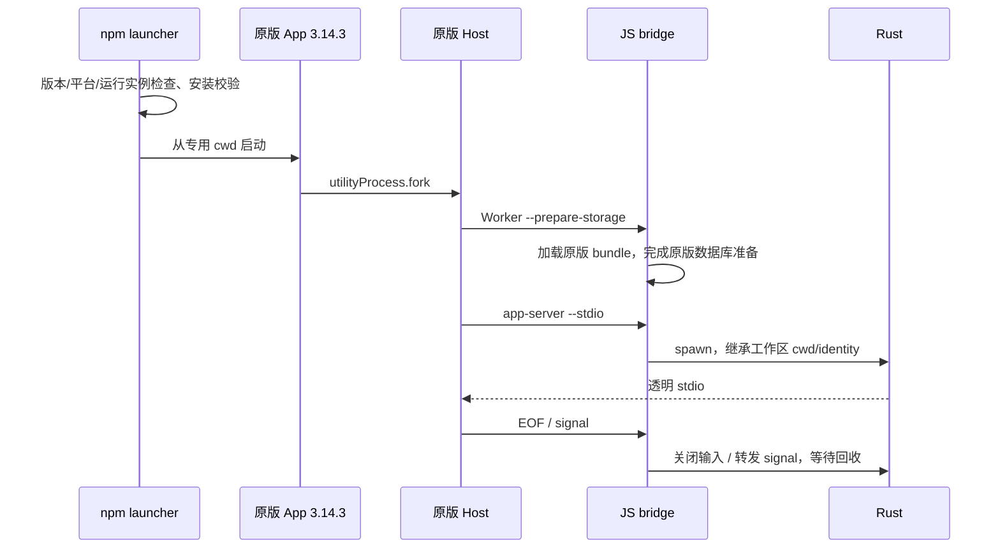

# npm Rust CLI 与 ZCode 3.14.3 启动桥接

## 基线与产品规则

App 唯一基线为原产品仓库 `v3.14.3`（`ab4d5e6ba0bc1d7c684d4159427fc6a1d6cf58c9`）。当前开源分支的 Host、协议客户端和存储初始化适配不能作为已发布 App 能力的证据。Rust 使用当前 Cargo workspace。

首版提供 npm 命令 `zcode-rust app launch`、`app status`、`app doctor`。`launch` 自动安装 npm 平台包内的预编译 binary 到用户运行时目录，再从版本专用目录直接启动已安装 App。支持显式 `--app`、`--runtime-dir`；开发验收可用 `--binary` 指向本地 release binary。npm 入口包名为 `@mbears/zcode-rs`，平台包名为 `@mbears/zcode-rs-<platform>`。入口 `package.json` 是包名的唯一来源；发布构建允许通过 `--scope` 只替换 scope，保留 `zcode-rs` 包名。命令行入口仍为 `zcode-rust`。不自动发布、不覆盖 App 文件、不改系统全局环境或用户工作区。

原图标继续启动内置 CLI；退出 Rust 入口启动的 App 后从原图标启动即回退。`launch` 不杀已有 App；发现已有实例则拒绝并要求完整退出。未知 App 版本在启动前拒绝。首版明确只允许 3.14.3。远端 SSH/WSL 不受本地启动器影响。

## 已发布代码接点

- `resolveDefaultZCodeAgentCommand` 的 env override 没有 `supportsStorageStartup` / `storagePreparationEntry`，不能使用该入口，必须清除继承的这组 override。
- `resolveBundledWorkspaceZCodeAgentCommand` 从进程 cwd 向上寻找 `apps/zcode-cli/packages/cli/dist/zcode.cjs`，优先于 packaged bundle，并提供两个存储字段。
- `prepareSessionStorage` 通过 Node Worker 运行该入口。桥接层在 `--prepare-storage` 时加载原 App 的 `resources/glm/zcode.cjs`，保持原版迁移与 Worker 生命周期；正式 stdio 模式启动 Rust。
- 桥接只转发字节、信号和退出状态，stdout 严格为协议。Rust 在继承的工作区 cwd 和 `ZCODE_WORKSPACE_IDENTITY` 下工作；不重写 workspace identity、会话或队列。

## 所有者、安装与启动顺序

安装器拥有版本目录；每次 launch 创建独立的启动目录与不可变 manifest，避免并发启动覆盖桥接配置。平台包包含二进制和 SHA-256 manifest；入口包不编译 Rust、不用 postinstall 下载。复制到临时目录，校验后原子 rename；已有版本须再次校验。安装失败不改变已有版本。运行目录不依赖 npm 缓存的生命周期。

Host 仍拥有进程树、owner/lease、协议 admission 与连接；Rust 拥有会话运行状态。桥接运行回执只记录 PID、版本、启动标识，不记录协议内容或凭据；status 区分启动器已启动与实际桥接已启动，不把选择当成运行事实。

Node bridge 不派生脱离 Host 进程组的进程；父进程退出、EOF、EPIPE 和信号必须收口；Windows 保持 Host 的 taskkill /T 边界。桌面 continuous 与手机 replayable 均由原 Host 和 Rust 协议拥有，桥接不改帧、不重放输入。

桥接使用独立管道转发原始字节，bridge 意外退出会关闭 Rust stdin，避免直接继承 Host 文件描述符后遗留运行时。macOS 按 executable 的加载记录判断已有 App，不能依赖被 `process.title` 改写的进程名。

当前限制：工作区路径必须使用真实路径。3.14.3 Host 不显式传递原始 `--cwd`，符号链接别名可能与 Rust 从 cwd 得到的路径不同，导致 workspace identity mismatch。启动器不通过改写 identity 或合并旧会话掩盖此问题；首版验收和发布说明必须保留这一边界。

## 分发与验收

构建脚本输出入口包和所选平台包，平台包以 os/cpu/libc 约束安装，optionalDependencies 固定相同版本。发布所需平台都准备完成后才发布入口包。平台、系统最低版本及二进制签名按真实构建证据声明，不把本机测试视为三平台通过。

包名变更通过真实 `npm pack` 和全新消费者目录的离线安装验收：默认产物使用 `@mbears/zcode-rs`，入口 optionalDependencies 与安装器解析的平台包一致；覆盖 scope 后入口和全部平台依赖仍使用 `zcode-rs`。`npx @mbears/zcode-rs@beta app doctor` / `app launch` 为公开使用命令。

验收先写测试，覆盖：错误 App 版本/路径、平台包缺失/损坏、路径含空格、重复安装、并发启动隔离、环境覆盖清除、Worker 原版入口、原始协议字节转发、EOF/信号/异常退出与子进程回收。冻结 tag resolver 的回归测试证明环境覆盖失败而桥接入口通过。

原版安装包 E2E 使用独立 HOME、Electron userData/sessionData、`ZCODE_DESKTOP_HOME_DIR`、显式数据库与产物目录，不读取或更改用户账号与真实会话。必须验证 Host cwd 继承、存储 ready、实际 Rust PID、对话及关闭；再用原版 Node 读取 Rust 写入的会话。以原版安装包的客户端或冻结 tag schema 为判据。记录未覆盖的 UI/功能边界，不宣称全部 Rust/Node 功能等价。
