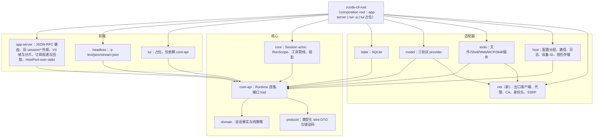
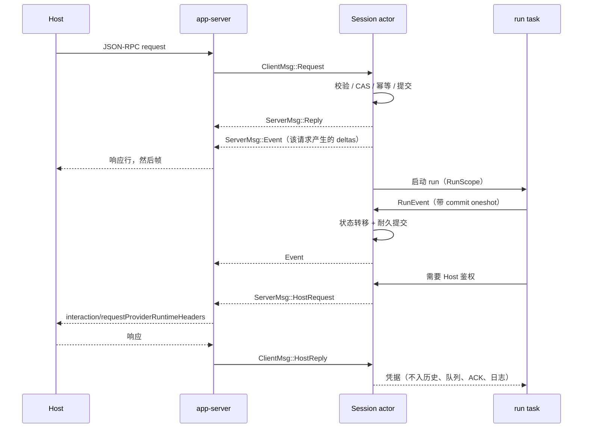
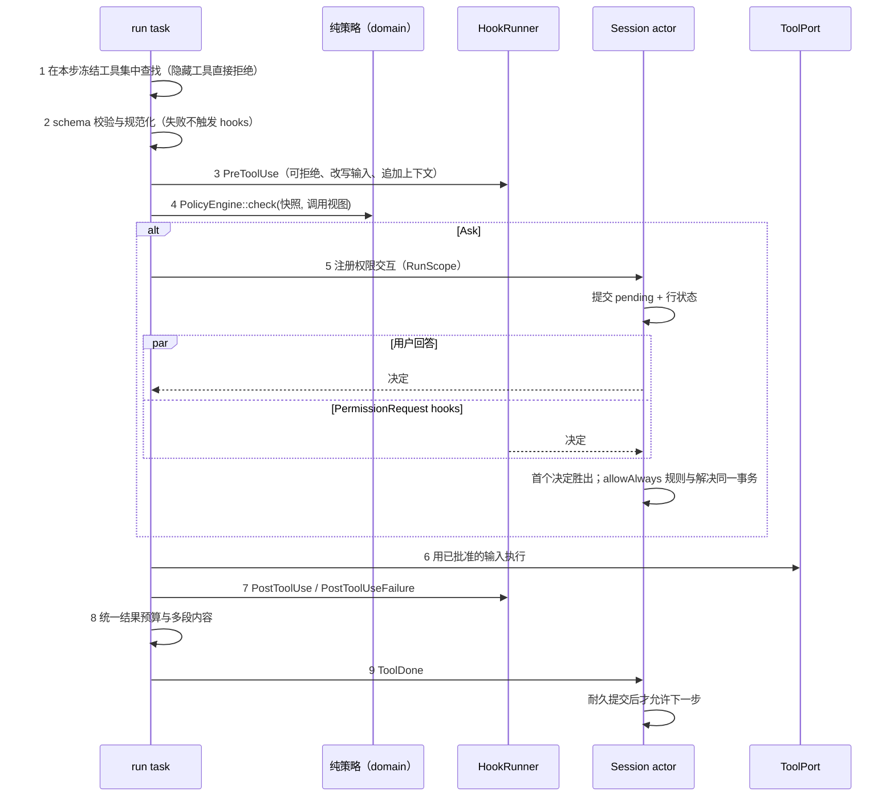

# zcode-cli-rust P0/P1 架构设计

日期：2026-09-23。基线：`main` / `494b673`。目标是让 Rust runtime 在 App stdio 场景完整替换 Node CLI，并具备独立 CLI 的 `-p` 入口。本文件定义架构、所有者、事件顺序、与 Node 的刻意差异和里程碑；各功能的精确 Node 契约在实现对应里程碑时补入分项 spec。

## 1. 范围

**P0（切默认前必须完成）**

| #   | 项                                                                                                      | 里程碑 |
| --- | ------------------------------------------------------------------------------------------------------- | ------ |
| 1   | Core 与传输解耦、类型化协议、错误码、TUI 入口                                                           | M0     |
| 2   | 权限模式（build/edit/plan/yolo/auto）、审批、规则、Bash 只读分类、plan 工具                             | M2     |
| 3   | `sendText` 扩展字段（browserAmbientContext、toolDisallowlist、modelExecution、automation/offPeak 归属） | M1     |
| 4   | Host 仍依赖的旧 `session/*` 方法与旧事件流（暂时对齐 Node，含手机 replayable 读路径）                   | M3     |
| 5   | 网络出口：代理、CA、身份头、Coding Plan 网关、设备 ID、子进程网络环境                                   | M1     |
| 6   | hooks（随 M2 工具管线完整实现，不做临时拒绝）                                                           | M2     |

**P1（切默认前应完成）**：Edit 宽松匹配（#7）、`-p` 无头模式（#8）、Bash 对齐（#9）、多内容工具结果与 Read 媒体/PDF（#10）、WebFetch/WebSearch（#11）、完整 hooks 与信任（#12）、流式恢复与异常防护（#13）、compact 质量（#14）、订阅回放与流控（#15）、插件管理与官方 MCP 鉴权（#16）、日志与用量（#17）、配置体系（#18）。

**非目标**：TUI 只保留子命令入口与前端契约；动态工作流全部不做（10 个 workflow 工具、submit_result/escalate、`workflows/*`、`workflowRun*`、相关 V4 命令、dwf child），继续显式返回不支持，由 App 按能力隐藏入口；Cron/OffPeak 工具、js REPL、浏览器/CUA、主代理记忆、登录与凭据存储属于 P2。

## 2. 现状中需要先消除的结构性隐患

均已在源码核对：

1. **传输与业务混在一起**：`Engine::serve` 直接解析 JSON-RPC 方法名、拼帧、分片（`crates/core/src/app/engine.rs:240`、`subscriptions.rs`）；`SessionRuntime`/`AppServer`/`TuiFrontend` 未被任何代码使用，`CoreRuntime::subscribe` 只转发 ACK。无法在其上构建 `-p` 或 TUI。
2. **协议与状态是字符串 JSON**：`Command { kind: String, payload: Value }`，`Session.mode/phase/task_type` 为 `String`，rows/messages/pending 为 `Value`。拼写错误可以编译通过。
3. **run 期等待者分散**：`permissions`、`questions`、`auth` 三个 map 由 Finished、stop、close、EOF 等路径分别手工清理，漏一处即泄漏或迟到回复。
4. **权限端口缺参数**：`ToolPort::requires_permission(name)` 看不到输入，无法表达 Bash 分类、路径规则或 hook 决策。
5. **错误码被压平**：除 `Unsupported method` 外一律 `-32602`；Host 依赖 `-32004/-32009/-32010/-32031/-32603`（`zcodeTaskServiceAdapter.ts:1235`）。
6. **Actor 会被输出阻塞**：`output.send(..).await` 在 actor 内；stdout 慢则整个 runtime 停顿。
7. **性能问题**：每次文本增量都会重算 `summary()` 并推送 sessions-index 帧；帧为计算大小先完整序列化一次、写出时再序列化一次；stdout 逐条 flush；`ModelDone` 扫描全部 rows；900 KiB 分片阈值超出手机 relay 在 base64 后的 1 MiB 预算。
8. **网络隐式行为**：reqwest 默认读取 `HTTP(S)_PROXY`，而 Node 对模型与 MCP 请求刻意忽略 shell 代理；两个 reqwest 版本（0.12 / 0.13）各自持有 TLS 配置。
9. **默认值偏离**：Rust microcompact 默认开启，Node 默认关闭（`compact.microcompact.enabled`）。

## 3. 设计原则（不变量）

1. **单一事实所有者**：Session actor 独占会话事实（输入、历史、模式、规则、交互、rows、用量）。适配器只持有进程句柄、连接和缓存，不持有业务事实。
2. **先提交后生效**：决策、审批、规则授予、工具结果、模式切换先耐久提交，再执行副作用或发布事件（沿用现有 commit receipt）。
3. **每步冻结快照**：每个模型 step 与每次工具调用读取一次不可变快照（工具集、策略、配置、出口配置、模型选型），执行中不读可变状态。
4. **纯决策、薄 IO**：权限、Bash 分类、hook 合并与匹配、Edit 匹配、compact 选轮、异常检测、no_proxy 匹配、网关改写、用量聚合都是 `domain` 中的纯函数，用 Node 生成的差分夹具做表驱动测试。
5. **失败安全方向**：解析不了的 Bash 视为非只读（改为询问）；未知命令、字段或状态显式拒绝，不返回空成功。
6. **Actor 不等待外部 IO**：actor 只等待存储提交；网络、进程、文件 IO 均在 run task 或适配器中执行。输出投递不能反压 actor。
7. **生成资产防漂移**：提示词、工具 schema、策略表、预批准域名、协议 JSON Schema、测试向量从 TS 源生成，`--check` 模式纳入 `pnpm test:zcode-cli-rust`（沿用现有 `generate-zcode-cli-rust-*.mjs` 模式）。

## 4. 目标架构



依赖方向沿用 `rust-cli-architecture.md`，并新增两条：`net` 只被 `model`、`tools` 与 composition root 依赖；`app-server`/`headless`/`tui` 只依赖 `core-api` 与 `protocol`，不能引用 `core` 内部类型。`scripts/check-zcode-cli-rust-boundaries.mjs` 增加对应规则。

### 4.1 Runtime 连接模型

替换当前 `SessionRuntime { dispatch, query, subscribe }`（三条独立返回路径会造成回复与事件的顺序竞争）：

```rust
pub trait Runtime: Send + Sync {
    fn connect(&self, info: ConnectionInfo) -> Connection;
}
pub struct Connection {
    pub tx: mpsc::Sender<ClientMsg>,       // 前端 → actor
    pub rx: mpsc::Receiver<ServerMsg>,     // actor → 前端，单一有序流
}
pub enum ClientMsg { Request { id: RequestId, body: RuntimeRequest }, HostReply { id: HostRequestId, result: HostResult }, Close }
pub enum ServerMsg { Reply { id: RequestId, result: Result<RuntimeResponse, RuntimeError> }, Event(RuntimeEvent), HostRequest { id: HostRequestId, body: HostRequest } }
```

- **顺序保证**：同一连接的回复与事件都来自 actor 的同一条 mpsc；处理请求时先入队 `Reply`，再入队该请求产生的事件（与 Node 先写响应行、再写 initial frame 一致）。
- **RuntimeEvent** 是类型化事实，至少包含：`ConversationDeltas { session, epoch, from, to, deltas }`（V4 行操作）、`SessionFact { session, seq, fact }`（旧事件流与 `-p` 的来源）、`IndexChanged`、`ConfigChanged`、`Interaction*`、`Notification`（如 `providerRuntimeHeadersCancelled`）。
- **HostRequest** 取代 Engine 内的 `auth` map：`ProviderRuntimeHeaders`、`OfficialMcpAuthHeaders`、`RuntimePreferences`。app-server 把它们映射为 stdio 反向请求；headless 在本地应答（静态配置或失败）。等待方持有 RAII guard，drop 时发送取消通知。
- **不反压 actor**：前端消费任务只做内存操作（记日志、编码、入写队列），写队列按字节限额；超额时标记订阅需要恢复，由回放日志或快照补齐，从不阻塞 actor。



### 4.2 类型化协议与错误码

- `protocol` crate 手写 serde 类型：JSON-RPC 信封、V4 `Command` 为 adjacently tagged enum（`#[serde(tag = "type", content = "payload")]`），每个 payload 独立 struct；旧 `session/*` 与控制面方法的参数与结果；V4 transport 参数；帧与分片。
- 未知字段策略与 TS 一致：TS strict 的对象用 `deny_unknown_fields`，passthrough 的保留 `#[serde(flatten)] extra`。
- **漂移检查**：新增 `scripts/generate-zcode-cli-rust-protocol-schema.mjs`，用 zod 4.6.5 的 `z.toJSONSchema()` 导出 command payload、transport、旧 `session/*` 与控制面方法参数的 JSON Schema，入库到 `crates/protocol/schema/`（`--check` 模式）。Rust 测试用 `schemars` 生成对应 schema，逐对象比较属性名、required、枚举值与 strict 属性；任何差异测试失败。
- **错误码**：`RuntimeError` 为枚举：`SessionNotFound(-32004, "Session not found: <id>")`、`SessionNotActive(-32004)`、`RevisionConflict{actual, expected}(-32009)`、`Busy(-32010)`、`RestoreWarning(-32031)`、`MethodNotFound(-32601)`、`InvalidParams{issues}(-32602, "Invalid params — <path>: <msg>; …"，data 与 zod issue 结构一致)`、`Internal{name, code?}(-32603)`。app-server 统一映射，业务代码只返回枚举。

### 4.3 状态类型化

- `Mode { Build, Edit, Yolo, Auto }` + `plan_enabled: bool`（与 Node `execution-state.ts` 相同，`plan` 仅为输入别名）；`Phase`、`TaskType`、`RowKind`、`ToolStatus`、`InteractionKind` 等为枚举，serde rename 保持现有 SQLite 与 wire 格式不变。
- Row 引入类型化结构，未知字段用 `extra` 保留，保证旧数据往返不丢。热点路径（文本增量、工具行、交互）先迁移；其余随功能改动迁移，不做一次性大改。
- 规范消息改为 `Arc<Message>`：每步构造请求只克隆指针；工具结果内容支持多段（见 5.10）。

### 4.4 RunScope

每个活跃 run 一个 `RunScope`，存于 `Active`：

```rust
struct RunScope {
    run_id: RunId, turn_id: TurnId, cancel: CancellationToken,
    waiters: Slab<Waiter>,                       // 权限、问答、hook 审批、Host 请求
    stream_rows: HashMap<ResponseId, RowIndex>,  // 文本增量 O(1) 定位
    open_rows: SmallVec<[RowIndex; 8]>,          // ModelDone 只更新本轮行
}
```

- 等待者只能通过 RunScope 注册；run 结束时（Finished/stop/close/EOF/存储失败）RunScope 整体 drop，所有等待者以 `Cancelled` 解决，对应 pending interaction 在同一次提交中关闭。
- 迟到事件继续按 `session + run_id` 丢弃（现有防护保留）。
- 删除 Engine 的 `permissions`、`questions`、`auth` map。

### 4.5 工具管线

所有工具调用走同一条管线，替换 `agent_loop::execute` 中分散的判断：



- **执行的输入就是被决定的输入**：管线持有输入值，决定后不可变；hook 的 `updatedInput` 触发重新校验与重新决策（Node `permission-input-recheck.ts`）。
- **并发**：连续的静态 `concurrentSafe` 调用组成一组，组内每个调用完整走管线，并发度来自 `toolConcurrency.maxConcurrency`（默认 10，Rust 现为 4），结果按调用顺序提交；写入与 Shell 保持屏障。
- **Core 内置工具**（Agent/Task/SendMessage/AskUserQuestion/Todo/Skill/EnterPlanMode/ExitPlanMode）与 ToolPort 工具用同一 `ToolDescriptor { name, schema, capability, budget, timeout, concurrent_safe, visibility }` 注册，统一分派。
- **工具可见性**：每步冻结 `ToolSet = registry ∩ profile ∩ !toolDisallowlist ∩ 能力开关 ∩ 嵌入式搜索分支`；工具定义与 token 估算按 `ToolSet` 版本缓存，不每 run 重算。

## 5. 各功能设计

### 5.1 M0：核心解耦与入口（P0 #1）

- JSON-RPC 路由、方法分派、帧编码与分片、订阅状态迁到 `app-server`；`Engine` 暴露 `RuntimeRequest` 枚举处理。
- `args.rs` 改为 clap 子命令：`app-server --stdio`（现有参数不变）、`run -p/--prompt ...`（M4 实现）、`tui`（占位：打印"TUI 尚未实现"并以退出码 2 结束）。`crates/tui` 只依赖 `core-api`，边界检查保证它不能访问存储或模型。
- 基础日志（`tracing` + 非阻塞文件写入，格式见 5.17）在 M0 接入，后续里程碑都依赖它排障。
- 性能修正：sessions-index 仅在摘要变化时发布；帧 payload 只序列化一次（`Box<RawValue>` 复用）；stdout 用 `BufWriter`，每批 flush 一次；分片阈值按 Node `wire-codec.ts` 的物理尺寸（NDJSON 行、socket 帧头、relay base64 信封三者取最大，约 786 KB）计算。

### 5.2 M1：接入兼容快修（P0 #3、#6，含 `session/close`）

- **sendText 扩展字段**：全部接受并按 Node 语义生效。
  - `browserAmbientContext`：按 `conversation.ts:141-181` 的原文改写本轮请求中的用户文本块；只存在于 RunContext 请求投影，持久化与 rows 使用原始输入。
  - `toolDisallowlist`：并入本轮冻结 `ToolSet`，附加 automation（`CronCreate/Update/Delete`）与 offPeak（`OffPeakCreate/SendMessage/Workflow`）集合（`prompt-turn.ts:189-254`）。
  - `modelExecution`：要求 `modelSelection`；忙时拒绝；选型只用于本 run，不写会话；`requestAuth` 冻结在 RunScope，不持久化；`subagents` 策略限制子代理选型与后台子代理；`memoryExtraction:"skip"` 记录但当前无记忆提取。
  - `automationId`/`offPeakTaskId`/`offPeakRunType`：仅作为本轮归属记录。
- **`session/close`**：`expectedPersistence` 不匹配返回 `{closed:false}`，否则按现有 `deleteSession` 收口语义关闭。
- **hooks**：不做临时拒绝（带 hooks 的插件会让所有输入被拒，违背对齐 Node 的目标），改为随 M2 工具管线完整实现，见 5.12。

### 5.3 M1：配置体系（P1 #18，提前）

- `host::config` 实现 Node 分层：默认 < `~/.zcode/cli/config.json` < 项目（git 根到 cwd，每级 `zcode.json` 后 `.zcode/config.json`）< `ZCODE_*` 环境 < CLI 覆盖；合并规则与 `config-merger.ts` 一致（MCP 例外：用户覆盖项目；项目 hooks 只作为信任候选）。
- 类型化 `Config` 结构，未知顶层键透传；单个文件解析或校验失败则整份忽略并产生 `config_file_invalid` 诊断，单个 MCP server 无效只跳过该项。
- 产出不可变 `Arc<ConfigSnapshot>`；无文件监听，与 Node 一致在入口处重新构建。消费者只拿快照。

### 5.4 M1：网络出口（P0 #5）

新增 `net` crate，所有 HTTP 客户端由 `Egress` 构建，统一 reqwest 0.13（与 rmcp 一致）：

- **代理**：只认 `network.httpProxy` 与 `ZCODE_HTTP_PROXY`（后者优先）；`network.noProxy`/`ZCODE_NO_PROXY` 用纯函数按 Node 规则逐 URL 匹配；关闭 reqwest 的环境代理读取。WebFetch 额外使用捕获的 shell 代理（`ZCODE_TOOL_ENV_PASSTHROUGH_JSON`）。支持 http/https/socks；`pac+` 显式报错。
- **CA**：`network.caCertFile` / `ZCODE_AGENT_CA_CERT`；与 Node 一致为**替换**系统根证书。
- **身份头**：进程内计算一次；合并顺序为默认头 < OpenRouter 归属 < provider `api.headers` < 每次尝试的 `requestAuth.headers` < 请求归属头（`x-request-id`、`x-zcode-session-type`、`x-zcode-trace-id`、`x-query-id`、`x-session-id`），大小写不敏感。
- **Coding Plan 网关**：纯函数改写两个官方 Anthropic 端点，在代理选择之前应用。
- **设备 ID**：读写 `~/.zcode/v2/telemetry-state.json`，沿用 Node 的锁文件协议；Anthropic 请求带 `metadata.user_id`。
- **子进程网络环境**：`Egress::subprocess_env()` 供 Bash、hooks、MCP stdio、插件 git 使用，规则同 `subprocess-env.ts`。
- 客户端按用途（model、mcp、webfetch）各一个、惰性构建并复用连接池。

### 5.5 M2：权限、plan 与审批（P0 #2）

- **状态**：Session 持有 `ExecutionState { mode, plan_enabled }`，经 `watch` 通道下发给 run task；每次工具调用读取一次快照（Node 分两处读取 mode 与 plan，属于竞态，见第 6 节）。模式切换先提交 `runtime-execution-state` 与 `SessionModeChanged`，再更新内存；启用 plan 时有活跃 Goal 则拒绝。
- **PolicyEngine**（domain，纯函数）：严格按 Node `service.ts` 的 15 步顺序、build 阶梯、edit 与 plan 规则、`ToolCapability` 元数据（readOnly、destructive、risk、sideEffectScope、needsApproval、permission 类别、allowedInPlanMode、requiresUserInteraction、alwaysAsk）实现。
- **规则**：项目规则存 Node `local_setting permission/ruleset`（spec rust-m11-node-storage）。会话规则仅在内存（与 Node 一致）。所有规则写入经 actor 串行化，并与交互解决同一事务提交，消除 Node 的丢失更新。
- **Bash 只读分类**：自写保守解析器，只接受 Node `unbash` 支持的子集（语句、`&&`/`||`、管道、`;`、引号与转义、重定向、静态环境赋值），其余一律"非只读"。策略表（safeFlags、子命令映射、环境变量白名单）由脚本从 TS 模块导出为 JSON；危险回调手工移植。Fig 命令注册表只用于"始终允许"前缀建议，转成紧凑 JSON 嵌入，首次使用时惰性解析。git 安全检查放在管线的异步阶段。
- **交互**：`InteractionRegistry` 状态机 `Pending → Resolved(by)`，首个解决者胜出，重复或未知 id 幂等成功。选项与 Node `permission-options.ts` 一致（allowOnce、allowAlways、allowSession、deny、fullAccess；workflowRefine 不做）。全权限：一个事务把会话与排队输入切到 yolo，并重新评估同会话其他待决权限。
- **Plan 工具**：EnterPlanMode/ExitPlanMode 契约同 `plan-mode.ts`；plan 审批投影为 `userInput`；计划文件写入 `.zcode/plans/plan-<id>.md`；compact 后注入 plan 文件提醒；`v4/conversation/plans` 返回 ExitPlanMode 行。
- **能力与导入**：`runtime/capabilities.independentPlanState=true`；`executionCapabilities.permissionModes=[build,edit,yolo,auto]`；导入的 TS 会话原样恢复模式。子代理 `permissionMode` 与 Explore 默认 yolo 同 Node。

### 5.6 M3：旧 `session/*` 外观与旧事件流（P0 #4）

2026-09-23 决定：暂时对齐 Node。Host 仍依赖旧 `session/*` 生命周期方法与 `session/event` 事件流（手机 replayable 读路径、cron/off-peak 建任务、历史导入、远端任务门面、关闭侧边对话），原因是 V4 命令面尚未覆盖这些需求（Host 源码注释已标注为过渡态）。Rust 实现 Host 当前实际使用的旧方法与事件流，Host、relay 与手机端不改动。等 Host 迁到 V4 后再删除这一层。

没有 V4 对应物的控制面方法（`runtime/capabilities`、`session/list`、`session/read`、`workspace/*`、`provider/*`、`mcp/list`、`skills/referenceCatalog`、`plugins/*`、`process/childProcesses`、`startup/*`）继续保留，契约对齐 Node 实现（已确认）。

- **方法**：`session/create`（全部参数，包括 importedHistory、allow/deny 列表、persistence、titleGeneration、parent）、`resume`、`compact`、`goal`、`setModel`、`setThoughtLevel`、`setMode`、`close`、`send`（附件回退）、`subscribe`、`messages`。它们在 app-server 中转换为 core 请求，不另建状态路径。
- **两套 revision**：Session 另持旧 `state_revision`，按 Node 规则递增并发送 `state.updated`；与 V4 revision 永不混用。
- **旧事件流**：core 产出类型化 `SessionFact`，app-server 的 `LegacyEventProjection`（纯函数）映射为 Node `session-mapper.ts` 的约 20 种事件类型，并保留有界 ring 供 `afterSeq` 回放。`-p --output-format stream-json` 复用同一投影。
- **反向请求**：`session/requestRuntimePreferences`，15 秒超时，`-32601`/`-32020` 时回退默认值。
- 实施前先抽取 Host `mapServiceEvent` 与手机端实际消费的字段，作为本投影的精确契约。

### 5.7 M4：`-p` 无头模式（P1 #8）

- `zcode-cli-rust run -p <text> [--output-format text|json|stream-json] [--attach <path>] [--mode] [--cwd]`，默认 yolo，退出码同 Node（成功 0、错误 1、SIGHUP 129 / SIGINT 130 / SIGTERM 143）。
- 三种输出格式与 Node 一致；`stream-json` 每行一个旧事件词表的 SessionEvent，最后一行为 `result`，复用 5.6 的旧事件投影。
- 通过 `Runtime::connect` 驱动，与 app-server 走同一核心；凭据来自 `--config` 静态模型或 Registry 环境（登录属 P2）。
- **差分测试**：`scripts/diff-zcode-cli-node-rust.mjs` 用同一本地模型 fixture 分别运行 Node `zcode -p` 与 Rust，归一化 ID 与时间后比较 stream-json 事件序列、`json` 输出与文件副作用。后续每个里程碑的行为对齐都用它验收。

### 5.8 M5：Edit（P1 #7）

移植 `edit-matchers.ts` 的 8 级匹配（replace_all 跳过 3 个宽泛匹配）、引号风格保留、`$` 字面替换、空 new_string 时同时删除尾随换行、错误码 1–13、`.ipynb` 拒绝、读后编辑与新鲜度规则、编码与行尾保持。测试向量由脚本从 TS 实现批量生成，逐字比较输出。

### 5.9 M5：Bash（P1 #9）

- **ShellSession**（每会话）：
  - 按 `$SHELL` 或 git-bash 选择 shell；
  - 首次使用时异步生成 init snapshot（10 秒超时，失败缓存，不再重试），并清理 30 天前的快照；
  - 按 Node 的包装脚本捕获退出后的 cwd，只在主会话中保持；
  - 环境为 UTF-8 locale、`PYTHONIOENCODING`、`GIT_EDITOR=true`，加上 `Egress::subprocess_env()`。
- **输出**：stdout 与 stderr 写同一个 O_APPEND 文件，读取头部 30000 字节（`BASH_MAX_OUTPUT_LENGTH`）。截断时返回 persisted-output 信封，内存占用恒定；输出超过 5 GiB 时终止进程。
- **超时**：默认 120 秒，最多 600 秒，可用 `BASH_*_TIMEOUT_MS` 覆盖。到时间的命令转入后台而不是终止（`sleep` 开头的命令除外）。进度事件在 2 秒后首次发送，之后每秒一次。
- **语义**：
  - 按最后一条命令解释退出码；
  - 识别 stdout 中的 `data:image` 输出；
  - Bash 读取的文件计入读取状态，改动已读文件时给出过期提示；
  - gh 限流提示；
  - Windows 输出解码。
- **嵌入式搜索**：Bash 可用时隐藏 Glob/Grep，并注入 find/grep 前导函数（后端二进制从 Host 环境变量获取，缺失时回退系统命令）。
- **进程回收**：沿用现有严格的进程树回收，不降级到 Node 的实现。

### 5.10 M5：多段工具结果与 Read 媒体（P1 #10）

- `ToolResult { status, parts: SmallVec<[Part; 2]>, display, artifact }`，`Part = Text | Media { mime, blob: BlobRef }`。媒体字节进入内容寻址 blob 存储（复用附件存储），规范历史只存引用，请求时由 model 层物化（与现有附件路径一致）。
- 各协议编码：
  - Anthropic：`tool_result` 内放 image 或 document 块。
  - Responses：`function_call_output` 为数组，含 `input_text`、`input_image`、`input_file`。
  - Chat：tool 消息只放占位文本，媒体放入这批 tool 消息之后的合成 user 消息；错误结果不附媒体。
  - 视频在所有协议中都走合成 user 消息；模型不支持的媒体替换为占位说明。
- **统一预算层**：按每个工具声明的 inline/model 字节上限、截断或落盘、保留头或尾处理，并附统一的截断说明；预算只计文本投影，不计媒体字节。
- **Read**：
  - 文本：未变化时返回提示；未给 `limit` 时 256 KiB 上限；按 25k token 上限返回部分视图，并标记为部分读取。
  - 图片：在 blocking 池解码，设像素上限防解压炸弹，最多 2 个并发，压缩阶梯同 `jimp-compression.ts`，WebP 直接透传。
  - 视频：不超过 30 MiB，直接透传。
  - PDF：用 `pdfinfo` 和 `pdftoppm`（外部命令，与 Node 相同），支持 `pages` 渲染或整份作为文档透传。
- MCP 图片结果走同一路径。

### 5.11 M5：WebFetch / WebSearch（P1 #11）

- **WebFetch**：
  - URL 校验：长度、协议、凭据、http 升级为 https、本地与内网名称拦截。
  - 每一跳只做字面 IP 检查，不解析域名（D12 保持 Node 语义，见第 6 节）。
  - 同主机重定向最多 10 次，跨主机时返回 `REDIRECT DETECTED`。
  - 10 MiB 响应上限，内容类型白名单。
  - HTML 转 markdown 移植 Node 的正则转换器，保证输出一致。
  - 缓存：以原始 URL 为键，15 分钟，总计 50 MiB，LRU。
  - `prompt` 用会话当前模型以辅助任务处理（无工具、最低推理档、输出上限 4096），预批准域名直接返回 markdown。
- **WebSearch**：仅当 `supportsNativeWebSearch` 时暴露；只支持 Anthropic 类 provider 的原生 `web_search` 工具，发起独立流式请求，从摘要中的 markdown 链接提取来源（与 Node 一致，没有 OpenAI 路径）。

### 5.12 M2：完整 hooks 与工作区信任（P0 #6、P1 #12）

- **事件**：7 种事件的触发时机与 Node 一致。
  - SessionStart 每个 runtime 实例一次；
  - UserPromptSubmit 在用户消息持久化之前；
  - Stop 仅在纯文本步触发，每轮最多续跑 3 次。
- **来源与执行**：
  - 来源为 user、plugin、internal，以及经信任的 project；
  - 同一事件的 hooks 顺序执行；
  - stdin 为单行 JSON，字段同 Node；
  - 支持 `${VAR}` 展开、每个 hook 的超时，以及 SIGTERM 后 750 ms 再 SIGKILL 的回收。
- **匹配**：用 `regress` crate（ECMAScript 正则语义）保证与 JS 行为一致。
- **合并**：在 domain 中实现为纯函数（刻意修正见第 6 节）。
- **信任**：
  - 与 Node 共用 `~/.zcode/security/workspace-hook-trust-v1.json`，包括格式、锁协议与原子写；
  - digest 用与 JS `JSON.stringify` 等价的规范化序列化，测试向量由 Node 生成；
  - 审批流程、toggle、revoke、`workspace/hooks/trustGrant` 与 4 个 V4 命令契约同 Node。
- **投影**：生成 `hookInvocation` 行与 HookRun 事件。

### 5.13 M7：流式恢复与异常防护（P1 #13）

- **已有可见输出后断流**：每个用户轮最多恢复 10 次，与 Start Plan busy 重试共用计数。
  - 尚无工具调用：丢弃部分输出，提交丢弃标记（不进入 provider 历史），发出恢复事件，行以 interrupted 关闭，用新的 response id 重试。
  - 已有完整工具调用：提交只含这些调用的 assistant 消息，未执行的调用给出 `not_executed` 合成结果（Rust 在流结束前不启动工具）。
  - 实现状态：见 [M7 spec](rust-m7-stream-recovery.md)。工具调用锚点恢复暂不实现（§2.5），断流前已完整的工具调用与文本一起丢弃后重试。
- **用户 stop**：把已流出的文本与推理（含签名）作为 assistant 消息提交，标记为 cancelled，保证历史与用户看到的一致。
- **异常防护**：
  - 连续 3 次相同的工具调用（按工具名加稳定 JSON 签名比较）时注入提醒，每轮最多 3 次；
  - 工具调用预算警告（默认关闭）；
  - 模型返回空响应时报 `empty_model_response`。
- **Start Plan busy**：错误码 3008–3010 时等待 1 秒、2 秒后重试。

### 5.14 M7：compact 质量（P1 #14）

- 摘要提示词从 `compact/prompt.ts` 生成为资产（约 6 KB，防漂移），摘要作为 user 消息写入，格式同 Node。
- **选轮**：以 assistant 消息为界分组；auto 和 reactive 保留最后一组，manual 不保留。
- **提示过长重试**：auto 把较新的组移入保留区；manual 丢弃最早的组，最多 3 次。auto 在可重试错误上最多尝试 3 次。
- **熔断**：连续失败 3 次后跳过自动压缩；两次压缩之间不足 3 个工具轮视为快速回填，连续 3 次时报错。
- **摘要请求**：输出上限 `min(常规上限, 20000)`；工具列表照常发送（超过 100 个时发空列表），出现工具调用即失败；媒体超限时以占位替换重试一次。
- **压缩后重新附带**：plan 文件，以及最近 Read 过的最多 5 个文件（单个不超过 5k token，总计不超过 50k），之后清空读取状态。
- **microcompact**：默认改为关闭，与 Node 一致；开启后有 60 分钟空闲触发与 token 压力触发两种条件。

### 5.15 M8：订阅回放与流控（P1 #15）

精确契约、所有者与验收见 [rust-m8-delivery.md](rust-m8-delivery.md)。实现时调整：保留日志放在 Actor（seq 分配者）而不是 app-server，避免无人订阅期间日志断档；`state.updated` 只发变化的顶层键。以下为原稿。

app-server 的投递层完全替换现有 `subscriptions.rs`：

- **TopicLog**（每个 topic）：`{ epoch, floor_seq, entries: VecDeque<{seq, deltas: Arc<[Delta]>}> }`。与 Node 一样保留 2000 条，另加 8 MiB 字节上限作为安全阀。
- **恢复**：订阅时若 `base.logEpoch` 相同且 `floor ≤ base.seq ≤ current`，按 profile 过滤并合并后发 resume 帧；否则发快照（最近 60 行）。`forceSnapshot` 同 Node。
- **Profile**：desktop-continuous 每 30 ms 刷新一次，推送全部流式路径；web-remote-replayable 每 150 ms 刷新一次，只推送 `text`。
- **每个订阅者一个缓冲**：超过 500 个操作或 1 MiB 时溢出，标记需要恢复。刷新时用单次定时器，同一时间只有一个在途帧；没有增量时也发帧，保证 seq 连续。
- **流控**：`saturated` 暂停定时器，缓冲继续累积直到溢出；`drained` 立即刷新；`closed` 解除暂停并清理上传，保留订阅（与 Node 一致）。
- **编码**：同一 profile 的 payload 每次刷新只编码一次，所有订阅者共享；分片算法与限制（16 MiB、1024 片、crc32）同 `wire-codec.ts`。

### 5.16 M9：用量（P1 #17）

- 每次模型请求向 `rust_usage` 表追加一条记录，字段包括：session、query_source、provider、model、各类 token、耗时、错误，以及工具用量。
- 提供 `v4/usage/stats` 与旧 `usage/stats`（同一实现，包括时区分桶、热力图等级、连续天数、缓存命中率），以及 `v4/conversation/usage` 与旧 `session/usage`（按 query_source 基线增量计算）。
- 聚合在 SQL 中完成，走请求级只读连接。
- 导入 TS 数据时迁移 `model_usage`、`turn_usage`、`tool_usage`。

### 5.17 日志（P1 #17，M0 接入、M9 补齐保留策略）

- 写入 `ZCODE_LOG_DIR` 或 `~/.zcode/cli/log/zcode-rust-YYYY-MM-DD.jsonl`。与 Node 同目录便于收集，文件名前缀不同，避免两个进程追加同一文件。
- 字段与 Node `serialize.ts` 一致；按 key 正则脱敏，深度上限 8。
- 保留 7 天：启动 60 秒后清理一次，只删除自己的文件。
- 通过 `tracing-appender` 的有界非阻塞队列写入，队列满时丢弃 debug 并计数，绝不阻塞。
- 级别按 AGENTS.md：流式 chunk、协议原始数据用 debug，生产环境不落盘。

### 5.18 M10：插件管理与官方 MCP 鉴权（P1 #16）

分期、精确契约与验收见 [rust-m10-plugins.md](rust-m10-plugins.md)。以下为原稿。

- **18 个 `plugins/*` 方法**：契约同 `bootstrap/zcode-protocol/plugins.ts`。与 Node 共用 `~/.zcode/cli/plugins` 的布局：`known_marketplaces.json`、`installed_plugins.json`、`cache/`、`data/`，以及原子目录事务（`.backup` 与 `.transaction.json` 边车文件）。
- **长操作**：操作 id 对应的 `CancellationToken` 注册表；重复 id 显式拒绝（刻意修正，见第 6 节）；`plugins/operationProgress` 通知。每个 storage root 一把进程内锁，协调方式同 Node。
- **来源**：
  - GitHub archive 优先，失败再用 git（带 sparse），90 秒超时，重试 3 次；
  - ZIP 需 HTTPS 与 sha256，大小与条目数有上限，拒绝路径穿越和符号链接；
  - 本地目录与文件。
- **模板插值**：`${user_config.*}`，以及敏感值只能出现在 env、header、clientSecret 等"敏感出口"的规则，同 `mcp.ts:384-446`；强制写入 `ZCODE_PLUGIN_ID`；server 名加命名空间 `plugin:<name>:<key>`。
- **官方插件的 JS MCP server**（2026-09-23 确认按 Codex 方式实现）：Rust runtime 不内嵌 JS 引擎，也不实现 `__zcode-plugin-host`；所有插件 MCP server 都按 `.mcp.json` 中的 `command/args/cwd/env` 作为普通外部进程启动。
  - Codex 的做法（本机 `~/.codex/plugins/cache` 实测，codex-cli 0.135.0）：官方 JS 插件的 `command` 指向插件自带的启动脚本（如 `scripts/launch_codex_app_tools_mcp`），脚本按顺序寻找 Node：`CODEX_MCP_NODE_PATH`（桌面 App 注入）→ 桌面 App 资源内自带的 `cua_node/bin/node` → 缓存中下载的 `codex-runtimes/.../node` → 系统 `node` → 否则报错“could not find a Node runtime”。第三方插件直接写 `"command": "node"`，依赖用户系统 Node。部分官方插件已改为托管的 HTTP MCP（`/ps/mcp`），本地不运行 JS。`env_vars` 白名单决定哪些父进程环境变量传给 server。
  - ZCode 对应方案：官方插件 seed 时写入插件自带的启动脚本，按 `ZCODE_MCP_NODE_PATH`（Host 注入 Electron helper 路径并设置 `ELECTRON_RUN_AS_NODE=1`，或 App 自带的独立 Node）→ 系统 `node` → 明确报错 的顺序寻找 Node。Rust 只负责按 manifest 启动进程、传递白名单环境变量与 `ZCODE_PLUGIN_ID`。computer-use 的 broker 安全门禁属于 P2，届时再迁移到启动脚本或独立 launcher。
- **官方 MCP 鉴权**：`interaction/requestOfficialMcpAuthHeaders` 作为 HostRequest。
  - HTTP：每次请求取头，401 重试一次，403 或 3xx 按 Node 的错误码处理。
  - stdio：每条出站消息注入 `_meta["com.zcode/official-mcp-auth"]`。
  - 目标 origin 必须可信，否则 fail-closed。

## 6. 已知 Node 缺陷清单（全部保持 Node 行为）

2026-09-23 逐条确认结果：**全部对齐 Node 现有行为**，D1–D7、D13 已明确选择保持 Node 语义；D8–D12 按同一原则默认保持 Node 语义。下表仅作为已知的 Node 缺陷清单留存，Rust 不实现这些修正；如需修正，需单独确认并先在 Node 修复。

| #   | Node 现状                                                                                          | Rust 方案                                    |
| --- | -------------------------------------------------------------------------------------------------- | -------------------------------------------- |
| D1  | 被 `toolDisallowlist` 隐藏的工具，如果模型仍调用，照样执行                                         | 以"工具不可用"错误结果拒绝                   |
| D2  | 用户点击不占用响应，同一微任务窗口内 PermissionRequest hook 可能覆盖用户答复                       | 用户答复先占用，先到者胜                     |
| D3  | mode 与 planEnabled 在两个时刻分别读取                                                             | 每次工具调用读取同一份快照                   |
| D4  | 项目规则的"读-合并-写"无锁，可能丢失更新                                                           | 经 actor 串行化，与交互解决同一事务提交      |
| D5  | WebFetch 的"始终允许"保存完整 URL，匹配时却按 `domain:host`，规则永远不命中                        | 保存为 `domain:host`                         |
| D6  | 选择全权限只放行当前这一条权限提示                                                                 | 同时重新评估同会话其他待决权限               |
| D7  | 重启后待决权限的收口未验证                                                                         | 冷恢复把工具行和交互标记为 interrupted       |
| D8  | hook stdout 超出 maxOutputBytes 时 JSON 解析失败，被静默忽略（deny 丢失）                          | 记为 hook 失败并在行中可见，仍保持 fail-open |
| D9  | hook 的 permissionRequestResult 后者覆盖前者；preventContinuation 会把 stopReason 覆盖为 undefined | 按 deny > ask > allow 合并；不以空值覆盖原因 |
| D10 | hook 超时有两个计时器，结果在 timed_out 与 failed 之间不确定                                       | 单一计时器，结果确定为 timed_out             |
| D11 | 插件操作 id 重复时静默覆盖                                                                         | 显式拒绝                                     |
| D12 | WebFetch 只做字面 IP 检查，DNS 解析后不校验                                                        | 解析器层过滤非公网地址                       |
| D13 | `ZCODE_*` 数值环境变量解析失败变成 0，例如会关闭超时                                               | 忽略该值并给出诊断                           |

保留 Node 语义、不修改的项（改动会影响用户已有预期）：yolo 跳过项目 deny 规则与 `disallowedTools`（2026-09-23 已确认）；plan 模式允许非破坏性 MCP 工具；自定义 CA 替换系统根证书；插件存在时强制启用用户 hooks；恢复时丢弃部分输出（不续写）。

## 7. 性能预算与措施

沿用 `rust-cli-parity-plan.md` 的预算（冷启动 p95 ≤ 100 ms；流式期间控制 RPC p95 ≤ 20 ms；Stop ACK p95 ≤ 100 ms；流式合并 ≤ 16 ms；空闲 RSS ≤ 50 MiB），新增：

| 项            | 预算 / 措施                                                      |
| ------------- | ---------------------------------------------------------------- |
| 权限决策      | 纯计算 p99 ≤ 1 ms，git 安全检查另计；每步快照 Arc 共享           |
| Bash 分类     | 单条命令 ≤ 200 µs；策略表启动时不解析，首次使用时构建            |
| 工具定义      | 按 ToolSet 版本缓存 schema JSON 与 token 估算                    |
| 文本增量      | RunScope 行索引 O(1)；index 仅在摘要变化时发布；payload 单次编码 |
| 请求构造      | `Arc<Message>` 克隆；编码一次，重试复用 `Bytes`（已有）          |
| Bash 输出     | 文件承载，内存只保留读取窗口；5 GiB 上限                         |
| 图片与 PDF    | blocking 池，信号量 2，像素上限；处理结果按 blob 缓存            |
| 回放日志      | 每个 topic ≤ 2000 条且 ≤ 8 MiB；订阅者缓冲 ≤ 1 MiB               |
| WebFetch 缓存 | ≤ 50 MiB LRU                                                     |
| 日志          | 非阻塞有界队列；debug 在生产环境不落盘                           |
| Hook 执行     | 只在匹配时 spawn；输出按上限截断，不整段缓存                     |

每个里程碑用 `scripts/bench-zcode-cli-rust-suite.mjs` 与 `bench-zcode-cli-node-rust.mjs` 复测，报告写入 `docs/reports/`。

## 8. 测试与验收

- **纯策略**：由 `scripts/generate-zcode-cli-rust-fixtures.mjs` 调用 TS 实现批量生成夹具，覆盖权限矩阵、Bash 分类语料（只允许 Rust 在更保守的方向上与 Node 不同）、Edit 匹配、hook 合并与 digest、no_proxy、网关改写、退出码解释、HTML 转 markdown、compact 选轮，Rust 用表驱动测试。
- **协议**：JSON Schema 漂移检查，加上现有 Node 驱动的集成测试（`packages/services/tests/zcode-cli-rust-*.test.ts`），新增错误码、旧 `session/*` 方法与旧事件流、回放与流控用例。
- **差分**：`-p` 模式下 Node 与 Rust 的 stream-json、`json` 输出与文件副作用比较。
- **E2E**：权限审批、plan 审批、hook 审批这类交互改动补真实 App 场景，并同时验证 desktop-continuous 与 web-remote-replayable。
- 每个里程碑执行 `pnpm typecheck`、`pnpm lint`、`pnpm fmt:check`、`pnpm architecture:check --changed`、`pnpm check:zcode-cli-rust`、`pnpm test:zcode-cli-rust`，结果如实写入报告。

## 9. 里程碑

| 里程碑 | 内容                                                                                                               | 依赖                             |
| ------ | ------------------------------------------------------------------------------------------------------------------ | -------------------------------- |
| M0     | 类型化协议与错误码、连接模型、app-server 路由与投递迁移、RunScope、状态枚举、子命令与 TUI 占位、基础日志、性能修正 | —                                |
| M1     | 配置体系、网络出口与 reqwest 统一、sendText 扩展字段、`session/close`                                              | M0                               |
| M2     | 工具管线、PolicyEngine、Bash 分类、交互状态机、plan 工具、能力声明、完整 hooks 与工作区信任                        | M1                               |
| M3     | 旧 `session/*` 外观、旧事件流投影、反向请求                                                                        | M0，建议在 M2 之后               |
| M4     | `-p` 无头模式与 Node/Rust 差分脚本                                                                                 | M3（stream-json 复用旧事件投影） |
| M5     | 多段结果与预算层、Edit、Bash、Read 媒体与 PDF、WebFetch/WebSearch、backgroundBashOutput                            | M2                               |
| M6     | （并入 M2）                                                                                                        | —                                |
| M7     | 流式恢复、异常防护、compact 质量                                                                                   | M2                               |
| M8     | 订阅回放与流控                                                                                                     | M0                               |
| M9     | 用量与日志保留                                                                                                     | M0                               |
| M10    | 插件管理与官方 MCP 鉴权                                                                                            | M1、M2                           |

每个里程碑开工前补对应分项 spec（精确契约与验收用例），以单独提交交付；未通过验收的能力不在 capabilities 中声明。
